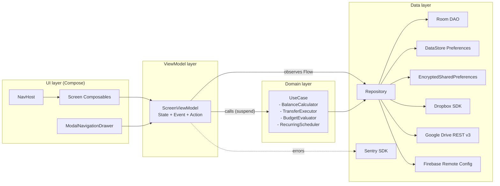
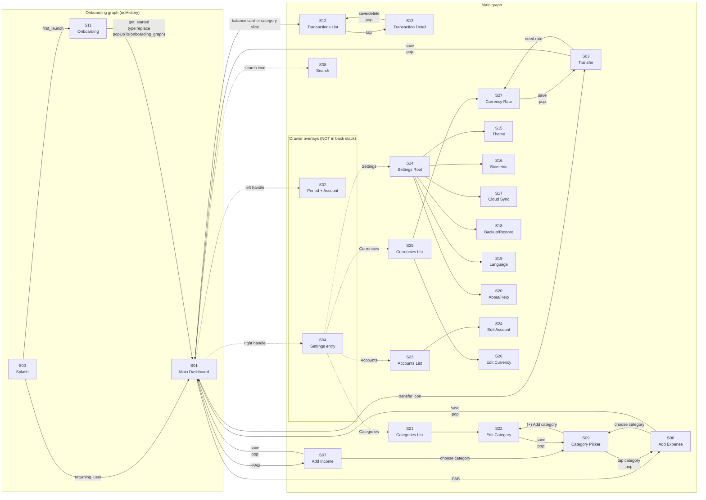
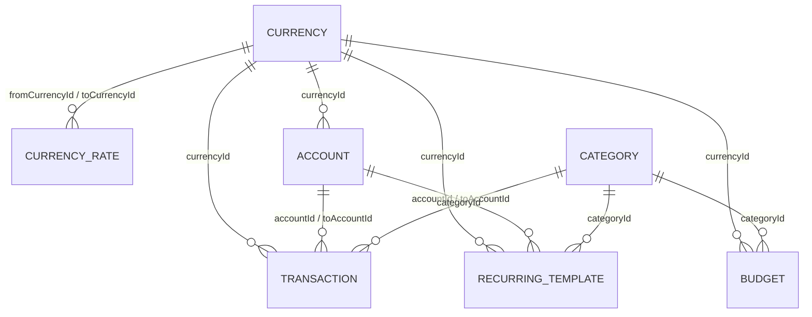

# MyMoney — Technical Design Document

> Re-implementation specification for the Monefy (`com.monefy.app.lite`) Android app on a modern Kotlin / Compose / Material 3 / MVVM stack. Reference depth (~100 pages).

---

## 0. Document metadata

| Field | Value |
|---|---|
| Document version | 1.1 |
| Date | 2026-05-18 |
| Target platform | Android |
| Language / UI toolkit | Kotlin 2.0.21, Jetpack Compose, Material 3 |
| Architecture pattern | MVVM with UDF (State / Event / Action) |
| Dependency injection | Hilt 2.52 |
| Network stack | Retrofit 2.11 + OkHttp 4.12 + kotlinx.serialization 1.7 |
| Persistence | Room 2.6.1 + DataStore Preferences 1.1.1 + EncryptedSharedPreferences 1.1.0-alpha07 |
| Navigation | androidx.navigation-compose 2.8.4 (single-activity NavHost) |
| Async / concurrency | kotlinx-coroutines 1.9 + Flow |
| Background work | WorkManager 2.10 (Hilt integration) |
| minSdkVersion / targetSdkVersion / compileSdkVersion | 31 / 36 / 36 |
| Audience focus | "Gaming" — aesthetic-only gamification (animation, haptic, sound), no XP/streaks/achievements |
| Monetization | Stripped — fully free, no IAP, no ads |
| Cloud sync | Dropbox (PKCE) + Google Drive (appDataFolder scope) snapshot sync |
| Crash reporting | Sentry (DSN to be re-issued) |
| Feature flags | Firebase Remote Config (fetch 12 h) |
| Document language | English |
| Document depth | Reference (~100 pages) |
| Inputs analysed | 10 screenshots, base.apk (23.1 MB), split_config.ru.apk |
| Inputs not used | Google Play page (Chrome MCP unavailable) — compensated via APK ground truth |

### Changelog

- **v1.1 (2026-05-18)** — §14 locked: 17 UX decisions resolved (AS-12 and AS-14 deviated from the original defaults — period strip "Pick a date" opens a 2-date range picker; donut percentage labels appear from ≥ 3 % instead of ≥ 5 %); 7 items deferred (6 DevOps prerequisites to week 8 of the v1.0 roadmap, 1 to the v1.1 backlog).
- **v1.0 (2026-05-17)** — initial reference-spec generated by `/app-tdd-creator`.

### Source-of-truth ranking

When two analysis sources disagree, the higher-ranked one wins. Each token, string, permission, or library claim in this document is marked with one of:

- **(APK)** — extracted from `base.apk` resources or AndroidManifest. Canonical.
- **(APK-ru)** — extracted from `split_config.ru.apk`. Canonical for Russian strings.
- **(screenshots, ±)** — derived from screenshot vision analysis. May be approximate.
- **(decision)** — design choice made by the analyst based on user answers, not present in the original.
- **(assumption)** — best-guess fill-in for items not visible in any source. Listed in §14.

---

## 1. Project overview

### 1.1. Name and short description

**MyMoney** is a personal-finance tracker that lets users log incomes, expenses, and transfers across multiple accounts and currencies, and view the running balance and per-category spend through a colourful donut chart. It is a re-implementation of Monefy (`com.monefy.app.lite`, v1.22.10) targeting the same end-user surface, with monetisation removed and a modernised Kotlin + Compose codebase. The hallmark of the design is the donut chart ringed by hand-drawn category icons connected by thin spokes — a deliberately playful, "notebook"-feeling alternative to corporate spreadsheet aesthetics.

### 1.2. Target audience

The product brief positions MyMoney for a **gaming-leaning audience** (per Q-A1): users who pick personal-finance apps for vibe and tactile feedback rather than analytical depth. They expect snappy animations, satisfying haptic responses on data entry, sound effects on milestones, and a visually rewarding daily ritual of "tap a category, drop in a number, watch the donut grow." We do not build a literal RPG layer (no XP, no virtual pet, no missions) — gamification stops at aesthetic micro-interactions (Q-B4 = `aesthetics_only`).

Secondary personas this still serves:
- **Casual budgeters** — people who want to know where the money went, without spreadsheets.
- **Multi-currency travellers** — the app's first-class multi-currency model serves anyone tracking accounts in different denominations.
- **Couples / households** — Dropbox / Google Drive sync allows the same backup to be restored on a partner's device.

### 1.3. Competitive landscape

Direct competitors in the "free fast log + chart" niche:

| App | Strengths vs. MyMoney | Weaknesses vs. MyMoney |
|---|---|---|
| Monefy (original) | Mature, large icon set, premium recurring | Closed-source, paywalled features, dated MVP + AndroidAnnotations stack |
| Spendee | Modern dashboard, bank-linking | Bank-linking requires SaaS subscription |
| Wallet by BudgetBakers | Polished, multi-platform | Subscription model, complex UI |
| 1Money | Simple, free | Limited multi-currency, less polished chart |
| Money Lover | Feature-rich | Heavy UI, dated visual language |
| Goodbudget | Envelope budgeting | Different metaphor — envelopes, not transactions |
| YNAB | Coaching + zero-based budgeting | Expensive subscription, steep learning curve |

We do not link to bank APIs in MVP. Our differentiation is **kept-simple-on-purpose** plus **joyful interactions**.

### 1.4. Unique value propositions

1. **One screen, one ritual.** The dashboard is the app — period selector, donut chart, balance card, and the two big add buttons. Most users complete a daily log in <10 seconds.
2. **Playful by default.** Hand-drawn category icons (custom illustrations), pastel mint-pink palette, animated donut growth, spring keypad, haptic on every key, success sound on save, confetti on positive-balance milestones.
3. **Multi-account, multi-currency, no compromises.** Each account has its own currency; transfers carry exchange rate; the dashboard aggregates per active account.
4. **Local-first, cloud-optional.** All data lives in Room on the device. Backup is opt-in via Dropbox or Google Drive (snapshot of the SQLite DB), never uploads transactions individually.
5. **Free forever.** No paywall — features that were Premium in the original (recurring transactions, dark theme, custom categories, app lock) are unlocked by default.
6. **No ads.** Ever.

### 1.5. Success metrics

| Metric | Target (3 mo after v1.0 launch) |
|---|---|
| D1 retention | ≥ 35 % |
| D7 retention | ≥ 15 % |
| Median session duration | 30–60 s (target — short, satisfying) |
| Median transactions per active user per week | ≥ 4 |
| Cloud-sync activation rate | ≥ 25 % of MAUs |
| Crash-free sessions (Sentry) | ≥ 99.5 % |
| Play Store rating | ≥ 4.5 stars after first 1 000 ratings |
| ANR rate | ≤ 0.1 % |

The "short session, often" pattern is the design intent. We optimise for "tapped open → record → closed" speed, not minutes-in-app.

---

## 2. Architecture

### 2.1. High-level architecture



Strict layer rules:
- **UI → ViewModel only.** No direct Repository calls from Composables; ViewModels expose `StateFlow<S>` consumed by `collectAsStateWithLifecycle()`.
- **ViewModel → UseCase or Repository.** Simple read paths go straight to Repository; multi-step or business-rule-heavy paths go through a UseCase.
- **Domain → Data.** UseCases depend on Repository interfaces, never on Room or SDK directly. Allows pure JVM unit tests.
- **Data layer hides framework details.** Repositories return Kotlin types (entities, value objects), not Room rows or SDK responses.

### 2.2. Module layout (Gradle)

```
:app                          ─ Application class, MainActivity, NavHost, DI graph entry
:core:ui                      ─ Theme, color, typography, shapes, design-system Composables
:core:designsystem            ─ Custom components (MonefyDonutChart, MonefyKeypad, …)
:core:database                ─ Room schema, DAOs, entity classes, type converters, migrations
:core:datastore               ─ AppSettings DataStore, EncryptedSharedPreferences wrappers
:core:network                 ─ OkHttp + Retrofit base, interceptors, exception mappers
:core:sync                    ─ Dropbox + GDrive sync repositories, conflict resolution
:core:domain                  ─ UseCases, repository interfaces, value objects
:core:common                  ─ Coroutine dispatchers, Result types, money formatting
:core:testing                 ─ Test fixtures, fakes, Compose test rule helpers
:feature:onboarding           ─ S00 splash + S11 onboarding pager
:feature:dashboard            ─ S01/S05 main dashboard + S02/S04 drawer states + S08 search
:feature:transaction          ─ S06 add-expense + S07 add-income + S03 transfer + S09 category picker + S27 currency-rate
:feature:transactionslist     ─ S12 transactions list + S13 transaction detail/edit
:feature:settings             ─ S14 + S15–S20 sub-screens
:feature:dictionaries         ─ S21–S26 categories/accounts/currencies CRUD
:feature:cloudsync            ─ S17 cloud sync setup screens
:feature:lockscreen           ─ S16 biometric setup + lock composable overlay
```

Gradle convention: Kotlin DSL (`build.gradle.kts`); shared dependency versions via `libs.versions.toml`; KSP for Room + Hilt; Compose compiler is decoupled (Kotlin 2.0 + `org.jetbrains.kotlin.plugin.compose`).

### 2.3. MVVM with UDF — per-screen contract

Every screen module follows the same shape. Example (`AddExpenseScreen`):

```kotlin
// State — what the UI displays right now
data class AddExpenseState(
    val amount: BigDecimal = BigDecimal.ZERO,
    val amountInput: String = "0",
    val currency: Currency,
    val account: Account,
    val category: Category? = null,
    val occurredAt: LocalDate = LocalDate.now(),
    val note: String = "",
    val isCalculatorActive: Boolean = false,
    val pendingOperator: Operator? = null,
    val isSaving: Boolean = false,
    val savedSignal: Long = 0L,
    val errorBanner: String? = null
)

// Event — user input or external trigger
sealed interface AddExpenseEvent {
    data class KeypadDigit(val d: Int) : AddExpenseEvent
    data class KeypadOperator(val op: Operator) : AddExpenseEvent
    object KeypadDot : AddExpenseEvent
    object KeypadBackspace : AddExpenseEvent
    object KeypadEquals : AddExpenseEvent
    data class NoteChanged(val text: String) : AddExpenseEvent
    data class DateChanged(val date: LocalDate) : AddExpenseEvent
    object ChooseCategoryClicked : AddExpenseEvent
    data class CategoryPicked(val categoryId: Long) : AddExpenseEvent
    object SaveClicked : AddExpenseEvent
    object DismissError : AddExpenseEvent
}

// Action — one-shot UI effect (navigation, snackbar, haptic, sound)
sealed interface AddExpenseAction {
    object NavigateBack : AddExpenseAction
    object NavigateToCategoryPicker : AddExpenseAction
    data class FireHaptic(val kind: HapticKind) : AddExpenseAction
    data class PlaySound(val key: SoundKey) : AddExpenseAction
    object ShowSavedConfetti : AddExpenseAction
}
```

The ViewModel exposes `state: StateFlow<AddExpenseState>` and `actions: Flow<AddExpenseAction>` (a SharedFlow with replay = 0). `onEvent(AddExpenseEvent)` is the only mutator entry point.

### 2.4. Persistence and sync strategy

| Concern | Layer | Notes |
|---|---|---|
| Transactional data (accounts, transactions, categories, …) | Room | Synchronous DAOs return suspend; observe via Flow |
| App settings | DataStore Preferences | Single namespace key-value document |
| Sensitive credentials (Dropbox token, GDrive email) | EncryptedSharedPreferences | AES256-GCM key alias |
| Cloud backup | Dropbox / GDrive | Full SQLite snapshot upload/download |
| Crash reports | Sentry | Auto-init; manual breadcrumbs on sync |
| Remote feature flags | Firebase Remote Config | 12 h fetch; cached values on failure |

Sync model is **full-snapshot, not delta**:
- Every sync = upload `monefy_backup.db` (a copy of the Room DB file) to `/Apps/MyMoney/` (Dropbox) or `appDataFolder` (GDrive).
- Conflict resolution = last-write-wins on `modifiedTime` vs `AppSettings.lastSyncAt`. Divergence triggers a `[Keep remote] [Keep local]` dialog on S17.
- Backup rotation = keep last 3 snapshots per target.
- Scheduling = `WorkManager` periodic worker every 6 h (configurable later) + manual trigger from S17.

### 2.5. Threading and dispatchers

- **Main** — UI rendering only (Compose recomposition).
- **Default** — CPU work (formatting, balance arithmetic, donut layout computation).
- **IO** — Room queries, DataStore reads, file I/O for sync snapshots, network calls.
- Injected via Hilt as `@Named` `CoroutineDispatcher` providers; never use `Dispatchers.IO` directly inside a class — always inject for testability.

### 2.6. Error handling

- Domain operations return `Result<T>` (custom alias around `kotlin.Result` with mapping helpers).
- Network/SDK throws are caught at the repository boundary and re-thrown as `SyncException(SyncError)`.
- ViewModels translate `SyncException` to `state.errorBanner` (string resource).
- All `Throwable` instances are reported to Sentry via `Sentry.captureException()` in the repository catch site, with breadcrumbs added for sync context.
- Crashes from un-tested code paths surface in Sentry as `level=ERROR`; ANRs as `level=ERROR` + tag `anr`.

---

## 3. Screen map and navigation

### 3.1. Screen inventory

The product has **27 navigable destinations** plus 2 drawer overlays. All are in scope for v1.0 per Q-B1 = `full_monefy_clone`.

| ID  | Name                                       | Source           | Type        | Phase | Has screenshot? |
|-----|--------------------------------------------|------------------|-------------|-------|-----------------|
| S00 | Splash                                     | (decision)       | standalone  | MVP   | no              |
| S11 | Onboarding (4 slides)                      | (APK + qB2)      | standalone  | MVP   | no              |
| S01 | Main dashboard (period: day, neg. balance) | screenshot 01    | dashboard   | MVP   | yes (01.jpg)    |
| S05 | Main dashboard (period: year, pos. balance)| screenshot 05    | dashboard   | MVP   | yes (05.jpg)    |
| S02 | Period & account drawer (left)             | screenshot 02    | drawer      | MVP   | yes (02.jpg)    |
| S04 | Settings entry drawer (right)              | screenshot 04    | drawer      | MVP   | yes (04.jpg)    |
| S06 | Add expense form                           | screenshot 06    | form        | MVP   | yes (06.jpg)    |
| S07 | Add income form                            | screenshot 07    | form        | MVP   | yes (07.jpg)    |
| S03 | Transfer form                              | screenshot 03    | form        | MVP   | yes (03.jpg)    |
| S09 | Category picker                            | screenshot 09+10 | picker      | MVP   | yes (09+10.jpg) |
| S08 | Search records                             | screenshot 08    | search      | MVP   | yes (08.jpg)    |
| S12 | Transactions list                          | (qB2)            | list        | MVP   | no              |
| S13 | Transaction detail / edit                  | (qB2)            | detail      | MVP   | no              |
| S14 | Settings root                              | (APK strings)    | settings    | MVP   | no              |
| S15 | Theme settings                             | (qC2)            | settings    | MVP   | no              |
| S16 | Biometric lock setup                       | (APK + qB2)      | settings    | MVP   | no              |
| S17 | Cloud sync (Dropbox / GDrive)              | (APK + qD2)      | settings    | MVP   | no              |
| S18 | Backup & restore                           | (APK)            | settings    | MVP   | no              |
| S19 | Language                                   | (qD4)            | settings    | MVP   | no              |
| S20 | About / Help                               | (APK strings)    | settings    | MVP   | no              |
| S21 | Categories list (CRUD)                     | (APK + screen 4) | list        | MVP   | no              |
| S22 | Category edit / create                     | (APK)            | form        | MVP   | no              |
| S23 | Accounts list (CRUD)                       | (APK + screen 4) | list        | MVP   | no              |
| S24 | Account edit / create                      | (APK)            | form        | MVP   | no              |
| S25 | Currencies list (CRUD)                     | (APK + screen 4) | list        | MVP   | no              |
| S26 | Currency edit / create                     | (APK)            | form        | MVP   | no              |
| S27 | Currency rate setup                        | (APK + S03)      | form        | MVP   | no              |

### 3.2. Navigation graph



### 3.3. Back-stack strategy

- **S01 is the single root destination.** System back from S01 exits the app.
- **S00 (splash) and S11 (onboarding) have `noHistory`** — once dismissed they cannot be returned to. Transition to S01 uses `popUpTo(onboarding_graph) { inclusive = true }`.
- **Drawers (S02, S04) are Compose state overlays**, not navigation destinations. They never add entries to the back stack. System back closes an open drawer if one is open; otherwise it follows the normal pop behaviour.
- **Add transaction forms (S06, S07, S03):** push from S01, pop on save back to S01 (the dashboard auto-refreshes from a `Flow<TransactionEntity>` subscription).
- **Category picker (S09):** pushed from `S06`/`S07`. Tapping a category pops `S09` and returns the chosen `categoryId` via `SavedStateHandle["pickedCategoryId"]` — the form ViewModel observes the savedStateHandle.
- **Settings hierarchy (S14 → S15…S20):** each sub-screen is pushed; system back unwinds linearly.
- **CRUD screens (S21/S23/S25):** pushed from S01 via the right drawer (S04). Edit/create forms (S22/S24/S26) push on top; save pops one level.
- **Transactions list (S12):** pushed from S01 (via balance card tap, or via a chart segment tap with category filter). Tap a row → push S13. Save/delete on S13 pops to S12.
- **Search (S08):** modal full-screen; back returns to S01.
- **Biometric lock (S16):** the LOCK is a Composable overlay shown on app resume — NOT a nav destination. The lock-SETUP screen (S16) is a normal settings sub-screen.
- **App Shortcuts (long-press launcher icon):** Add Expense / Income / Transfer skip onboarding (rely on `AppSettings.onboardingCompletedAt != null`), reach `S01`, then auto-push the appropriate form. If biometric lock is enabled, the lock overlay intercepts first.

### 3.4. Deep links and App Shortcuts

```xml
<!-- AndroidManifest.xml — only the new entries; Dropbox + Drive intent filters inherited verbatim from original APK -->
<activity android:name=".MainActivity" android:exported="true">
    <intent-filter><action android:name="android.intent.action.MAIN"/>
                   <category android:name="android.intent.category.LAUNCHER"/></intent-filter>

    <!-- monefy:// deep links (new in re-impl) -->
    <intent-filter android:autoVerify="false">
        <action android:name="android.intent.action.VIEW"/>
        <category android:name="android.intent.category.DEFAULT"/>
        <category android:name="android.intent.category.BROWSABLE"/>
        <data android:scheme="monefy"/>
    </intent-filter>

    <!-- Google Drive open (inherited from APK) -->
    <intent-filter>
        <action android:name="com.google.android.apps.drive.DRIVE_OPEN"/>
        <category android:name="android.intent.category.DEFAULT"/>
    </intent-filter>

    <meta-data android:name="android.app.shortcuts"
               android:resource="@xml/shortcuts"/>
</activity>

<activity android:name="com.dropbox.core.android.AuthActivity" android:exported="true">
    <!-- Dropbox OAuth scheme (re-issue for our app key) -->
    <intent-filter>
        <action android:name="android.intent.action.VIEW"/>
        <category android:name="android.intent.category.BROWSABLE"/>
        <category android:name="android.intent.category.DEFAULT"/>
        <data android:scheme="db-YOUR_APP_KEY"/>
    </intent-filter>
</activity>
```

```xml
<!-- res/xml/shortcuts.xml -->
<shortcuts xmlns:android="http://schemas.android.com/apk/res/android">
    <shortcut android:shortcutId="shortcut_expense"
              android:enabled="true"
              android:icon="@drawable/ic_shortcut_expense"
              android:shortcutShortLabel="@string/expense_transaction_shortcut_short_label">
        <intent android:action="android.intent.action.VIEW"
                android:data="monefy://add-expense"
                android:targetPackage="com.example.mymoney"
                android:targetClass="com.example.mymoney.MainActivity"/>
    </shortcut>
    <shortcut android:shortcutId="shortcut_income" ...>
        <intent android:data="monefy://add-income" ... />
    </shortcut>
    <shortcut android:shortcutId="shortcut_transfer" ...>
        <intent android:data="monefy://add-transfer" ... />
    </shortcut>
</shortcuts>
```

| Deep link URI | Target screen | Notes |
|---|---|---|
| `monefy://add-expense` | S06 | App Shortcut "Add Expense" |
| `monefy://add-income`  | S07 | App Shortcut "Add Income"  |
| `monefy://add-transfer`| S03 | App Shortcut "Add Transfer"|
| `db-YOUR_APP_KEY://...`| S17 (Dropbox OAuth result handler) | Replace `YOUR_APP_KEY` |
| `com.google.android.apps.drive.DRIVE_OPEN` (custom Intent action) | S18 (Open backup from Drive) | Inherited from APK |

`SHORTCUT_*_short_label` string keys (APK) are kept verbatim, English values `Expense` / `Income` / `Transfer`, Russian `Расход` / `Доход` / `Перевод`.

## 4. Screen specifications

This section covers all 27 destinations from §3.1. Each entry lists purpose, layout structure, ViewModel contract (`State` / `Event` / `Action`), all observed and inferred states, user actions, navigation in/out, related integrations (§9), and acceptance criteria.

Convention used in every sub-section:

- **Composable shell** — name of the top-level Composable.
- **ViewModel** — name of the matching `androidx.lifecycle.ViewModel` class.
- **Layout** — high-level slot composition.
- **Strings** — APK-rooted string-resource keys, with EN (APK) and RU (APK-ru) values where present.
- **States** — every distinct StateFlow snapshot the screen can render.
- **Acceptance criteria** — at least three testable rules.

### 4.0. S00 — Splash

- **Composable shell:** `SplashScreen()`
- **ViewModel:** `SplashViewModel`
- **Purpose:** Show the brand logo for the time it takes to initialise Room, DataStore, Hilt graph, and run the first-launch decision. minSdk = 31 gives us the native `SplashScreen` API; we extend it with a 250 ms minimum visible duration to avoid flicker on warm starts.
- **Layout:** Full-screen background `#f2fff7` (APK light surface), centred vector logo (`monefy_icon.xml` from APK — re-traced as `ic_logo.xml` in our re-impl), no text.
- **States:**
  - `Initializing` — visible (default).
  - `RouteToOnboarding` — fires `NavigateToOnboarding` action after `AppSettings.onboardingCompletedAt == null`.
  - `RouteToMain` — fires `NavigateToMain` action otherwise.
- **Acceptance criteria:**
  1. Splash is dismissed within 500 ms on a Pixel 5 (warm start) and within 1 200 ms on a low-end Android 12 device (cold start).
  2. The decision between Onboarding and Main is taken without flicker (single recomposition).
  3. If Hilt fails to construct any singleton, the splash crashes loudly with a Sentry-reported `FATAL`, not a silent loop.

### 4.1. S11 — Onboarding (4 slides)

- **Composable shell:** `OnboardingPager()` — `HorizontalPager(state = pagerState, pageCount = 4)`.
- **ViewModel:** `OnboardingViewModel`
- **Purpose:** Introduce the app's core concepts to first-time users. The APK already ships `onboarding_hero_1..4` and `onboarding_step_1..4` drawables; we reuse the narrative (4 slides).
- **Slides (decision, anchored on APK drawables):**
  1. **Welcome.** "Tap to add expenses or incomes — see them in the donut chart." Illustration: `onboarding_hero_1`.
  2. **Multi-account.** "Cash, card, savings — keep them all separate." Illustration: `onboarding_hero_2`.
  3. **Currencies.** "Travel? Multi-currency works out of the box." Illustration: `onboarding_hero_3`.
  4. **Sync.** "Back up to Dropbox or Google Drive in one tap. Or stay offline — you choose." Illustration: `onboarding_hero_4`.
- **Strings (decision, all new keys):**
  ```
  onboarding_slide_1_title = "Welcome to MyMoney"
  onboarding_slide_1_body  = "Tap a category, drop in a number. That's it."
  onboarding_slide_2_title = "Multi-account"
  onboarding_slide_2_body  = "Cash, card, savings — track them side by side."
  onboarding_slide_3_title = "Travel-friendly"
  onboarding_slide_3_body  = "Add accounts in any currency."
  onboarding_slide_4_title = "Yours to keep"
  onboarding_slide_4_body  = "Optional Dropbox or Google Drive backup. Free, no ads."
  onboarding_skip          = "Skip"
  onboarding_next          = "Next"
  onboarding_get_started   = "Get Started"
  ```
- **Layout:** Top: dismissable "Skip" text-button (right-aligned). Centre: hero illustration (54 % of viewport height). Below: title (`Display Medium`), body (`Body Large`). Bottom: pager indicator (4 dots), CTA button (`Next` for slides 1–3, `Get Started` for slide 4).
- **Animations (aesthetic gamification):** slide-in spring on hero, fade-cross on text, pager dots animate width on selection (Material 3 worm-style).
- **Sound:** soft "swipe" tick on page change (if `AppSettings.soundEnabled`).
- **ViewModel contract:**
  ```kotlin
  data class OnboardingState(val page: Int = 0, val isLast: Boolean = false)
  sealed interface OnboardingEvent {
      data class PageChanged(val index: Int) : OnboardingEvent
      object SkipClicked : OnboardingEvent
      object NextClicked : OnboardingEvent
      object GetStartedClicked : OnboardingEvent
  }
  sealed interface OnboardingAction {
      object NavigateToMain : OnboardingAction
      data class FireHaptic(val kind: HapticKind) : OnboardingAction
  }
  ```
- **Acceptance criteria:**
  1. Swiping or tapping CTA advances pages; on slide 4 the CTA reads `Get Started` and tapping it persists `AppSettings.onboardingCompletedAt = now()` then navigates to S01.
  2. `Skip` from any slide does the same as `Get Started`.
  3. Pager indicator reflects the current page (worm transition between dots).
  4. Onboarding is not re-shown after `onboardingCompletedAt != null`.

### 4.2. S01 — Main dashboard (period: day, negative balance)


- **Composable shell:** `DashboardScreen()` — root `Scaffold` wrapped by `ModalNavigationDrawer` (left) inside another `ModalNavigationDrawer` (right). Drawer state hoisted to `DashboardViewModel`.
- **ViewModel:** `DashboardViewModel`
- **Purpose:** Show, for the current period filter and active account, the running balance, the income/expense donut, every category as a coloured icon-with-percent around the donut, and the two big "−" / "+" FABs. This is the primary daily-use screen.
- **Strings (APK):**
  ```
  monefy_app_name        = "Monefy"                 (APK)
  balance                = "Balance" / "Баланс"     (APK / APK-ru)
  income_title           = "INCOMES" / "ДОХОДЫ"     (APK / APK-ru)
  expense_title          = "EXPENSES" / "РАСХОДЫ"   (APK / APK-ru)
  empty_view_title       = "There are no records for this period yet"
                         / "Еще нет записей за данный период"   (APK / APK-ru)
  add_transaction_button_hint = "Tap to add a new expense record"
                              / "Нажмите для добавления расхода" (APK / APK-ru)
  ```
- **Layout (top → bottom):**
  - **TopAppBar (M3 medium)** — leading: hamburger icon (opens left drawer); title slot: brand wordmark vector + active-account name as a chip; trailing: search icon, transfer/swap icon (↔), overflow `MoreVert`. Height 64 dp (M3, decision per Q-C4 — original used 38 dp).
  - **PeriodStrip** — horizontal `LazyRow` of date chips ("16 May | Sun, 17 May | 18 May | …"); pager-bound to the current period. Swipe + horizontal scroll. Currently centred item is the active period; on tap or fling the new centre item becomes active.
  - **DonutChart** — custom `MonefyDonutChart` Composable, ~55 % of viewport height, drawn entirely with `Canvas` and `Path` APIs. Outer ring = expenses (warm tones) and incomes (mint). Inner labels = totals `(income, expense)`. Category icons orbit the chart with thin spokes connecting each icon to its slice (signature visual).
  - **BalanceCard** — pill-shaped card centred below chart; background `#f66561` if balance < 0, `#7ac794` if balance ≥ 0. Text: `"Balance −10 005.00 ₽"` (locale + sign aware).
  - **SideHandles** — vertical 4 dp pill "handles" on left and right edges; tap or drag opens the corresponding drawer.
  - **BottomFabPair** — two circular ExtendedFloatingActionButton-like buttons; left = "−" (red), right = "+" (green). 72 dp diameter. Pressing animates a quick 0.9× → 1.0× spring scale with haptic.
- **States:**
  - `Loading` — initial DB fetch ≤ 500 ms; show donut skeleton (greyed segments).
  - `Empty` — period has zero transactions; show `empty_view_title` overlay on top of the donut.
  - `Normal(negative)` — balance < 0; balance pill is `#f66561`.
  - `Normal(positive)` — balance ≥ 0; balance pill is `#7ac794`.
  - `Normal(zero)` — balance = 0; balance pill is `#7ac794` with the value `"0.00"` (no special treatment).
  - `Error` — Repository emits `Result.Failure`; show inline banner `"Could not load data"` with retry button.
- **ViewModel contract (excerpt):**
  ```kotlin
  data class DashboardState(
      val isLoading: Boolean,
      val period: PeriodSelection,
      val account: Account,
      val income: BigDecimal,
      val expense: BigDecimal,
      val balance: BigDecimal,
      val perCategory: List<CategorySlice>,
      val isLeftDrawerOpen: Boolean,
      val isRightDrawerOpen: Boolean,
      val errorBanner: String?
  )
  sealed interface DashboardEvent {
      data class PeriodChanged(val period: PeriodSelection) : DashboardEvent
      data class AccountChanged(val accountId: Long) : DashboardEvent
      data class CategorySliceTap(val categoryId: Long) : DashboardEvent
      object BalanceCardTap : DashboardEvent
      object MinusFabClicked : DashboardEvent
      object PlusFabClicked : DashboardEvent
      object SearchClicked : DashboardEvent
      object SwapToolbarClicked : DashboardEvent
      object LeftDrawerToggle : DashboardEvent
      object RightDrawerToggle : DashboardEvent
  }
  sealed interface DashboardAction {
      object NavigateToAddExpense : DashboardAction
      object NavigateToAddIncome : DashboardAction
      object NavigateToTransfer : DashboardAction
      object NavigateToSearch : DashboardAction
      data class NavigateToTransactionsList(val categoryFilter: Long?) : DashboardAction
      data class FireHaptic(val kind: HapticKind) : DashboardAction
  }
  ```
- **Business rules wired here:** BR-1, BR-2, BR-3, BR-4, BR-5, BR-6, BR-7, BR-8, BR-9, BR-18, BR-20, BR-21 (§5).
- **Gesture map (locked in v1.1, see §14.1):**
  - Toolbar ↔ icon → `DashboardAction.NavigateToTransfer` (S03) — **AS-1 / OQ-11**.
  - `BalanceCard` tap → `DashboardAction.NavigateToTransactionsList(categoryFilter = null)` (S12 unfiltered) — **AS-2**.
  - Donut slice tap → `DashboardAction.NavigateToTransactionsList(categoryFilter = slice.categoryId)` (S12 with category filter) — **AS-3**.
- **Acceptance criteria:**
  1. With zero data, balance reads `0.00`, donut shows the empty-state placeholder, FABs remain enabled.
  2. With at least one expense, the donut renders ≥ 1 slice per category that has spend in the selected period; segments add to 100 %.
  3. Swiping the period strip changes the active period and re-fetches data in ≤ 300 ms (Room-bound, indexed query).
  4. Tap on the balance card pushes S12 with no filter (AS-2).
  5. Tap on a category slice pushes S12 with `categoryFilter = <that id>` (AS-3).
  6. Tap on the toolbar ↔ icon pushes S03 Transfer (AS-1 / OQ-11).
  7. Negative balance → pill background = `#f66561`; positive → `#7ac794`.
  8. App Shortcut `monefy://add-expense` from launcher reaches S06 without first showing onboarding (assuming `onboardingCompletedAt != null`).

### 4.3. S05 — Main dashboard (period: year, positive balance)


This is the same `DashboardScreen` Composable as S01, rendered with a different `PeriodSelection` (`Year`) and a richer dataset that yields a positive balance. There is no new code surface; it exists in the inventory because it documents a distinct visual variant.

- **Variant-specific assertions:**
  1. With period = Year and incomes > expenses, balance pill background = `#7ac794` (positive).
  2. Donut shows category-slice percentage labels for the larger slices (locked: show label when slice ≥ 3 % of the period total per AS-14, §14.1; below that, omit and let the colour speak).
  3. The pagger indicator at the top (period strip) shows year-bracket chips: `"2024 | 2025–2026 | 2027"` style.
- **APK-stringed labels visible in the screenshot:** `INCOMES` (`income_title`), `EXPENSES` (`expense_title`), `Balance` (`balance`), all from APK strings.xml verbatim.

### 4.4. S02 — Period & account drawer (left)


- **Composable shell:** `LeftPeriodDrawerContent()` rendered inside `ModalNavigationDrawer` drawer slot.
- **ViewModel:** shared `DashboardViewModel` (no separate VM).
- **Purpose:** Pick the active period filter (Day / Week / Month / Year / All / Interval / Custom date) and switch the active account (= "wallet"). Aligned to BR-6, BR-7.
- **Strings (APK):**
  ```
  period_day      = "Day"      / "День"
  period_week     = "Week"     / "Неделя"
  period_month    = "Month"    / "Месяц"
  period_year     = "Year"     / "Год"
  period_all      = "All"      / "Все"
  period_interval = "Interval" / "Интервал"
  period_pick_date = "Pick a date" / "Выбор даты"
  account_card_balance = "Balance '%s'" / "Баланс «%s»"     (APK: account_initial_balance)
  ```
- **Layout (top → bottom):**
  - Account selector — `ExposedDropdownMenu` chip at top showing `<account-icon> <name> · <currency code>` (e.g. `€ Динары · RUB`). Tap opens a list of accounts to switch.
  - Divider.
  - Period radio-button list — 7 rows, each `Day` / `Week` / `Month` / `Year` / `All` / `Interval` / `Pick a date`. `RadioButton` + label, single-select.
  - "Interval" expands inline to show start + end date pickers.
  - "Pick a date" pushes Material 3 `DateRangePicker` (start + end), NOT a single-day picker — see AS-12 deviation in §14.1.
- **State:** part of `DashboardState.period` and `DashboardState.account`. `PeriodSelection` is a sealed hierarchy with `Day` / `Week` / `Month` / `Year` / `All` / `Interval(start, end)` / `CustomRange(start, end)` variants — the last variant is emitted by "Pick a date".
- **Acceptance criteria:**
  1. Switching the account in the drawer immediately re-renders the dashboard with the new account's currency formatting and balance.
  2. Period radio is mutually exclusive — only one is "active" at any time.
  3. Selecting "Pick a date" hides the drawer and shows `DateRangePicker` (M3); on confirm with `start ≤ end` it sets `period = CustomRange(start, end)` (AS-12 — **DEVIATION** from the v1.0 default that collapsed to `Day(selected_date)`).
  4. Picking only a start (no end) keeps the picker open with a hint; `Confirm` is disabled until both dates are valid.
  5. Drawer width = 296 dp on phones (Material 3 `DrawerDefaults.MaximumDrawerWidth` is 320 dp; clamp).

### 4.5. S04 — Settings entry drawer (right)


- **Composable shell:** `RightSettingsDrawerContent()`.
- **ViewModel:** shared `DashboardViewModel`.
- **Purpose:** Entry point to the four reference dictionaries (Categories, Accounts, Currencies) and to the Settings root. Each icon is a large 80 dp tile.
- **Strings (APK):**
  ```
  drawer_categories = "Categories" / "Категории"
  drawer_accounts   = "Accounts"   / "Счета"
  drawer_currencies = "Currencies" / "Валюты"
  drawer_settings   = "Settings"   / "Настройки"
  ```
- **Layout:** 2×2 grid of large square tiles (icon + label below). Each tile = a `Card` with `onClick`. Order: Categories (top-left), Accounts (top-right), Currencies (bottom-left), Settings (bottom-right).
- **Acceptance criteria:**
  1. Tap on each tile closes the drawer and pushes the corresponding destination (S21 / S23 / S25 / S14).
  2. Tiles use the same icon style (outlined, single-stroke, white-on-mint) as the original drawables for visual continuity (assets re-traced).
  3. Drawer's surface colour is `#f2fff7` (APK), text colour `#2E4A3A` (decision based on contrast on that surface).

### 4.6. S06 — Add Expense form


- **Composable shell:** `AddExpenseScreen()`.
- **ViewModel:** `AddExpenseViewModel`.
- **Purpose:** Enter a new expense — amount via on-screen calculator (supports `+ − × ÷ .`), optional note, optional date override, then `Choose Category` to commit. Per Q-B4, the keypad has a spring-press animation and haptic on every key.
- **Strings (APK):**
  ```
  new_expense_title       = "New expense"        / "Новый расход"
  amount_hint             = "0"                  / "0"
  note_hint               = "Note"               / "Заметка"
  choose_category_cta     = "CHOOSE CATEGORY"    / "ВЫБОР КАТЕГОРИИ"
  date_chip_pattern       = "%EEEE, %d %MMMM"    / e.g. "Sunday, 17 May" / "Воскресенье, 17 мая"
  ```
- **Layout (top → bottom):**
  - TopAppBar — title `New expense`, leading back-arrow, trailing `↔` toggle (swap to "Add Income" mode).
  - Date chip — `Chip` with calendar icon + formatted date.
  - Amount card — large monospaced display of the running expression; currency code shown above ("`RUB`").
  - Note field — `OutlinedTextField` with pen leading icon.
  - Calculator keypad — 4×5 grid: `7 8 9 ÷ ⌫`, `4 5 6 ×`, `1 2 3 −`, `0 . = +`. Each key is a square `MaterialTheme.shapes.medium` Button.
  - CTA button — `Choose Category`, full-width, primary.
- **States:**
  - `Editing(zero)` — amount = 0; CTA disabled by default (Q-A10 decision).
  - `Editing(typing)` — user has typed digits; CTA enabled.
  - `Editing(with_operator)` — expression includes an unresolved operator (e.g. `12 +`); CTA computes `=` then proceeds on tap.
  - `Saving` — after category picked + save commits; show progress.
  - `Saved` — confetti animation + haptic + sound; pop back to S01.
  - `Error` — banner with retry.
- **Validation rules (§5):** `amount > 0`, `note ≤ 256 chars`, `categoryId != null` before save.
- **`+ ADD` return path (AS-4, §14.1):** when the user enters S06, taps `Choose Category`, taps `+ ADD` on S09, fills S22 and saves — the navigation stack pops back **all the way to S06**, skipping S09, with `state.category` already set to the newly-created `CategoryEntity`. Behaviour is implemented via `SavedStateHandle["pendingCategoryId"]` in `AddExpenseViewModel`.
- **Acceptance criteria:**
  1. Typing `1`, `2`, `+`, `3`, `=` results in `15.00` (locale-aware decimal separator).
  2. Tapping ⌫ removes the rightmost character; on `"0"` becomes a no-op.
  3. Operator pressed twice in a row replaces the pending operator (`12 + −` → operator is `−`).
  4. Choose Category is disabled while the displayed value is `0`.
  5. Date chip opens system date picker; the chosen date is reflected in the chip and stored in `state.occurredAt`.
  6. Save pop-back to S01 happens within 500 ms of tapping a category in S09; the dashboard re-renders with the new transaction reflected.
  7. Every key press fires `HapticKind.SOFT` and (if `AppSettings.soundEnabled`) `SoundKey.KEYPAD_TAP`.
  8. After `+ ADD` flow (S09 → S22 → save), the user lands back on S06 with the new category pre-selected and the typed amount preserved (AS-4); S09 is NOT visible during the return.

### 4.7. S07 — Add Income form


Structurally identical to S06, but for incomes. The same `AddExpenseScreen` Composable is reused with a `kind = TransactionKind.INCOME` argument; the title becomes `"New income"` / `"Новый доход"` (`new_income_title`), the toolbar ↔ toggle flips back to `New expense`, and the CTA still reads `Choose Category` — but the category picker S09 filters to income categories only.

- **APK string difference:** `new_income_title = "New income"` / `"Новый доход"`.
- **Variant-specific assertions:**
  1. Categories shown in S09 when arriving from S07 are only those with `kind = INCOME`.
  2. The save persists a `Transaction(kind = INCOME)`; the dashboard donut renders the saved value on the green (income) half.
  3. Toolbar ↔ tap morphs the form into Add Expense without losing the typed amount or note (state preserved).
  4. The `+ ADD` return path (S09 → S22 → save → S07) follows the same contract as S06 (AS-4, §14.1): the new income category is pre-selected on S07, S09 is skipped on the return leg.

### 4.8. S03 — Transfer form


- **Composable shell:** `TransferScreen()`.
- **ViewModel:** `TransferViewModel`.
- **Purpose:** Move money from one account to another. If accounts share a currency, a single amount suffices. If currencies differ, the user must set the rate (S27) before saving.
- **Strings (APK):**
  ```
  new_transfer_title      = "New transfer"  / "Новый перевод"
  source_label            = "From"          / "Откуда"
  target_label            = "To"            / "Куда"
  accounts_have_to_be_different = "Accounts have to be different"
                          / "Счета должны быть разные"
  currency_rate           = "Currency rate" / "Курс валют"
  ```
- **Layout (top → bottom):**
  - TopAppBar — `New transfer`, back, save-disabled-by-default check icon (becomes enabled when validation passes).
  - Amount card (large display, similar to S06).
  - Note field.
  - From-account dropdown — shows account name + currency code; chevron expands.
  - To-account dropdown — same.
  - (Conditional) Rate panel — visible when source and target currencies differ. Shows `1 RUB = 0.012 EUR` and a "Change" button → pushes S27.
  - Calculator keypad — only shown when amount field is focused; defaults to hidden so the form is readable.
  - Save FAB at bottom-right (or `Check` icon in toolbar).
- **States:**
  - `Editing` — initial.
  - `MissingRate` — transient state entered only between the user picking mismatched accounts and the auto-navigation to S27 firing; never seen as an idle state by the user (see AS-6 below).
  - `RateLoaded` — rate available, CTA enabled.
  - `Saving` / `Saved` / `Error` — as S06.
- **Business rules wired:** BR-15, BR-16 (§5).
- **Auto-push to S27 (AS-6, §14.1):** the moment both account dropdowns are filled and `sourceAccount.currencyId != targetAccount.currencyId` AND `CurrencyRateDao.findRate(from, to) == null`, `TransferViewModel` emits `TransferAction.NavigateToCurrencyRate(fromCurrencyId, toCurrencyId)`. S27 is pushed with the pair pre-filled; on save it pops back to S03 with the rate applied (via `SavedStateHandle["pendingRate"]`). The user never has to tap a "Set rate" button — the screen brings them there.
- **Transfer storage (AS-7, §14.1):** save inserts a **single** `TransactionEntity` row with `kind = transfer`, `accountId = from`, `toAccountId = to`, `amount = amount`, `toAmount = amount × rate`, `exchangeRate = rate`. Approach B (single-row) — not two linked rows. See §7.2.
- **Acceptance criteria:**
  1. Save is disabled until `from ≠ to`, `amount > 0`, and (if currencies differ) a `CurrencyRate` row exists.
  2. With mismatched currencies and no stored rate, S03 auto-navigates to S27 without user action (AS-6); after S27 save the user returns to S03 with the rate filled in.
  3. Tapping `Change` in the rate panel pushes S27 manually with the from/to pair pre-filled (override path).
  4. After saving, a single `Transaction(kind = TRANSFER, accountId = from, toAccountId = to, toAmount = amount × rate, exchangeRate = rate)` row is inserted (AS-7); the dashboard balance reflects both legs.
  5. If a row already exists for the pair `(from, to)`, the panel shows it pre-filled; the user can still tap `Change` to edit. No auto-push fires in this case.

### 4.9. S08 — Search records


- **Composable shell:** `SearchRecordsScreen()`.
- **ViewModel:** `SearchRecordsViewModel`.
- **Purpose:** Live-search across notes and category names of all transactions. Supports voice input via system `RecognizerIntent` (no `RECORD_AUDIO` permission — system speech app handles capture).
- **Strings (APK):**
  ```
  search_records_hint = "Search records" / "Поиск записей"
  search_voice_cd     = "Voice search"   / "Голосовой поиск"
  ```
- **Layout (top → bottom):**
  - SearchBar (M3) — leading: back arrow; placeholder: `Search records`; trailing: microphone icon (when query empty), clear icon (when query non-empty).
  - SuggestionsRow — recent queries (chips). Stored in Room `SearchHistory` table, max 20 distinct.
  - ResultsList — `LazyColumn` of `TransactionItemCompact` rows: category icon, amount, currency, date, note excerpt. Tap → push S13.
  - Empty-state slot — "No matches" when query is non-empty and zero results.
- **States:**
  - `Empty(history=...)` — query is blank; show history chips.
  - `Loading` — query just changed, debounced 200 ms; results being fetched.
  - `Results(rows)` — non-empty.
  - `EmptyResults` — non-empty query, zero hits.
  - `Error` — Room error (rare).
- **Acceptance criteria:**
  1. Typing triggers a 200 ms debounced query that searches `transaction.note LIKE %?% OR category.name LIKE %?%` (case-insensitive).
  2. Tapping the microphone launches `Intent(RecognizerIntent.ACTION_RECOGNIZE_SPEECH)` with `EXTRA_PROMPT = "Speak to search"`. On result, the recognised text is set as the query.
  3. If `RecognizerIntent` is unavailable on the device, the mic icon is hidden and a Snackbar reading `"Voice search unavailable on this device"` is shown when the user previously had voice.
  4. Tapping a result row pushes S13 (transaction detail) populated with the chosen `Transaction`.

### 4.10. S09 — Category picker


(Both screenshots represent the same screen, scrolled differently.)

- **Composable shell:** `CategoryPickerScreen()`.
- **ViewModel:** `CategoryPickerViewModel`.
- **Purpose:** Pick a category for the in-progress transaction. Default sort = `sortOrder ASC`. Shows the typed amount in a small chip at the top so the user keeps context.
- **Strings (APK):**
  ```
  category_picker_title = "Choose category" / "Выбор категории"
  add_category_cta      = "+ ADD"            / "+ ДОБАВИТЬ"
  ```
- **Layout:**
  - TopAppBar — title `Choose category`, leading back.
  - AmountPreview chip — top-centre, small pill showing `"8"` (the current amount).
  - LazyVerticalGrid — `GridCells.Fixed(3)`, padding 16 dp, vertical scroll. Each cell: icon (outlined, in category colour), label below.
  - Floating `+ ADD` chip at bottom-right — pushes S22 (create category) preserving the in-progress amount.
- **Sort order (decision based on screenshots S09+S10):**
  - Expense default order: Hygiene, Food, Housing, Health, Cafe, Car, Clothing, Pets, Gifts, Entertainment, Phone, Sport, Bills, Taxi, Transport.
  - (Income default order: Salary, Other — to be confirmed with seed data; see §14 D-5.)
- **Acceptance criteria:**
  1. The grid renders all non-archived categories matching the parent form's `kind`.
  2. Tap on a category cell pops back to the parent form (S06 / S07) and sets `state.category = chosen`. Save in the parent form is then enabled.
  3. Tap on `+ ADD` pushes S22 with `kind` pre-filled; on S22 save, the nav stack pops **two destinations** at once (S22 + S09), landing directly back on S06/S07 with `state.category` already set to the newly-created category (AS-4, §14.1). The user does NOT briefly see S09 on the return leg.
  4. Long-press a category cell shows a context menu with `Edit` (pushes S22 with the category id) and `Archive` (sets `isArchived = true`).

### 4.11. S12 — Transactions list

- **Composable shell:** `TransactionsListScreen()` — `LazyColumn` driven by Paging 3 `flow.collectAsLazyPagingItems()`.
- **ViewModel:** `TransactionsListViewModel`.
- **Purpose:** Show every transaction in the active period (and optional category filter), grouped by day.
- **Entry points (locked, §14.1):**
  - Tap on the **balance card on S01/S05** → `categoryFilter = null` (AS-2).
  - Tap on a **donut slice on S01/S05** → `categoryFilter = slice.categoryId` (AS-3).
  - Tap on the **toolbar Search → S08 → result row** → `categoryFilter` inherited from search hit (if relevant).
  - Deep-link `monefy://transactions` (currently not exposed in the launcher — reserved).
- **Strings (decision; APK had no listing screen so we coin keys):**
  ```
  transactions_list_title       = "Transactions"     / "Транзакции"
  transactions_list_filter_chip = "Category: %s"     / "Категория: %s"
  transactions_list_empty       = "No records for this period"
                                / "Нет записей за этот период"
  transactions_list_delete_undo = "Transaction deleted" / "Транзакция удалена"
  transactions_list_undo_action = "UNDO"             / "ОТМЕНИТЬ"
  ```
- **Layout (top → bottom):**
  - TopAppBar — title `Transactions`, leading back, trailing search icon (jumps to S08).
  - FilterChipsRow — category filter (removable), period chip (read-only, mirrors dashboard period), account chip (read-only, mirrors dashboard active account).
  - DayHeaders + transaction rows — `LazyColumn` items: sticky `dateHeader("Sun, 17 May")` followed by `TransactionItem` rows.
  - Each item shows: category icon (or transfer arrow for transfers), amount (red for expense, green for income, neutral for transfer), currency, note excerpt, time. Trailing chevron for tap-affordance.
- **States:**
  - `Loading` — initial paging key load.
  - `Empty` — `transactions_list_empty`.
  - `Loaded(items)` — normal.
  - `Error` — banner.
- **Swipe-to-delete (AS-9, §14.1):** swipe-end on a row reveals `Delete` action; tapping issues `TransactionDao.softDelete(id, now())` and shows a `Snackbar` with the `UNDO` action and `SnackbarDuration.Long` (5 s by Material 3 default; configurable in `SnackbarHostState.showSnackbar(duration = 5_000L)` for explicit control). On `UNDO` within 5 s, the `is_deleted` flag is reverted in the same DAO call. After 5 s the soft-delete is final; `pruneDeleted(before = now - 5_000)` becomes eligible to physically remove the row on the next worker cycle.
- **Paging:** Page size 50; prefetch distance 10. Backed by `TransactionDao.pagedByAccount`.
- **Acceptance criteria:**
  1. With no category filter, the list shows every transaction for the active period sorted by `occurredAt DESC, createdAt DESC`.
  2. With a category filter, only matching transactions are shown; for a transfer that has no category, the filter has no effect (transfer rows are visible only when filter is empty).
  3. Day headers stick at the top while scrolling.
  4. Swipe-delete then Undo restores the row in place; without Undo, the row is permanently `isDeleted = true` after 5 s.
  5. Tap on a transfer row pushes S13 in "transfer view" mode.

### 4.12. S13 — Transaction detail / edit

- **Composable shell:** `TransactionDetailScreen()`.
- **ViewModel:** `TransactionDetailViewModel`.
- **Purpose:** View, edit, or delete a single transaction. Mirrors the structure of S06 / S07 (for expense/income) or S03 (for transfer); the only differences are pre-population and a `Delete` action.
- **Strings (mostly reused from add screens; new keys for delete):**
  ```
  delete_transaction_title  = "Delete this transaction?" / "Удалить эту транзакцию?"
  delete_transaction_body   = "This cannot be undone after 5 seconds."
                            / "После 5 секунд отменить нельзя."
  delete_confirm            = "Delete"  / "Удалить"
  cancel                    = "Cancel"  / "Отмена"
  ```
- **Layout:** identical to S06 / S07 / S03 by `kind`; toolbar trailing icon = `Delete` (trash) instead of toggle ↔. Floating `Save` FAB.
- **Acceptance criteria:**
  1. On enter, all fields are pre-populated from the entity.
  2. Editing any field marks state `isDirty = true`; Save FAB toggles enabled.
  3. Save persists the edits via `TransactionDao.upsert`; navigates back to S12 with an updated row.
  4. Delete shows a confirmation dialog. On confirm, the same Undo Snackbar appears as in S12.
  5. For a transfer with cross-currency rate, the rate is editable inline; saving the rate updates the underlying `CurrencyRate` row as well.

### 4.13. S14 — Settings root

- **Composable shell:** `SettingsScreen()`.
- **ViewModel:** `SettingsViewModel`.
- **Purpose:** Aggregate entry point to all settings sub-screens.
- **Strings (APK + decision):**
  ```
  settings_title          = "Settings"  / "Настройки"
  settings_section_appearance = "Appearance"  / "Внешний вид"
  settings_theme          = "Theme"     / "Тема"
  settings_section_security = "Security" / "Безопасность"
  settings_biometric_lock = "App lock"  / "Блокировка приложения"
  settings_section_cloud  = "Cloud"     / "Облако"
  settings_cloud_sync     = "Sync"      / "Синхронизация"
  settings_backup_restore = "Backup & Restore" / "Резервная копия"
  settings_section_general = "General"  / "Общее"
  settings_language       = "Language"  / "Язык"
  settings_sound_toggle   = "Sound effects"  / "Звуки"
  settings_haptic_toggle  = "Haptic feedback"/ "Тактильный отклик"
  settings_section_about  = "About"     / "О приложении"
  settings_about_help     = "About & Help" / "Справка"
  settings_oss_licenses   = "Open-source licences" / "Лицензии"
  ```
- **Layout:** Material 3 `ListItem` rows grouped under section headers. Each row: leading icon, title, trailing chevron (or `Switch` for direct toggles like `Sound`, `Haptic`).
- **Acceptance criteria:**
  1. Section headers use `LabelMedium` typography with `onSurfaceVariant` colour.
  2. Sound and Haptic toggles update `AppSettings.soundEnabled` / `hapticEnabled` immediately on flip.
  3. Tap on any non-toggle row pushes the corresponding sub-screen (S15–S20).

### 4.14. S15 — Theme settings

- **Purpose:** Choose between `System` (follow Android dark/light), `Light`, `Dark`.
- **Layout:** Three radio rows + preview swatch on the right of each.
- **Strings:**
  ```
  theme_system = "Follow system" / "Системная"
  theme_light  = "Light"         / "Светлая"
  theme_dark   = "Dark"          / "Тёмная"
  ```
- **Acceptance criteria:**
  1. Changing the radio updates `AppSettings.themeMode`; the app's theme switches without restart.
  2. The preview swatch shows the dashboard background tint for each option.
  3. `System` correctly follows the configuration change (e.g., when the device flips dark mode at sunset).

### 4.15. S16 — Biometric lock setup

- **Composable shell:** `BiometricSetupScreen()` (the settings *configuration* screen). The runtime **lock UI** itself is a separate Composable, `BiometricLockOverlay`, rendered by `MainActivity` above the `NavHost` (see "Lock UI architecture" below).
- **ViewModel:** `BiometricSetupViewModel` (delegates to `BiometricManager` and `BiometricPrompt`).
- **Purpose:** Enable/disable the app lock that triggers on every cold start and after a configurable idle timeout.
- **Lock UI architecture (AS-5, §14.1):** the lock is **not a navigation destination**. It is a `Composable` overlay rendered by `MainActivity` immediately above the root `NavHost` (see the architecture sketch in §2.1) and gated on a single `MutableState<Boolean>` (`isLocked`). When `isLocked == true`, the overlay covers the entire `NavHost`, no destination behind it is interactive, and system back is intercepted by the overlay. It is therefore impossible to reach the lock by `NavController.navigate(...)` and equally impossible to `popBackStack` from inside it. Cold start, `onResume` past `idle_timeout`, and explicit `lockNow()` calls flip the flag to `true`; a successful `BiometricPrompt` callback flips it back to `false`.
- **Strings (APK + new):**
  ```
  biometric_section_title    = "App lock"  / "Блокировка приложения"
  biometric_enable_toggle    = "Require biometric on open"
                             / "Запрашивать биометрию при открытии"
  biometric_unavailable      = "Biometric hardware not available"
                             / "Биометрия не поддерживается устройством"
  biometric_enrol_required   = "Add a fingerprint or face in system settings first"
                             / "Сначала добавьте биометрию в настройках системы"
  biometric_error_color      = colorRes "#ff5722" (APK)
  ```
- **Layout:** Toggle row + explainer text + idle-timeout dropdown (`Immediately`, `30 s`, `1 min`, `5 min`).
- **States:**
  - `Available(enabled = bool)` — happy path.
  - `NoHardware` — `BiometricManager.BIOMETRIC_ERROR_NO_HARDWARE` → toggle disabled, message shown.
  - `NotEnrolled` — `BIOMETRIC_ERROR_NONE_ENROLLED` → toggle disabled, message + system-settings deeplink.
- **Acceptance criteria:**
  1. Toggling on prompts `BiometricPrompt`; only on success persist `AppSettings.biometricLockEnabled = true`.
  2. After enabling, a fresh cold start of the app shows the lock overlay before S01.
  3. The lock overlay is shown over any screen on `onResume` if idle time exceeds `idle_timeout`. The lock cannot be bypassed by system back.
  4. Failure: `BIOMETRIC_ERROR_LOCKOUT` → show fallback PIN entry. (PIN is initialised at first enable via a small dialog.)

### 4.16. S17 — Cloud sync (Dropbox / Google Drive)

- **Composable shell:** `CloudSyncScreen()`.
- **ViewModel:** `CloudSyncViewModel`.
- **Purpose:** Connect / disconnect cloud sync targets, view last-sync status, manually trigger a sync, resolve conflicts.
- **Strings (APK + new):**
  ```
  sync_title            = "Cloud sync" / "Облачная синхронизация"
  sync_dropbox_section  = "Dropbox"
  sync_gdrive_section   = "Google Drive"
  sync_connect          = "Connect"    / "Подключить"
  sync_disconnect       = "Disconnect" / "Отключить"
  sync_now              = "Sync now"   / "Синхронизировать"
  sync_last_at          = "Last sync: %s" / "Последняя синхронизация: %s"
  sync_in_progress      = "Synchronization..." / "Синхронизация..." (APK)
  sync_auto_toggle      = "Automatic sync (every 6 h)"
                        / "Автоматическая синхронизация (каждые 6 ч)"
  sync_conflict_title   = "Remote backup is newer"
                        / "Резервная копия в облаке новее"
  sync_conflict_body    = "Replace local data with remote backup?"
                        / "Заменить локальные данные облачной копией?"
  sync_keep_remote      = "Keep remote" / "Из облака"
  sync_keep_local       = "Keep local"  / "Локальные"
  dropbox_sync_text     = "Lets you use Monefy on multiple devices and keep a shared
                          ledger." (APK)
                        / "Позволяет использовать Monefy на нескольких мобильных
                          устройствах и вести общий учет финансов." (APK-ru)
  ```
- **Layout:** Two collapsible cards (Dropbox, Drive). Each card holds:
  - Connection status row (avatar / email / 'Not connected').
  - Connect / Disconnect button.
  - `Sync now` button (disabled if not connected).
  - `Auto sync` toggle — single global control: `AppSettings.autoSyncEnabled` (per OQ-7, not per-provider).
  - Last sync timestamp.
  - Inline error banner for last sync failure.
- **Auto-sync schedule (OQ-7, §14.1):** the interval is **fixed at 6 hours** and is **not user-settable**. With `autoSyncEnabled = true`, a single `PeriodicWorkRequest.Builder(SyncWorker::class.java, 6, TimeUnit.HOURS)` is enqueued (`ExistingPeriodicWorkPolicy.KEEP`) with constraints `setRequiredNetworkType(UNMETERED) + setRequiresBatteryNotLow(true)`. Toggling the switch to `false` cancels the periodic work; toggling back to `true` re-enqueues it. There is intentionally no "3 h / 12 h / 24 h" selector.
- **Acceptance criteria:**
  1. Tap `Connect` for Dropbox launches `Auth.startOAuth2PKCE`; on success the refresh token is persisted to `EncryptedSharedPreferences` and the row reflects the connected state.
  2. Tap `Connect` for Drive launches `GoogleSignInClient.signInIntent` with `drive.appdata` scope; on success email is stored encrypted.
  3. `Sync now` enqueues a one-time `SyncWorker` with `target = dropbox` / `target = gdrive`; UI shows progress, then last-sync timestamp updates.
  4. Toggling `Auto sync` ON enqueues a single 6 h `PeriodicWorkRequest` covering both providers (each provider that is connected is synced inside the worker). Toggling OFF cancels it. The toggle and the persisted `AppSettings.autoSyncEnabled` always agree (OQ-7).
  5. Conflict (remote `modifiedTime > localLastSyncAt + 1 min`) shows the conflict dialog; user picks Remote → Drive download replaces local DB after a safety local backup; user picks Local → push local DB with overwrite.
  6. Disconnect clears stored credentials and disables the corresponding row.

### 4.17. S18 — Backup & Restore

- **Composable shell:** `BackupRestoreScreen()`.
- **ViewModel:** `BackupRestoreViewModel`.
- **Purpose:** Manage local file backups (Storage Access Framework write/read), import/export CSV, see the on-device DB size, perform a "factory reset" (clear all data with confirmation).
- **Strings (APK + new):**
  ```
  backup_title             = "Backup & Restore" / "Резервная копия"
  backup_export_db         = "Export database (.db)"
                           / "Экспорт базы (.db)"
  backup_import_db         = "Import database"
                           / "Импорт базы"
  backup_export_csv        = "Export to CSV"
                           / "Экспорт в CSV"
  backup_import_csv        = "Import from CSV"
                           / "Импорт из CSV"
  backup_size_label        = "Database size: %s"
                           / "Размер базы: %s"
  backup_reset_cta         = "Delete all data"
                           / "Удалить все данные"
  delete_database_message  = "Your data will be deleted completely including the data
                            in Google Drive or Dropbox. Do you want to continue?" (APK)
                           / "Все данные будут удалены, включая данные в Google Drive
                              или Dropbox. Продолжить?" (APK-ru)
  ```
- **Layout:** Two sections — `Local file` (export/import .db + export/import CSV via SAF) and `Reset` (DB size + destructive reset button).
- **Backup rotation (OQ-8, §14.1):** the local-backup directory keeps **the 3 most recent backups**. The count is fixed and not exposed to the user. Each export inserts a new `monefy_backup_yyyyMMddHHmm.db` and immediately deletes the oldest file in the same SAF tree URI if the count exceeds 3. The rotation is implemented in `BackupRepository.exportDb()` using `DocumentFile.fromTreeUri(...).listFiles().sortedBy { it.lastModified() }.dropLast(3).forEach { it.delete() }`.
- **Acceptance criteria:**
  1. Export .db opens `CreateDocument` SAF intent with `application/octet-stream`, default name `monefy_backup_yyyyMMddHHmm.db`. On confirm, copies the closed Room DB file to the chosen URI.
  2. After a successful export, the directory contains at most 3 backup files; the oldest excess files have been deleted (OQ-8). The directory listing in the UI shows newest-first.
  3. Import .db opens `OpenDocument` SAF intent with `application/octet-stream`; on choose, copies into the app data directory atomically (replacing live DB), then restarts the activity.
  4. CSV export writes a single file with columns: `id, kind, amount, currency, account, category, note, occurredAt, createdAt`. CSV escaping per RFC 4180.
  5. Reset shows two-step confirmation dialog using `delete_database_message`; on final OK, wipes Room + DataStore + EncryptedSharedPrefs; restarts at S00.

### 4.18. S19 — Language

- **Composable shell:** `LanguageScreen()`.
- **Purpose:** Pick `System`, `English`, `Russian`.
- **Strings:** `language_system = "Follow system"` / `language_en = "English"` / `language_ru = "Русский"`.
- **Acceptance criteria:**
  1. Tapping a non-system row calls `AppCompatDelegate.setApplicationLocales(LocaleListCompat.forLanguageTags("en"))` (or `ru`); per-app language API is available on minSdk 31+.
  2. After change, the app recreates and renders in the chosen locale.
  3. `System` clears the override.

### 4.19. S20 — About / Help

- **Composable shell:** `AboutHelpScreen()`.
- **Purpose:** Static info — version, build hash, privacy policy link, EULA link, open-source licences (sub-screen via OSS plugin), help (bundled HTML in WebView).
- **Strings:**
  ```
  about_app_name      = "MyMoney"
  about_version       = "Version %s (%d)"
  about_privacy       = "Privacy policy"
  about_eula          = "Terms of use"
  about_help          = "Help"
  about_licences      = "Open-source licences"
  about_attribution   = "A free re-implementation of Monefy (see Help)."
  ```
- **Layout:** Material 3 `ListItem` rows.
- **Privacy Policy delivery (AS-15 / OQ-4, §14.1):** ships as **bundled HTML** at `app/src/main/assets/privacy_policy_en.html` and `assets/privacy_policy_ru.html`. The "Privacy policy" row opens an in-app `WebView` that loads `file:///android_asset/privacy_policy_<lang>.html` based on the current `AppCompatDelegate.getApplicationLocales()[0]`. No hosted URL is used at v1.0 launch (no infrastructure to maintain; works offline). If the legal team later opts for a hosted policy, the row is the single integration point — swap `WebView.loadUrl(...)` to the hosted URL.
- **Acceptance criteria:**
  1. Tap `Privacy policy` opens an in-app `WebView` pointing to the bundled `assets/privacy_policy_<lang>.html` (AS-15); the view works without any network connectivity.
  2. Tap `Help` opens a bundled `assets/help_en.html` (or `help_ru.html` based on locale).
  3. `Open-source licences` pushes the `OssLicensesMenuActivity` from the Google Play OSS-licences-plugin.

### 4.20. S21 — Categories list (CRUD)

- **Composable shell:** `CategoriesListScreen()`.
- **ViewModel:** `CategoriesListViewModel`.
- **Purpose:** Manage categories — re-order, archive, edit, create. Two tabs at the top: `Expenses` / `Incomes`.
- **Strings (APK):**
  ```
  categories_title       = "Categories" / "Категории"
  categories_tab_expense = "Expenses"   / "Расходы"
  categories_tab_income  = "Incomes"    / "Доходы"
  category_archive_cta   = "Archive"    / "Архивировать"
  category_unarchive_cta = "Unarchive"  / "Восстановить"
  category_add_fab_cd    = "Add category" / "Добавить категорию"
  ```
- **Layout:** TopAppBar + `TabRow` (2 tabs) + `LazyColumn` of `CategoryRow`. Each row: drag handle, icon (in category colour), name. Trailing overflow menu: Edit / Archive (or Unarchive). FAB bottom-right → S22.
- **Acceptance criteria:**
  1. Drag-and-drop re-orders rows; on drop, `CategoryDao.upsertAll` writes the new `sortOrder` values.
  2. Tap on a row pushes S22 with the category id.
  3. Tap on FAB pushes S22 with `kind` pre-filled from the active tab.
  4. Archive sets `isArchived = true`; archived items disappear from the active tab but appear in a `View archived` overflow option.

### 4.21. S22 — Category edit / create

- **Composable shell:** `EditCategoryScreen()`.
- **ViewModel:** `EditCategoryViewModel`.
- **Purpose:** Edit an existing category or create a new one.
- **Strings (APK):**
  ```
  edit_category_title   = "Edit category"  / "Изменить категорию"
  add_category_title    = "Add category"   / "Добавить категорию"
  category_name_label   = "Name"           / "Название"
  category_icon_label   = "Icon"           / "Иконка"
  category_color_label  = "Colour"         / "Цвет"
  category_kind_label   = "Kind"           / "Тип"
  category_kind_expense = "Expense"        / "Расход"
  category_kind_income  = "Income"         / "Доход"
  ```
- **Layout:** Name field (`OutlinedTextField`), icon picker (grid of available `iconKey`s from `assets/category_icons/*.xml`), colour picker (15 swatches from the category-icon palette), kind radio (`Expense` / `Income`), Save FAB.
- **Acceptance criteria:**
  1. Save is disabled when name is blank or > 32 chars.
  2. Icon and colour both have a default if creating new (first icon, palette[0]).
  3. After save, pop back to the picker (S09) auto-selecting the new category if reached from a transaction form, else pop back to S21.

### 4.22. S23 — Accounts list (CRUD)

- **Composable shell:** `AccountsListScreen()`. Same shape as S21.
- **Purpose:** Manage accounts (cash / card / bank / savings).
- **Strings (APK + new):**
  ```
  accounts_title                = "Accounts" / "Счета"
  account_delete_blocked_title  = "Cannot delete account" / "Удаление невозможно"
  account_delete_blocked_body   = "Move the %d transactions on this account to another
                                   account first, or delete them, then try again."
                                / "Сначала перенесите %d транзакций со счёта на другой
                                   счёт или удалите их, затем повторите."
  ```
- **Layout:** `LazyColumn` of rows: drag handle, type icon, name, currency code, running balance. Overflow → Edit / Archive / Delete / Set as default. FAB → S24.
- **Delete / archive contract (AS-13 / OQ-15, §14.1):** when the user invokes Delete or Archive on a row, `AccountsListViewModel` first calls `TransactionDao.countByAccount(accountId, includeDeleted = false)`. If the count is `> 0`, the action is **blocked** and `AlertDialog` `account_delete_blocked_*` is shown with the count substituted; the dialog has only an `OK` button. There is no cascade-delete path and no silent migration. The user must explicitly re-assign or delete each transaction first (on S12 with the account chip filter).
- **Acceptance criteria:**
  1. The default account is highlighted with a chip; setting another as default updates `AppSettings.defaultAccountId` and is reflected immediately on the dashboard.
  2. Delete/Archive on an account with `transactionCount == 0` proceeds normally (with a single-step confirm).
  3. Delete/Archive on an account with `transactionCount > 0` opens the `account_delete_blocked_*` dialog (AS-13); the destructive action does NOT execute. Closing the dialog returns the user to S23 with no state change.
  4. Balances displayed are computed live from `AccountDao.computeBalance(id)`.

### 4.23. S24 — Account edit / create

- **Composable shell:** `EditAccountScreen()`.
- **Strings (APK):** `edit_account_title = "Edit account"`; `add_account_title = "Add account"`.
- **Layout:** Name, type radio (`Cash`/`Card`/`Bank`/`Savings`), currency dropdown (Currencies list), initial balance amount, icon + colour pickers, default toggle.
- **Acceptance criteria:**
  1. Saving a new account with non-zero `initialBalance` does NOT insert a transaction — the balance is a property of the account row, not a derived line item.
  2. Editing initial balance later re-computes the displayed balance immediately.
  3. Currency cannot be edited once the account has any transaction (would break currency consistency). Show inline message.

### 4.24. S25 — Currencies list (CRUD)

- **Composable shell:** `CurrenciesListScreen()`.
- **Purpose:** Enable/disable currencies, edit symbols, set default, and manage exchange rates (via S27).
- **Strings (APK + new):** `currencies_title = "Currencies"` / `"Валюты"`; `currency_active_toggle = "Active"`.
- **Layout:** `LazyColumn` of `CurrencyRow`: code, symbol, name, switch (active). Overflow → Edit / Manage rates → S27.
- **Acceptance criteria:**
  1. Disabling a currency hides it from account creation but does NOT touch existing accounts.
  2. The currency used by at least one account cannot be disabled (toggle is locked with an inline hint).
  3. Default currency badge — used for new accounts' default.

### 4.25. S26 — Currency edit / create

- **Composable shell:** `EditCurrencyScreen()`.
- **Strings (APK):** `currency_edit_title = "Edit currency"` (`CurrencyActivity_` label in APK).
- **Layout:** Code (3-letter), symbol (1–4 chars), name, decimal digits picker (0..8, default 2), active toggle.
- **Acceptance criteria:**
  1. Code is uppercased automatically and validated against `^[A-Z]{3}$` regex.
  2. Editing an existing currency does NOT migrate historical transactions; only future formatting changes.
  3. Bundled list (USD, EUR, RUB, JPY, GBP, CNY, KRW, INR, …) is seeded on first install; cannot be deleted but can be deactivated.

### 4.26. S27 — Currency rate setup

- **Composable shell:** `CurrencyRateScreen()`.
- **ViewModel:** `CurrencyRateViewModel`.
- **Purpose:** Set or update the exchange rate between two currencies, used when transferring between accounts of different currencies.
- **Strings (APK):**
  ```
  currency_rate_title  = "Currency rate" / "Курс валют"
  currency_rate_pattern= "1 %s = %s %s"
                       / "1 %s = %s %s"
  currency_rate_save   = "Save"  / "Сохранить"
  ```
- **Layout:** Two read-only currency rows (`From`, `To`) and an amount input for the rate. Live preview: `"1 RUB = 0.012 EUR"`.
- **Acceptance criteria:**
  1. Save inserts or updates the `(fromCurrencyId, toCurrencyId)` row in `CurrencyRate` (unique index).
  2. Save returns the new/updated rate to the caller (S03 transfer form) via `SavedStateHandle`.
  3. Rate must be a positive `Double`; zero or negative is rejected with an inline error.
  4. Updating an inverse rate `(B → A)` after `(A → B)` is allowed; both rows can exist independently.

## 5. Business rules

The rules below are extracted from screenshot analysis (screens S01–S10, all (screenshots, ±) unless cross-validated by APK strings). Each is testable and binds to one or more screen acceptance criteria in §4.

| ID    | Rule                                                                                                                                                | Bound screens   |
|-------|-----------------------------------------------------------------------------------------------------------------------------------------------------|-----------------|
| BR-1  | The dashboard is the app's single root — donut chart + category percentages + balance card + dual FABs. Everything else is reached via drawer/FAB.   | S01, S05        |
| BR-2  | Balance card colour signals the sign of the balance: `#f66561` for negative, `#7ac794` for positive.                                                 | S01, S05        |
| BR-3  | The donut centre shows two totals: income (green) on top, expense (red) below.                                                                       | S01, S05        |
| BR-4  | The donut's two halves (green / red) split by income vs expense. Inside each half, sub-segments are coloured per category.                           | S01, S05        |
| BR-5  | Around the donut, each visible category icon shows its share of expenses-or-incomes as a `% ` label when the share is ≥ 3 % (AS-14 deviation, §14.1); otherwise the icon stands without a label. | S01, S05 |
| BR-6  | The left drawer holds the period filter: Day / Week / Month / Year / All / Interval / Pick-date.                                                     | S02             |
| BR-7  | Active account (with its own currency) is chosen at the top of the left drawer; its name is mirrored in the dashboard top app bar as a chip.         | S01, S02, S05   |
| BR-8  | Tap "−" FAB (red) opens the Add Expense form with empty amount and today's date pre-filled.                                                          | S01, S06        |
| BR-9  | Tap "+" FAB (green) opens the Add Income form with empty amount and today's date pre-filled.                                                          | S01, S07        |
| BR-10 | On Add Expense / Add Income, the toolbar swap (↔) icon switches between the two without losing the typed amount or note.                              | S06, S07        |
| BR-11 | The calculator supports four operations (+ − × ÷) and a decimal point; computing `=` becomes the transaction amount.                                  | S06, S07        |
| BR-12 | "Choose Category" CTA pushes the picker (S09); the typed amount is preserved across this navigation.                                                  | S06, S07, S09   |
| BR-13 | On the category picker, the current amount appears as a chip at the top so the user keeps context.                                                    | S09             |
| BR-14 | A category can be created in place from the picker via `+ ADD`; the new category is auto-selected and the user returns to the form.                   | S09, S22        |
| BR-15 | A transfer is a single transaction with `from_account`, `to_account`, `amount`, and optional `to_amount`/`rate` if currencies differ.                  | S03             |
| BR-16 | If `from_account.currency != to_account.currency`, the rate must be set (S27) before save can be enabled.                                              | S03, S27        |
| BR-17 | Every transaction form has a date chip in its header; tapping it opens a system date picker. Default = today.                                          | S03, S06, S07   |
| BR-18 | The dashboard search icon opens S08 with the text-field focused and the soft keyboard visible.                                                         | S01, S05, S08   |
| BR-19 | The right drawer opens four reference targets: Categories, Accounts, Currencies, Settings.                                                             | S04             |
| BR-20 | Horizontal swipe on the period strip re-anchors the active period without leaving the screen.                                                          | S01             |
| BR-21 | The toolbar ↔ icon on the dashboard navigates to S03 Transfer (decision per Q-N1; confidence 0.85).                                                    | S01, S03        |
| BR-22 | The note field on every transaction form supports free-text up to 256 chars; pen-icon is decorative.                                                   | S03, S06, S07   |
| BR-23 | When the calculator is hidden (S03), tapping the amount field shows it; tapping anywhere else hides it.                                                | S03             |
| BR-24 | Soft-deleted transactions remain in the DB with `isDeleted = true` for 5 seconds (Undo window) before being eligible for sync push as a delete.        | S12, S13        |
| BR-25 | The app lock overlay (if `biometricLockEnabled`) is shown on every `onResume` if elapsed idle time ≥ `idle_timeout`.                                   | S16             |
| BR-26 | App Shortcuts always reach S06/S07/S03 directly, but the biometric overlay still intercepts first if enabled.                                          | S01, S06, S07, S03 |
| BR-27 | The "milestone" confetti+sound fires exactly **once** in the app's lifetime — on the first dashboard render that produces `balance ≥ 0` for any period. Tracked via `AppSettings.firstPositiveSeen` (AS-10, §14.1). A negative-balance dashboard never plays it. | S01, S05 (gamification) |

---

## 6. Design system

> Source ranking: every token below is annotated `(APK)`, `(APK-ru)`, `(screenshots, ±)`, `(decision)`, or `(M3-default)`. When two sources disagree, APK wins.

### 6.1. Colour palette

#### Light scheme

| Token              | Hex       | Source        | Use                                                                  |
|--------------------|-----------|---------------|----------------------------------------------------------------------|
| `primary`          | `#7ac794` | (APK) `green_2` | Top app bar, FAB ring, accent button, donut income half             |
| `onPrimary`        | `#FFFFFF` | (APK)         | Text/icon on primary                                                  |
| `primaryContainer` | `#a9e0bb` | (APK) `green_1` | Active state, selection highlight                                   |
| `onPrimaryContainer` | `#2E4A3A` | (decision)  | Text on primaryContainer                                              |
| `secondary`        | `#50ab6f` | (APK) `green_3` | Outline/border on inputs, secondary accent                          |
| `onSecondary`      | `#FFFFFF` | (decision)    | Text/icon on secondary                                                |
| `tertiary`         | `#f66561` | (APK) `red`   | Negative-balance pill, "−" FAB ring, error states, expense half       |
| `onTertiary`       | `#FFFFFF` | (decision)    | Text on tertiary                                                      |
| `background`       | `#f2fff7` | (APK) `main_background` | Screen background                                            |
| `onBackground`     | `#1c1b1f` | (M3-default)  | Body text on background                                               |
| `surface`          | `#f2fff7` | (APK)         | Cards, drawer, list items                                             |
| `onSurface`        | `#ae000000` | (APK) ARGB | Primary text on surface (68 % black opacity from APK)                  |
| `surfaceVariant`   | `#d7f3e1` | (APK) `green_0` | Inactive chip, list row hover, calculator-key surface variant      |
| `onSurfaceVariant` | `#7a9685` | (screenshots, ±) | Secondary text, date row, percentage labels                       |
| `outline`          | `#a9e0bb` | (APK) `green_1` | Thin borders on inputs, dividers                                    |
| `outlineVariant`   | `#cfe3d2` | (screenshots, ±) | Subtle divider                                                     |
| `error`            | `#f66561` | (APK) `red`   | Same as tertiary by design — single warning colour                    |
| `onError`          | `#FFFFFF` | (decision)    | Text/icon on error                                                    |

#### Dark scheme

| Token              | Hex       | Source        | Use                                                                  |
|--------------------|-----------|---------------|----------------------------------------------------------------------|
| `primary`          | `#7ac794` | (APK) — same mint as light | Brand consistency in dark mode                          |
| `onPrimary`        | `#FFFFFF` | (decision)    |                                                                      |
| `primaryContainer` | `#2f5d3d` | (decision, derived) |                                                                |
| `secondary`        | `#9CBBA8` | (decision)    | Lighter outline contrast                                              |
| `tertiary`         | `#f66561` | (APK) — same red |                                                                   |
| `background`       | `#424242` | (APK) `main_background` dark | Dark grey, not pure black (matches original)            |
| `onBackground`     | `#e6e1e5` | (M3-default)  |                                                                      |
| `surface`          | `#424242` | (APK) — same as bg | Flat surface                                                     |
| `onSurface`        | `#FFFFFF` | (APK) `primaryTextColor` dark |                                                       |
| `surfaceVariant`   | `#616161` | (APK) `action_bar_background` dark |                                                  |
| `onSurfaceVariant` | `#cac4d0` | (M3-default)  |                                                                      |
| `outline`          | `#616161` | (APK)         |                                                                      |
| `error`            | `#f66561` | (APK)         |                                                                      |
| `onError`          | `#FFFFFF` | (decision)    |                                                                      |

#### Compose ColorScheme

```kotlin
val LightColors = lightColorScheme(
    primary             = Color(0xFF7AC794),
    onPrimary           = Color(0xFFFFFFFF),
    primaryContainer    = Color(0xFFA9E0BB),
    onPrimaryContainer  = Color(0xFF2E4A3A),
    secondary           = Color(0xFF50AB6F),
    onSecondary         = Color(0xFFFFFFFF),
    tertiary            = Color(0xFFF66561),
    onTertiary          = Color(0xFFFFFFFF),
    background          = Color(0xFFF2FFF7),
    onBackground        = Color(0xFF1C1B1F),
    surface             = Color(0xFFF2FFF7),
    onSurface           = Color(0xAE000000),
    surfaceVariant      = Color(0xFFD7F3E1),
    onSurfaceVariant    = Color(0xFF7A9685),
    outline             = Color(0xFFA9E0BB),
    outlineVariant      = Color(0xFFCFE3D2),
    error               = Color(0xFFF66561),
    onError             = Color(0xFFFFFFFF),
)

val DarkColors = darkColorScheme(
    primary             = Color(0xFF7AC794),
    onPrimary           = Color(0xFFFFFFFF),
    primaryContainer    = Color(0xFF2F5D3D),
    onPrimaryContainer  = Color(0xFFFFFFFF),
    secondary           = Color(0xFF9CBBA8),
    onSecondary         = Color(0xFF000000),
    tertiary            = Color(0xFFF66561),
    onTertiary          = Color(0xFFFFFFFF),
    background          = Color(0xFF424242),
    onBackground        = Color(0xFFE6E1E5),
    surface             = Color(0xFF424242),
    onSurface           = Color(0xFFFFFFFF),
    surfaceVariant      = Color(0xFF616161),
    onSurfaceVariant    = Color(0xFFCAC4D0),
    outline             = Color(0xFF616161),
    outlineVariant      = Color(0xFF4B4B4B),
    error               = Color(0xFFF66561),
    onError             = Color(0xFFFFFFFF),
)
```

#### Category-icon palette (content-tier — not a theme token)

Each category has a fixed colour stored as a `Color` resource (mirrors original APK pattern). 15 default values, (APK):

| Category (EN / RU)            | Hex       |
|-------------------------------|-----------|
| Clothing / Одежда             | `#9C5BB8` |
| Bills / Счета                  | `#C9A227` |
| Food / Еда                     | `#E07AAE` |
| Entertainment / Развлечения    | `#F08A3E` |
| Taxi / Такси                   | `#E0A52C` |
| Housing / Жильё                | `#4A8FCB` |
| Health / Здоровье              | `#D85A5A` |
| Pets / Питомцы                 | `#3DA98A` |
| Sport / Спорт                  | `#7AC29A` |
| Gifts / Подарки                | `#D9A4A4` |
| Phone / Связь                  | `#9CBBA8` |
| Transport / Транспорт          | `#E07A7A` |
| Hygiene / Гигиена              | `#3A4F8C` |
| Cafe / Кафе                    | `#7A9685` |
| Car / Машина                   | `#4A5870` |

(Hexes from (screenshots, ±) — APK uses named `color/<name>` resources; the chart Composable resolves the colour at draw-time.)

### 6.2. Typography

We use system Roboto (Q-C3 = `roboto_system`). Compose Type scale:

```kotlin
val MoneyTypography = Typography(
    displayLarge    = TextStyle(fontFamily = FontFamily.Default, fontSize = 48.sp, fontWeight = FontWeight.Light,  lineHeight = 56.sp),
    displayMedium   = TextStyle(fontFamily = FontFamily.Default, fontSize = 36.sp, fontWeight = FontWeight.Light,  lineHeight = 44.sp),
    headlineLarge   = TextStyle(fontFamily = FontFamily.Default, fontSize = 28.sp, fontWeight = FontWeight.Normal, lineHeight = 36.sp),
    headlineMedium  = TextStyle(fontFamily = FontFamily.Default, fontSize = 22.sp, fontWeight = FontWeight.Normal, lineHeight = 28.sp),
    titleLarge      = TextStyle(fontFamily = FontFamily.Default, fontSize = 20.sp, fontWeight = FontWeight.Medium, lineHeight = 28.sp),
    titleMedium     = TextStyle(fontFamily = FontFamily.Default, fontSize = 18.sp, fontWeight = FontWeight.Medium, lineHeight = 24.sp),
    bodyLarge       = TextStyle(fontFamily = FontFamily.Default, fontSize = 16.sp, fontWeight = FontWeight.Normal, lineHeight = 24.sp),
    bodyMedium      = TextStyle(fontFamily = FontFamily.Default, fontSize = 14.sp, fontWeight = FontWeight.Normal, lineHeight = 20.sp),
    labelLarge      = TextStyle(fontFamily = FontFamily.Default, fontSize = 14.sp, fontWeight = FontWeight.Medium, lineHeight = 20.sp),
    labelMedium     = TextStyle(fontFamily = FontFamily.Default, fontSize = 12.sp, fontWeight = FontWeight.Medium, lineHeight = 16.sp),
    labelSmall      = TextStyle(fontFamily = FontFamily.Default, fontSize = 11.sp, fontWeight = FontWeight.Medium, lineHeight = 16.sp),
)
```

Sizes are tuned for M3 (decision, Q-C4). The original APK ships compact scales (e.g. `action_bar_title_font_size_sp = 18`, `category_name_font_size_grid_sp = 12`, APK dimens) which we adopt selectively as content-tier sizes (e.g. category-grid label = `labelMedium` = 12 sp, matching APK).

Logo wordmark: vector drawable `ic_logo.xml`, not text — preserves the handwritten feel of the original.

### 6.3. Spacing

```kotlin
object Spacing {
    val none = 0.dp
    val xs   = 4.dp
    val s    = 8.dp
    val m    = 12.dp   // category-grid item gap, FAB inner pad
    val l    = 16.dp   // screen horizontal padding
    val xl   = 24.dp   // section gap
    val xxl  = 32.dp   // hero spacing on onboarding / about
}
```

Base unit 8 dp (decision, matches `(screenshots, ±)` and aligns with `m3_*` dimens shipped via Material Components).

### 6.4. Shapes

```kotlin
val MoneyShapes = Shapes(
    extraSmall  = RoundedCornerShape(4.dp),
    small       = RoundedCornerShape(8.dp),
    medium      = RoundedCornerShape(12.dp),
    large       = RoundedCornerShape(16.dp),
    extraLarge  = RoundedCornerShape(28.dp),
)
```

Decision: `medium = 12 dp` overrides the APK `corner_radius_dp = 3 dp` (which is M2-era flat). Per Q-C4 = `close_to_original_on_m3_baseline`, we modernise corner radii. Balance card uses `extraLarge`; FAB uses `RoundedCornerShape(50)` for circular.

### 6.5. Components

| Component                  | Provided by              | Notes                                                              |
|----------------------------|--------------------------|--------------------------------------------------------------------|
| `TopAppBar`                | M3                       | Default; height 64 dp                                              |
| `ModalNavigationDrawer`    | M3                       | Wraps `NavHost` at root                                            |
| `Scaffold`                 | M3                       | Used on every screen                                               |
| `Button`, `OutlinedButton`, `TextButton`, `FilledTonalButton` | M3 | Default; primary CTAs use `Button`                                 |
| `FloatingActionButton`     | M3                       | Two-FAB layout on dashboard (custom positioning, not standard)     |
| `Card`                     | M3                       | Balance card, calculator key                                       |
| `Chip`                     | M3                       | Date chip, period chip, filter chip                                |
| `TextField`, `OutlinedTextField` | M3                 | Forms                                                              |
| `SearchBar`                | M3                       | S08                                                                |
| `DatePickerDialog`         | M3                       | Date chip → system picker                                          |
| `BiometricPrompt`          | androidx.biometric       | S16 + lock overlay                                                 |
| `MonefyDonutChart`         | Custom (`@Composable`)   | Pure `Canvas`/`Path`; 2-tier (income/expense, then per-category)   |
| `MonefyKeypad`             | Custom                   | 4×5 grid, spring + haptic + sound                                  |
| `MonefyAmountInput`        | Custom                   | Headline-sized currency + expression display                       |
| `MonefyBalancePill`        | Custom                   | Pill `Card` whose colour reflects sign                             |
| `MonefyCategorySpoke`      | Custom                   | Lays out category icons orbiting the donut with thin spokes        |
| `MonefyConfetti`           | Custom (Lottie or Canvas)| Aesthetic gamification; positive-milestone trigger                 |

`MonefyDonutChart` Composable signature:

```kotlin
@Composable
fun MonefyDonutChart(
    income: BigDecimal,
    expense: BigDecimal,
    slices: List<CategorySlice>,        // per-category sub-segments
    modifier: Modifier = Modifier,
    onSliceClick: ((CategorySlice) -> Unit)? = null,
    animationSpec: AnimationSpec<Float> = spring(dampingRatio = 0.7f, stiffness = 300f)
)
```

Donut layout:
- Outer ring split 50/50 between income and expense halves (top = income green, bottom = expense red).
- Each half is further subdivided by category proportions (within its kind).
- Inner labels (centred): two stacked numbers — income above, expense below.
- Surrounding icons: laid out around the chart on an invisible circle, ~16–24 dp larger radius than the chart; thin 1 dp line connects icon centre to the corresponding outer-ring slice midpoint.
- On the first composition the segments grow from 0 % over 600 ms with the spring spec.

**Percentage label threshold (AS-14, §14.1 — DEVIATION from the original 5 % default):** the slice text label `"NN%"` is drawn only when `slice.fraction >= 0.03` (i.e. **≥ 3 %** of the period total). For slices below the threshold the slice itself and its legend entry remain visible; only the on-chart percentage glyph is omitted to avoid clipping with neighbouring labels. The constant lives in `MonefyDonutChart` as `private const val LABEL_THRESHOLD = 0.03f`.

### 6.6. Iconography

- **Category icons**: 15 hand-drawn vector drawables, single-stroke outlined, in their named colour (per the category palette table). Stored in `:core:designsystem/src/main/res/drawable-anydpi-v26/ic_cat_*.xml`. Re-traced from APK references where licensing permits; otherwise custom-drawn for our re-impl.
- **System icons**: Material Symbols Outlined (via `androidx.compose.material.icons:material-icons-extended` or vectorised assets in `:core:ui/src/main/res/drawable/`).
- **Brand wordmark**: `ic_logo.xml` (decision) — vector traced from `monefy_icon.xml` in APK to preserve handwriting (re-traced with our project name).

Asset re-use note: the original APK ships 384 drawables (357 vector, APK §`drawable_total`). Of those, the launcher icon (`mipmap-anydpi-v26/ic_launcher.xml`), onboarding heroes (`onboarding_hero_*.xml`), and the FAB backgrounds (`add_new_expense_transaction_button.xml`, `add_new_income_transaction_button.xml`) are the most visually distinctive; in our re-impl we will redraw them to avoid trademark issues, keeping the spirit (hand-drawn outline + signature colour).

### 6.7. Motion

| Motion                      | Spec                                          | Trigger                                          |
|-----------------------------|-----------------------------------------------|--------------------------------------------------|
| Screen transition (push)    | M3 `slideInHorizontally` 300 ms                | NavHost composable                              |
| Drawer slide                | `tween(durationMillis = 250)`                 | Drawer open/close                                |
| Donut grow                  | `spring(dampingRatio = 0.7, stiffness = 300)` | Initial dashboard composition / data update     |
| Keypad press                | `spring(0.6, 500)` scale 1.0 → 0.92 → 1.0     | Every keypad tap                                 |
| FAB press                   | `spring(0.55, 400)` scale 1.0 → 0.9 → 1.0     | "−" / "+" FAB tap                                |
| Balance-card colour swap    | `tween(400)`                                  | Sign change                                      |
| Confetti                    | One-shot Lottie ~1500 ms                      | First-ever positive period balance (lifetime, AS-10 — flag `AppSettings.firstPositiveSeen` flips once and never resets) |
| Pager dot worm              | M3 default                                    | Onboarding pager                                  |

### 6.8. Sound (aesthetic gamification)

Sounds are short Ogg Vorbis assets in `:core:ui/src/main/res/raw/`. Played via `SoundPool`. Each sound is gated on `AppSettings.soundEnabled`.

| Key              | Asset                | When played                                                        |
|------------------|----------------------|--------------------------------------------------------------------|
| `KEYPAD_TAP`     | `tap.ogg`            | Calculator key                                                     |
| `SAVE_OK`        | `kaching.ogg`        | Successful transaction save                                        |
| `SWIPE`          | `swipe.ogg`          | Onboarding page change, period strip swipe                         |
| `DELETE`         | `pop.ogg`            | Soft-delete on S12 (subtle)                                        |
| `MILESTONE`      | `confetti.ogg`       | First-ever positive-balance render (lifetime, AS-10 — see §6.7)    |
| `ERROR`          | `buzz.ogg`           | Validation error or sync failure                                   |

A Remote-Config-controlled `aesthetic_sound_pack` parameter swaps the asset folder (e.g. `default`, `minimal`, `none`) — sound packs may ship in later updates without an app release.

### 6.9. Haptic feedback

Gated on `AppSettings.hapticEnabled`. Use the `androidx.core.view.HapticFeedbackConstants`-equivalent in `View.performHapticFeedback`, or `Vibrator` with predefined effects on Android 12+.

| Kind            | Effect (API 31+)                  | When                                                       |
|-----------------|-----------------------------------|------------------------------------------------------------|
| `SOFT`          | `VibrationEffect.Composition.PRIMITIVE_CLICK` short | Calculator key, chip toggle                        |
| `MEDIUM`        | `PRIMITIVE_CLICK` standard        | FAB press, drawer open                                     |
| `HEAVY`         | `PRIMITIVE_THUD`                  | Transaction save, delete                                   |
| `WARNING`       | `PRIMITIVE_TICK × 2`              | Validation error                                           |
| `SUCCESS_SHIMMER` | `PRIMITIVE_SHIMMER` (API 33+, fallback to TICK×3 on 31–32) | Milestone confetti                          |

### 6.10. Accessibility

- Contrast: all primary text on background passes WCAG AA at 4.5:1.
- Touch targets: minimum 48 dp × 48 dp (M3 default).
- TalkBack: every Composable that emits a meaningful action exposes `contentDescription`; the donut chart announces "Donut chart, income X, expense Y" and per-slice content via `semantics { invisibleToUser = false; contentDescription = … }`.
- Dynamic font scale: every typography token uses `sp` and scales with the system font.
- High-contrast mode (Android 14+): we honour the `Color.HighContrast` overlays where present.

---

## 7. Data model

### 7.1. ER diagram



### 7.2. Entities (Room)

All timestamps are `Long` epoch-millis. Money fields are `Double` (Room natively supports Double; for higher precision we use `BigDecimal` in the domain layer with TypeConverters — see §7.3). Nullable references use `Long?`.

```kotlin
@Entity(tableName = "currency")
data class CurrencyEntity(
    @PrimaryKey(autoGenerate = true) val id: Long = 0L,
    @ColumnInfo(name = "code")            val code: String,           // ISO-4217, 3-letter
    @ColumnInfo(name = "symbol")          val symbol: String,         // "$", "€", "₽"
    @ColumnInfo(name = "name")            val name: String,           // "US Dollar"
    @ColumnInfo(name = "decimal_digits")  val decimalDigits: Int,     // typically 2
    @ColumnInfo(name = "is_active")       val isActive: Boolean,
    @ColumnInfo(name = "sort_order")      val sortOrder: Int
)

@Entity(tableName = "currency_rate",
        foreignKeys = [
            ForeignKey(entity = CurrencyEntity::class, parentColumns = ["id"], childColumns = ["from_currency_id"], onDelete = RESTRICT),
            ForeignKey(entity = CurrencyEntity::class, parentColumns = ["id"], childColumns = ["to_currency_id"],   onDelete = RESTRICT)
        ],
        indices = [Index(value = ["from_currency_id", "to_currency_id"], unique = true)])
data class CurrencyRateEntity(
    @PrimaryKey(autoGenerate = true) val id: Long = 0L,
    @ColumnInfo(name = "from_currency_id") val fromCurrencyId: Long,
    @ColumnInfo(name = "to_currency_id")   val toCurrencyId: Long,
    @ColumnInfo(name = "rate")             val rate: Double,
    @ColumnInfo(name = "updated_at")       val updatedAt: Long
)

@Entity(tableName = "account",
        foreignKeys = [
            ForeignKey(entity = CurrencyEntity::class, parentColumns = ["id"], childColumns = ["currency_id"], onDelete = RESTRICT)
        ],
        indices = [Index("currency_id"), Index("sort_order")])
data class AccountEntity(
    @PrimaryKey(autoGenerate = true) val id: Long = 0L,
    @ColumnInfo(name = "name")             val name: String,
    @ColumnInfo(name = "currency_id")      val currencyId: Long,
    @ColumnInfo(name = "initial_balance")  val initialBalance: Double,
    @ColumnInfo(name = "type")             val type: String,        // cash / card / bank / savings
    @ColumnInfo(name = "color_hex")        val colorHex: String,
    @ColumnInfo(name = "icon_key")         val iconKey: String,
    @ColumnInfo(name = "is_default")       val isDefault: Boolean,
    @ColumnInfo(name = "sort_order")       val sortOrder: Int,
    @ColumnInfo(name = "created_at")       val createdAt: Long,
    @ColumnInfo(name = "updated_at")       val updatedAt: Long,
    @ColumnInfo(name = "is_archived")      val isArchived: Boolean
)

@Entity(tableName = "category",
        indices = [Index("kind"), Index("sort_order")])
data class CategoryEntity(
    @PrimaryKey(autoGenerate = true) val id: Long = 0L,
    @ColumnInfo(name = "name")             val name: String,
    @ColumnInfo(name = "kind")             val kind: String,        // expense / income
    @ColumnInfo(name = "icon_key")         val iconKey: String,
    @ColumnInfo(name = "color_hex")        val colorHex: String,
    @ColumnInfo(name = "sort_order")       val sortOrder: Int,
    @ColumnInfo(name = "is_default")       val isDefault: Boolean,
    @ColumnInfo(name = "is_archived")      val isArchived: Boolean,
    @ColumnInfo(name = "created_at")       val createdAt: Long
)

@Entity(tableName = "transaction",
        foreignKeys = [
            ForeignKey(entity = CurrencyEntity::class, parentColumns = ["id"], childColumns = ["currency_id"],    onDelete = RESTRICT),
            ForeignKey(entity = AccountEntity::class,  parentColumns = ["id"], childColumns = ["account_id"],     onDelete = RESTRICT),
            ForeignKey(entity = AccountEntity::class,  parentColumns = ["id"], childColumns = ["to_account_id"],  onDelete = SET_NULL),
            ForeignKey(entity = CategoryEntity::class, parentColumns = ["id"], childColumns = ["category_id"],    onDelete = SET_NULL)
        ],
        indices = [
            Index("account_id"),
            Index("to_account_id"),
            Index("category_id"),
            Index(value = ["account_id", "occurred_at"]),
            Index(value = ["category_id", "occurred_at"]),
            Index("occurred_at"),
            Index("is_deleted")
        ])
data class TransactionEntity(
    @PrimaryKey(autoGenerate = true) val id: Long = 0L,
    @ColumnInfo(name = "kind")             val kind: String,            // expense / income / transfer
    @ColumnInfo(name = "amount")           val amount: Double,
    @ColumnInfo(name = "currency_id")      val currencyId: Long,
    @ColumnInfo(name = "account_id")       val accountId: Long,
    @ColumnInfo(name = "category_id")      val categoryId: Long?,
    @ColumnInfo(name = "note")             val note: String?,
    @ColumnInfo(name = "occurred_at")      val occurredAt: Long,
    @ColumnInfo(name = "created_at")       val createdAt: Long,
    @ColumnInfo(name = "updated_at")       val updatedAt: Long,
    @ColumnInfo(name = "is_deleted")       val isDeleted: Boolean,
    @ColumnInfo(name = "to_account_id")    val toAccountId: Long?,
    @ColumnInfo(name = "to_amount")        val toAmount: Double?,
    @ColumnInfo(name = "exchange_rate")    val exchangeRate: Double?
)

@Entity(tableName = "budget",
        foreignKeys = [
            ForeignKey(entity = CategoryEntity::class, parentColumns = ["id"], childColumns = ["category_id"], onDelete = CASCADE),
            ForeignKey(entity = CurrencyEntity::class, parentColumns = ["id"], childColumns = ["currency_id"], onDelete = RESTRICT)
        ],
        indices = [Index("category_id"), Index("currency_id")])
data class BudgetEntity(
    @PrimaryKey(autoGenerate = true) val id: Long = 0L,
    @ColumnInfo(name = "category_id")     val categoryId: Long?,        // null = total budget
    @ColumnInfo(name = "period_kind")     val periodKind: String,
    @ColumnInfo(name = "period_start")    val periodStart: Long,
    @ColumnInfo(name = "amount")          val amount: Double,
    @ColumnInfo(name = "currency_id")     val currencyId: Long,
    @ColumnInfo(name = "alert_threshold_pct") val alertThresholdPct: Int,
    @ColumnInfo(name = "is_active")       val isActive: Boolean
)

@Entity(tableName = "recurring_template",
        foreignKeys = [
            ForeignKey(entity = CurrencyEntity::class, parentColumns = ["id"], childColumns = ["currency_id"],   onDelete = RESTRICT),
            ForeignKey(entity = AccountEntity::class,  parentColumns = ["id"], childColumns = ["account_id"],    onDelete = RESTRICT),
            ForeignKey(entity = AccountEntity::class,  parentColumns = ["id"], childColumns = ["to_account_id"], onDelete = SET_NULL),
            ForeignKey(entity = CategoryEntity::class, parentColumns = ["id"], childColumns = ["category_id"],   onDelete = SET_NULL)
        ],
        indices = [Index("next_run_at"), Index("is_active"), Index("account_id")])
data class RecurringTemplateEntity(
    @PrimaryKey(autoGenerate = true) val id: Long = 0L,
    @ColumnInfo(name = "base_kind")     val baseKind: String,
    @ColumnInfo(name = "amount")        val amount: Double,
    @ColumnInfo(name = "currency_id")   val currencyId: Long,
    @ColumnInfo(name = "account_id")    val accountId: Long,
    @ColumnInfo(name = "category_id")   val categoryId: Long?,
    @ColumnInfo(name = "to_account_id") val toAccountId: Long?,
    @ColumnInfo(name = "note")          val note: String?,
    @ColumnInfo(name = "recurrence_kind") val recurrenceKind: String,   // daily / weekly / monthly / yearly
    @ColumnInfo(name = "interval")      val interval: Int,
    @ColumnInfo(name = "by_day")        val byDay: String?,             // e.g. "MO,WE,FR" for weekly
    @ColumnInfo(name = "starts_at")     val startsAt: Long,
    @ColumnInfo(name = "ends_at")       val endsAt: Long?,
    @ColumnInfo(name = "next_run_at")   val nextRunAt: Long,
    @ColumnInfo(name = "is_active")     val isActive: Boolean
)

@Entity(tableName = "sync_log", indices = [Index("performed_at"), Index("target")])
data class SyncLogEntity(
    @PrimaryKey(autoGenerate = true) val id: Long = 0L,
    @ColumnInfo(name = "target")        val target: String,     // dropbox / gdrive
    @ColumnInfo(name = "event")         val event: String,      // push / pull / conflict / error
    @ColumnInfo(name = "entity_kind")   val entityKind: String?,
    @ColumnInfo(name = "entity_id")     val entityId: Long?,
    @ColumnInfo(name = "performed_at")  val performedAt: Long,
    @ColumnInfo(name = "status")        val status: String,     // success / failure / partial
    @ColumnInfo(name = "payload_hash")  val payloadHash: String?,
    @ColumnInfo(name = "error_message") val errorMessage: String?
)

@Entity(tableName = "search_history", indices = [Index("used_at")])
data class SearchHistoryEntity(
    @PrimaryKey(autoGenerate = true) val id: Long = 0L,
    @ColumnInfo(name = "query")     val query: String,
    @ColumnInfo(name = "used_at")   val usedAt: Long
)
```

### 7.3. AppSettings (DataStore Preferences)

```kotlin
data class AppSettings(
    val language: String = "system",          // system / en / ru
    val themeMode: String = "system",         // system / light / dark
    val biometricLockEnabled: Boolean = false,
    val biometricIdleTimeoutSec: Int = 60,
    val soundEnabled: Boolean = true,
    val hapticEnabled: Boolean = true,
    val defaultAccountId: Long = -1L,
    val defaultPeriod: String = "month",
    val dateFirstDayOfWeek: Int = 1,          // 1 = Monday
    val currencySymbolPosition: String = "before",
    val onboardingCompletedAt: Long? = null,
    val lastSyncAt: Long? = null,
    val autoSyncEnabled: Boolean = true,      // OQ-7 — auto-sync ON by default (6 h fixed period)
    val budgetModeEnabled: Boolean = true,
    val firstPositiveSeen: Boolean = false    // AS-10 — flips to true on first lifetime positive-balance render, never resets
)

// Sensitive — EncryptedSharedPreferences (NOT DataStore)
data class SecureSettings(
    val dropboxRefreshToken: String? = null,
    val gdriveAccountEmail: String? = null,
    val pinHash: String? = null               // for biometric lockout fallback
)
```

### 7.4. DAOs

```kotlin
@Dao
interface CurrencyDao {
    @Query("SELECT * FROM currency WHERE is_active = 1 ORDER BY sort_order")
    fun observeActive(): Flow<List<CurrencyEntity>>

    @Query("SELECT * FROM currency ORDER BY sort_order")
    fun observeAll(): Flow<List<CurrencyEntity>>

    @Query("SELECT * FROM currency WHERE id = :id LIMIT 1")
    suspend fun findById(id: Long): CurrencyEntity?

    @Query("SELECT * FROM currency WHERE code = :code COLLATE NOCASE LIMIT 1")
    suspend fun findByCode(code: String): CurrencyEntity?

    @Upsert
    suspend fun upsert(item: CurrencyEntity): Long

    @Upsert
    suspend fun upsertAll(items: List<CurrencyEntity>)

    @Query("UPDATE currency SET is_active = :active WHERE id = :id")
    suspend fun setActive(id: Long, active: Boolean)
}

@Dao
interface CurrencyRateDao {
    @Query("SELECT * FROM currency_rate WHERE from_currency_id = :from AND to_currency_id = :to LIMIT 1")
    suspend fun findRate(from: Long, to: Long): CurrencyRateEntity?

    @Query("SELECT * FROM currency_rate")
    fun observeAll(): Flow<List<CurrencyRateEntity>>

    @Upsert
    suspend fun upsert(rate: CurrencyRateEntity): Long

    @Query("DELETE FROM currency_rate WHERE id = :id")
    suspend fun deleteById(id: Long)
}

@Dao
interface AccountDao {
    @Query("SELECT * FROM account WHERE is_archived = 0 ORDER BY sort_order")
    fun observeActive(): Flow<List<AccountEntity>>

    @Query("SELECT * FROM account WHERE id = :id LIMIT 1")
    suspend fun findById(id: Long): AccountEntity?

    @Query("SELECT * FROM account WHERE is_default = 1 LIMIT 1")
    suspend fun findDefault(): AccountEntity?

    @Query("""
        SELECT a.initial_balance
             + COALESCE((SELECT SUM(amount) FROM `transaction` WHERE account_id = :id AND kind = 'income'   AND is_deleted = 0), 0)
             - COALESCE((SELECT SUM(amount) FROM `transaction` WHERE account_id = :id AND kind = 'expense'  AND is_deleted = 0), 0)
             - COALESCE((SELECT SUM(amount) FROM `transaction` WHERE account_id = :id AND kind = 'transfer' AND is_deleted = 0), 0)
             + COALESCE((SELECT SUM(to_amount) FROM `transaction` WHERE to_account_id = :id AND kind = 'transfer' AND is_deleted = 0), 0)
        FROM account a WHERE a.id = :id
    """)
    suspend fun computeBalance(id: Long): Double

    @Upsert
    suspend fun upsert(account: AccountEntity): Long

    @Query("UPDATE account SET is_archived = 1 WHERE id = :id")
    suspend fun archive(id: Long)

    @Transaction
    suspend fun setDefault(id: Long) {
        clearDefaults()
        markDefault(id)
    }
    @Query("UPDATE account SET is_default = 0") protected abstract suspend fun clearDefaults()
    @Query("UPDATE account SET is_default = 1 WHERE id = :id") protected abstract suspend fun markDefault(id: Long)
}

@Dao
interface CategoryDao {
    @Query("SELECT * FROM category WHERE kind = :kind AND is_archived = 0 ORDER BY sort_order")
    fun observeByKind(kind: String): Flow<List<CategoryEntity>>

    @Query("SELECT * FROM category ORDER BY sort_order")
    fun observeAll(): Flow<List<CategoryEntity>>

    @Query("SELECT * FROM category WHERE id = :id LIMIT 1")
    suspend fun findById(id: Long): CategoryEntity?

    @Upsert
    suspend fun upsert(category: CategoryEntity): Long

    @Upsert
    suspend fun upsertAll(categories: List<CategoryEntity>)

    @Query("UPDATE category SET is_archived = 1 WHERE id = :id")
    suspend fun archive(id: Long)
}

@Dao
interface TransactionDao {
    @Query("""
        SELECT * FROM `transaction`
        WHERE account_id = :accountId
          AND occurred_at BETWEEN :from AND :to
          AND is_deleted = 0
        ORDER BY occurred_at DESC, created_at DESC
    """)
    fun pagedByAccount(accountId: Long, from: Long, to: Long): PagingSource<Int, TransactionEntity>

    @Query("""
        SELECT * FROM `transaction`
        WHERE is_deleted = 0
        ORDER BY occurred_at DESC, created_at DESC
        LIMIT :limit
    """)
    fun observeRecent(limit: Int): Flow<List<TransactionEntity>>

    @Query("""
        SELECT c.id AS categoryId, c.name AS categoryName, c.color_hex AS colorHex,
               SUM(t.amount) AS total
        FROM `transaction` t
        INNER JOIN category c ON c.id = t.category_id
        WHERE t.account_id = :accountId
          AND t.occurred_at BETWEEN :from AND :to
          AND t.kind = :kind
          AND t.is_deleted = 0
        GROUP BY c.id
        ORDER BY total DESC
    """)
    suspend fun getCategorySummary(accountId: Long, from: Long, to: Long, kind: String): List<CategorySummaryRow>

    @Query("""
        SELECT * FROM `transaction`
        WHERE is_deleted = 0
          AND (note LIKE '%' || :q || '%' COLLATE NOCASE
               OR category_id IN (SELECT id FROM category WHERE name LIKE '%' || :q || '%' COLLATE NOCASE))
        ORDER BY occurred_at DESC
        LIMIT :limit
    """)
    suspend fun searchByNote(q: String, limit: Int = 200): List<TransactionEntity>

    @Query("SELECT * FROM `transaction` WHERE id = :id LIMIT 1")
    suspend fun findById(id: Long): TransactionEntity?

    @Upsert
    suspend fun upsert(transaction: TransactionEntity): Long

    @Query("UPDATE `transaction` SET is_deleted = 1, updated_at = :now WHERE id = :id")
    suspend fun softDelete(id: Long, now: Long)

    @Query("DELETE FROM `transaction` WHERE is_deleted = 1 AND updated_at < :before")
    suspend fun pruneDeleted(before: Long)
}

@Dao
interface BudgetDao {
    @Query("SELECT * FROM budget WHERE is_active = 1")
    fun observeActive(): Flow<List<BudgetEntity>>

    @Query("SELECT * FROM budget WHERE category_id = :id AND is_active = 1 LIMIT 1")
    suspend fun findForCategory(id: Long): BudgetEntity?

    @Query("SELECT * FROM budget WHERE category_id IS NULL AND is_active = 1 LIMIT 1")
    suspend fun findTotalBudget(): BudgetEntity?

    @Upsert
    suspend fun upsert(budget: BudgetEntity): Long

    @Query("UPDATE budget SET is_active = 0 WHERE id = :id")
    suspend fun deactivate(id: Long)
}

@Dao
interface RecurringTemplateDao {
    @Query("SELECT * FROM recurring_template WHERE is_active = 1 AND next_run_at <= :now")
    suspend fun findDue(now: Long): List<RecurringTemplateEntity>

    @Query("SELECT * FROM recurring_template ORDER BY next_run_at ASC")
    fun observeAll(): Flow<List<RecurringTemplateEntity>>

    @Upsert
    suspend fun upsert(template: RecurringTemplateEntity): Long

    @Query("UPDATE recurring_template SET next_run_at = :nextRunAt WHERE id = :id")
    suspend fun updateNextRun(id: Long, nextRunAt: Long)

    @Query("UPDATE recurring_template SET is_active = 0 WHERE id = :id")
    suspend fun deactivate(id: Long)
}

@Dao
interface SyncLogDao {
    @Insert
    suspend fun insert(entry: SyncLogEntity): Long

    @Query("SELECT * FROM sync_log WHERE target = :target ORDER BY performed_at DESC LIMIT :limit")
    suspend fun recentByTarget(target: String, limit: Int = 100): List<SyncLogEntity>

    @Query("DELETE FROM sync_log WHERE target = :target AND id NOT IN (SELECT id FROM sync_log WHERE target = :target ORDER BY performed_at DESC LIMIT 100)")
    suspend fun pruneOld(target: String)
}

@Dao
interface SearchHistoryDao {
    @Query("SELECT * FROM search_history ORDER BY used_at DESC LIMIT 20")
    fun observe(): Flow<List<SearchHistoryEntity>>

    @Query("INSERT OR REPLACE INTO search_history(query, used_at) VALUES(:q, :now)")
    suspend fun upsertQuery(q: String, now: Long)

    @Query("DELETE FROM search_history WHERE id NOT IN (SELECT id FROM search_history ORDER BY used_at DESC LIMIT 20)")
    suspend fun pruneToLimit()
}
```

### 7.5. Cache strategy

| Entity                | Storage               | Pattern                                     |
|-----------------------|-----------------------|---------------------------------------------|
| Currency              | Room                  | Seeded on first install (20 ISO currencies) |
| CurrencyRate          | Room                  | User-edited                                  |
| Account               | Room                  | User-edited                                  |
| Category              | Room                  | 15 expense + N income seeded; user can add   |
| Transaction           | Room                  | All user data; soft-delete + prune          |
| Budget                | Room                  | User-edited                                  |
| RecurringTemplate     | Room                  | User-edited; WorkManager updates `nextRunAt`|
| SyncLog               | Room                  | Audit; pruned to 100 per target             |
| SearchHistory         | Room                  | Pruned to last 20 distinct                  |
| AppSettings           | DataStore Preferences | Single doc                                  |
| Secrets               | EncryptedSharedPrefs  | Token + email + PIN hash                    |

Snapshot sync (§9.1) treats the entire `monefy_backup.db` as the unit; per-record sync is not in scope.

### 7.6. Migrations

`schema_v1` ships in v1.0. Migration scaffolding:

```kotlin
@Database(
    entities = [
        CurrencyEntity::class,
        CurrencyRateEntity::class,
        AccountEntity::class,
        CategoryEntity::class,
        TransactionEntity::class,
        BudgetEntity::class,
        RecurringTemplateEntity::class,
        SyncLogEntity::class,
        SearchHistoryEntity::class
    ],
    version = 1,
    exportSchema = true     // checked-in JSON for diffing on PRs
)
@TypeConverters(MoneyTypeConverters::class)
abstract class MoneyDatabase : RoomDatabase() { … }
```

Migration policy:
- We **never** ship a destructive migration in release.
- We **always** export Room schema JSON to `schemas/` and require PR review to update.
- For dev/QA: `Room.databaseBuilder().fallbackToDestructiveMigrationFrom(99)` is a no-op for production (99 is unreachable); dev configurations may differ.

### 7.7. Seeding

On first install, an `InitialDataSeeder` runs once (gated by `DataStore` `seededAt` field). Seeds:

- 20 common currencies — `USD, EUR, RUB, GBP, JPY, CNY, KRW, INR, AUD, CAD, CHF, HKD, NZD, SGD, MXN, BRL, TRY, ZAR, PLN, UAH`.
- A default "Cash" account in the user's locale currency (probed via `Currency.getInstance(Locale.getDefault())`, fallback `USD`).
- 15 expense categories per §6.1 table.
- 2 income categories — `Salary` and `Other` (locked per AS-8 / OQ-12, §14.1). The user can add more in S22.

```kotlin
// Locked income seed (AS-8 / OQ-12)
internal val DEFAULT_INCOME_CATEGORIES = listOf(
    CategorySeed(name = "Salary", iconKey = "ic_cat_salary",  colorHex = "#7AC29A", sortOrder = 0),
    CategorySeed(name = "Other",  iconKey = "ic_cat_other",   colorHex = "#9CBBA8", sortOrder = 1),
)
```

### 7.8. Validation rules per entity

| Entity            | Rule                                                                              |
|-------------------|-----------------------------------------------------------------------------------|
| Currency          | `code` matches `^[A-Z]{3}$`; `symbol` non-blank ≤ 4 chars; `decimalDigits ∈ 0..8` |
| CurrencyRate      | `rate > 0`; `fromCurrencyId != toCurrencyId`; unique `(from, to)`                |
| Account           | `name` non-blank, ≤ 32 chars; `type ∈ {cash, card, bank, savings}`; `colorHex` matches `^#[0-9A-Fa-f]{6}$` |
| Category          | `name` non-blank, ≤ 32 chars; `kind ∈ {expense, income}`                          |
| Transaction       | `amount > 0`; `kind ∈ {expense, income, transfer}`; `categoryId` non-null when `kind != transfer`; `toAccountId` non-null when `kind == transfer`, and `toAccountId != accountId`; `note ≤ 256` |
| Budget            | `amount > 0`; `periodKind ∈ {day, week, month, year, custom}`; `alertThresholdPct ∈ 1..100` |
| RecurringTemplate | `amount > 0`; `interval ≥ 1`; `endsAt > startsAt` if non-null                     |
| AppSettings       | `language ∈ {system, en, ru}`; `themeMode ∈ {system, light, dark}`; `defaultPeriod ∈ {day, week, month, year, all}`; `firstPositiveSeen` flips monotonically false → true |

### 7.9. Background workers

| Worker                  | Schedule                                          | Constraints                                  | Notes                                                                   |
|-------------------------|---------------------------------------------------|----------------------------------------------|-------------------------------------------------------------------------|
| `SyncWorker` (auto)     | `PeriodicWorkRequest`, **6 h fixed** (OQ-7)        | UNMETERED + battery not low                  | Enqueued when `AppSettings.autoSyncEnabled == true`; cancelled when false |
| `SyncWorker` (manual)   | `OneTimeWorkRequest`, on demand from S17           | none                                         | Bypasses the toggle; user-initiated                                     |
| `RecurringWorker`       | `PeriodicWorkRequest`, daily (24 h)                | none                                         | Generates due transactions **silently** (AS-11, §14.1) — no `NotificationManager` calls, no Snackbar emit, no badge increment. New rows simply appear in S12 on the next dashboard load. |
| `BackupRotationWorker`  | invoked synchronously by `BackupRepository.exportDb()` | none                                     | Keeps the **3 most recent** local backups (OQ-8). Deletes the oldest excess files in the SAF tree. |
| `PruneDeletedWorker`    | `PeriodicWorkRequest`, daily                       | battery not low                              | Calls `TransactionDao.pruneDeleted(now - retentionMs)` (retention = 30 days; tombstones beyond that are physically removed) |

`RecurringWorker` is the implementation site for AS-11: even though Q-D3 already declared "no notifications", AS-11 specifically rules out the softer alternatives (badge, toast, bottom-sheet) — the worker MUST NOT call into any UI surface or DataStore flag that would let the dashboard differentiate "newly-recurring" rows from any other transaction.

---

## 8. Technical requirements

### 8.1. Build configuration

| Setting              | Value                                                  |
|----------------------|--------------------------------------------------------|
| `minSdkVersion`      | 31                                                     |
| `targetSdkVersion`   | 36                                                     |
| `compileSdkVersion`  | 36                                                     |
| Java toolchain       | 17 (OpenJDK)                                           |
| Kotlin               | 2.0.21                                                 |
| AGP                  | 8.7.x                                                  |
| Compose compiler     | bound to Kotlin 2.0 plugin                             |
| Gradle               | 8.10+                                                  |
| KSP                  | 2.0.21-1.0.28                                           |
| Build types          | `debug`, `release`, `staging`                          |
| Product flavours     | none (single-flavour app, simpler than original)       |
| Code shrinking       | R8 enabled in `release` + `staging`                    |
| Resource shrinking   | enabled with `release`                                 |
| Target APK size      | ≤ 15 MB (re-impl, vs 23.1 MB original (APK))           |
| ProGuard/R8 keep-rules | kotlinx.serialization, Hilt-generated classes, Room generated DAO impls, Sentry, Dropbox SDK |

### 8.2. Permissions

Manifest is much smaller than the original APK's 12. Each line is annotated with source.

| Permission                                        | Status      | Source / reason                                                   |
|---------------------------------------------------|-------------|-------------------------------------------------------------------|
| `android.permission.INTERNET`                     | KEEP        | (APK)                                                              |
| `android.permission.ACCESS_NETWORK_STATE`         | KEEP        | (APK)                                                              |
| `android.permission.USE_BIOMETRIC`                | KEEP        | (APK) — S16                                                        |
| `android.permission.WAKE_LOCK`                    | KEEP        | (APK) — WorkManager                                                |
| `com.android.vending.BILLING`                     | REMOVED     | (decision Q-B3) — no IAP                                            |
| `android.permission.USE_FINGERPRINT`              | REMOVED     | (decision) — superseded by USE_BIOMETRIC on minSdk 31              |
| `android.permission.POST_NOTIFICATIONS`           | REMOVED     | (decision Q-D3) — no notifications                                 |
| `android.permission.RECEIVE_BOOT_COMPLETED`       | REMOVED     | (decision) — WorkManager handles reboot persistence natively       |
| `android.permission.FOREGROUND_SERVICE`           | REMOVED     | (decision) — no fg sync service                                    |
| `android.permission.READ_PHONE_STATE`             | REMOVED     | (decision) — was telephony-aware analytics in original             |
| `com.google.android.gms.permission.AD_ID`         | REMOVED     | (decision Q-B3) — no ads                                            |
| `com.google.android.finsky.permission.BIND_GET_INSTALL_REFERRER_SERVICE` | REMOVED | (decision) — was install-attribution                |
| `android.permission.RECORD_AUDIO`                 | NOT ADDED   | (decision) — voice search uses RecognizerIntent (system app captures audio) |

Final count: **4 manifest permissions** (down from 12).

### 8.3. Storage layout on disk

```
/data/data/com.example.mymoney/
  databases/
    monefy.db                        — Room database
    monefy.db-shm, .db-wal           — WAL
  files/
    datastore/
      app_settings.preferences_pb    — DataStore proto-binary
    cache/
      backup_staging.db              — temp file during sync
  shared_prefs/
    com.example.mymoney_secure.xml   — EncryptedSharedPreferences
```

### 8.4. R8 / ProGuard keep rules

```proguard
# kotlinx.serialization
-keepclasseswithmembers class * {
    @kotlinx.serialization.* <methods>;
}
-keep class **$$serializer { *; }

# Room
-keep class * extends androidx.room.RoomDatabase
-keep @androidx.room.Entity class *

# Hilt-generated
-keep class * extends dagger.hilt.android.internal.lifecycle.HiltViewModelFactory
-keep class hilt_aggregated_deps.** { *; }

# Sentry
-keep class io.sentry.** { *; }

# Dropbox SDK reflectively loads response classes
-keep class com.dropbox.core.** { *; }

# Google API client uses GenericData reflection
-keep class com.google.api.client.** { *; }

# Compose stability
-dontwarn androidx.compose.runtime.**
```

### 8.5. Sizing and performance budgets

| Budget                          | Target           | Mechanism                                                 |
|---------------------------------|------------------|-----------------------------------------------------------|
| Release APK / AAB size          | ≤ 15 MB          | R8 + resource shrinker + vector drawables only            |
| Cold-start time (Pixel 5)       | ≤ 600 ms to first interactive | Baseline Profile + Room schema seeded ahead    |
| Dashboard render (Pixel 5)      | ≤ 16.6 ms / frame | Lazy donut composition + state hoisting                  |
| TransactionsList scroll         | 0 dropped frames at 90 Hz | Paging 3 + stable IDs                            |
| Cold-start memory               | ≤ 60 MB Java heap | No image caches at start; Coil disabled by default        |
| ANR rate (Sentry)               | ≤ 0.1 %          | All Room queries off main; no blocking I/O                |
| Crash-free sessions             | ≥ 99.5 %         | Sentry; strict-null Kotlin                                 |

### 8.6. Original-vs-reimpl reference

| Aspect                  | Original Monefy (APK)                  | MyMoney re-impl                       |
|-------------------------|-----------------------------------------|----------------------------------------|
| UI framework            | XML Views + Material Components 2 (APK) | Jetpack Compose + Material 3 (decision)|
| Architecture            | MVP + AndroidAnnotations (APK)          | MVVM + UDF (decision Q-E)             |
| DI                      | Dagger (APK)                            | Hilt 2.52 (decision Q-E1)             |
| ORM                     | Room + OrmLite legacy (APK)             | Room only (decision)                  |
| Network                 | OkHttp3 (APK)                           | OkHttp 4.12 + Retrofit 2.11 (Q-E2)    |
| Charting                | Custom + ? (likely MPAndroidChart or proprietary) | Pure Compose Canvas (decision) |
| Monetization            | Google Play Billing 7.0 + ads + Premium IAP (APK) | None — fully free (Q-B3)    |
| Crash reporting         | Sentry (APK)                            | Sentry (kept; new DSN)                 |
| Sync                    | Dropbox + Google Drive (APK)            | Dropbox + Google Drive (same)         |
| Permissions             | 12 (APK)                                | 4 (decision)                          |
| APK size                | 23.1 MB (APK)                           | ≤ 15 MB target                         |
| `minSdk`                | 21 (APK)                                | 31 (Q-D1)                              |

---

## 9. Integrations

> Source: backend-api-extractor (`pipeline/06_backend_api.md`) cross-validated with APK (`pipeline/07_apk.md`).

MyMoney has **no proprietary REST backend**. Persistence is local (§7). Four external surfaces only.

### 9.1. External integrations

#### Dropbox Snapshot Sync

| Property        | Value                                                                                    |
|-----------------|------------------------------------------------------------------------------------------|
| Auth            | OAuth 2 PKCE via `com.dropbox.core:dropbox-core-sdk:7.0.0`; refresh token in EncryptedSharedPreferences |
| App key         | `YOUR_APP_KEY` (placeholder; register new app at dropbox.com/developers; original APK used `wxbzuly0x7v23t8` — must NOT reuse) |
| OAuth callback  | `db-YOUR_APP_KEY://...` (intent filter inherited from APK, scheme replaced)              |
| Endpoints used  | `users/get_current_account`, `files/upload`, `files/download`, `files/list_folder`, `files/get_metadata`, `files/delete_v2` |
| Storage path    | `/Apps/MyMoney/`                                                                          |
| File name pattern | `monefy_backup_<yyyyMMddHHmm>.db`; keep last 3 by `server_modified DESC`                |
| Conflict policy | Last-write-wins by `server_modified` vs `AppSettings.lastSyncAt`; user dialog if both sides changed since last sync |
| Retry           | 3 attempts, exponential backoff 1 s / 2 s / 4 s; respect `RateLimitException.retryAfter` |
| Rate limit      | ~25 req/sec/user — far above our ≤ 1 req per sync                                          |

#### Google Drive Snapshot Sync

| Property        | Value                                                                                  |
|-----------------|----------------------------------------------------------------------------------------|
| Auth            | Google Sign-In with `drive.appdata` scope                                              |
| SDK             | `com.google.api-client:google-api-client-android:2.6.0` + `com.google.apis:google-api-services-drive:v3-rev20240914-2.0.0` |
| Files location  | `appDataFolder` (invisible to user in Drive UI, app-only access)                        |
| Endpoints used  | `GET /drive/v3/files?spaces=appDataFolder`, `POST /upload/drive/v3/files?uploadType=multipart`, `GET /drive/v3/files/{id}?alt=media`, `DELETE /drive/v3/files/{id}` |
| Conflict policy | identical to Dropbox (`modifiedTime` comparison)                                        |
| Retry           | 3 attempts, exponential; silent re-auth on 401 via `GoogleSignIn.silentSignIn()`        |
| Quota           | 1 B requests/day project-wide; per-user generous; we do ≤ 1 req per sync                 |

#### Firebase Remote Config

| Property        | Value                                                                                  |
|-----------------|----------------------------------------------------------------------------------------|
| Endpoint        | `firebaseremoteconfig.googleapis.com` (SDK-managed)                                    |
| Fetch interval  | 12 h prod / 0 s debug                                                                  |
| Parameters      | `feature_recurring_templates_enabled`, `feature_budget_mode_enabled`, `dropbox_sync_enabled`, `gdrive_sync_enabled`, `min_supported_version_code`, `aesthetic_sound_pack` |
| Failure policy  | Use cached values; if no cache, use in-app defaults                                    |

#### Sentry

| Property        | Value                                                                                  |
|-----------------|----------------------------------------------------------------------------------------|
| DSN             | (replace original APK DSN with own — original: `https://8798feb6bdfcd4ab961ecd986fc80d90@o155653.ingest.us.sentry.io/4508238736916480`; MUST NOT reuse) |
| Init            | Auto via `io.sentry.android.core.SentryAndroid.init(...)` ContentProvider              |
| Events          | Uncaught throws (auto), ANRs (auto), manual breadcrumbs for sync failures, Room migration failures |
| Consent         | Opt-in via Settings → Privacy → "Send crash reports" toggle; default OFF until first explicit opt-in (decision) |

### 9.2. Endpoints found in original APK

| URL                                                                                                                       | Purpose       | Action in re-impl                  |
|---------------------------------------------------------------------------------------------------------------------------|---------------|------------------------------------|
| `https://8798feb6bdfcd4ab961ecd986fc80d90@o155653.ingest.us.sentry.io/4508238736916480` (APK `endpoints_extracted`)        | Sentry DSN    | Replace with own project DSN       |
| `db-wxbzuly0x7v23t8` (APK manifest scheme)                                                                                | Dropbox OAuth | Re-register, use new key            |
| `com.google.android.apps.drive.DRIVE_OPEN` (APK manifest action)                                                          | Drive intent  | Keep verbatim                       |

No other URLs are extractable from `base.apk` without jadx (which is not installed); we expect additional Firebase endpoints managed by the Firebase SDK at runtime.

### 9.3. Third-party SDKs (Gradle dependencies)

| Artifact                                                          | Version          | Purpose                                                                |
|-------------------------------------------------------------------|------------------|------------------------------------------------------------------------|
| `androidx.core:core-ktx`                                          | 1.13.1           | Core extensions                                                         |
| `androidx.core:core-splashscreen`                                 | 1.0.1            | S00 splash                                                              |
| `androidx.activity:activity-compose`                              | 1.9.3            | Single-activity host                                                    |
| `androidx.lifecycle:lifecycle-viewmodel-compose`                  | 2.8.7            | `viewModel()` in Composables                                            |
| `androidx.lifecycle:lifecycle-runtime-compose`                    | 2.8.7            | `collectAsStateWithLifecycle`                                            |
| `androidx.navigation:navigation-compose`                          | 2.8.4            | NavHost                                                                 |
| `androidx.compose:compose-bom`                                    | 2024.11.00       | BoM                                                                     |
| `androidx.compose.material3:material3`                            | BoM-managed      | M3 components                                                            |
| `androidx.compose.material:material-icons-extended`               | BoM-managed      | System icons                                                             |
| `androidx.compose.ui:ui-tooling`                                  | BoM-managed (debug) | Compose tooling                                                       |
| `androidx.compose.ui:ui-test-junit4`                              | BoM-managed (test)  | Compose tests                                                         |
| `androidx.hilt:hilt-navigation-compose`                           | 1.2.0            | `hiltViewModel()`                                                        |
| `androidx.hilt:hilt-work`                                         | 1.2.0            | Hilt + WorkManager                                                       |
| `com.google.dagger:hilt-android`                                  | 2.52             | Hilt                                                                     |
| `com.google.dagger:hilt-compiler` (KSP)                           | 2.52             | Hilt KSP                                                                 |
| `androidx.room:room-runtime`                                      | 2.6.1            | Room                                                                     |
| `androidx.room:room-ktx`                                          | 2.6.1            | Room coroutines                                                          |
| `androidx.room:room-paging`                                       | 2.6.1            | Paging 3 integration                                                     |
| `androidx.room:room-compiler` (KSP)                               | 2.6.1            | Room KSP                                                                 |
| `androidx.paging:paging-runtime-ktx`                              | 3.3.2            | Paging                                                                   |
| `androidx.paging:paging-compose`                                  | 3.3.2            | Compose Paging                                                            |
| `androidx.datastore:datastore-preferences`                        | 1.1.1            | AppSettings                                                              |
| `androidx.security:security-crypto`                               | 1.1.0-alpha07    | EncryptedSharedPreferences                                                |
| `androidx.biometric:biometric`                                    | 1.2.0-alpha07    | BiometricPrompt                                                          |
| `androidx.work:work-runtime-ktx`                                  | 2.10.0           | SyncWorker, RecurringTemplateWorker                                      |
| `com.squareup.okhttp3:okhttp`                                     | 4.12.0           | HTTP transport                                                            |
| `com.squareup.okhttp3:logging-interceptor`                        | 4.12.0 (debug)   | Debug logging                                                             |
| `com.squareup.retrofit2:retrofit`                                 | 2.11.0           | REST                                                                     |
| `com.jakewharton.retrofit:retrofit2-kotlinx-serialization-converter`| 1.0.0          | Retrofit ↔ kotlinx.serialization                                          |
| `org.jetbrains.kotlinx:kotlinx-serialization-json`                | 1.7.3            | Serialization                                                            |
| `org.jetbrains.kotlinx:kotlinx-coroutines-android`                | 1.9.0            | Coroutines                                                               |
| `org.jetbrains.kotlinx:kotlinx-coroutines-play-services`          | 1.9.0            | `await()` for Google Tasks                                                |
| `org.jetbrains.kotlinx:kotlinx-coroutines-test`                   | 1.9.0 (test)     | Coroutine tests                                                          |
| `com.dropbox.core:dropbox-core-sdk`                               | 7.0.0            | Dropbox sync                                                              |
| `com.google.api-client:google-api-client-android`                 | 2.6.0            | Google HTTP                                                               |
| `com.google.apis:google-api-services-drive`                       | v3-rev20240914-2.0.0 | Drive REST                                                            |
| `com.google.android.gms:play-services-auth`                       | 21.2.0           | Google Sign-In                                                           |
| `com.google.firebase:firebase-bom`                                | 33.5.1           | Firebase BoM                                                              |
| `com.google.firebase:firebase-config-ktx`                         | BoM              | Remote Config                                                            |
| `com.google.firebase:firebase-analytics-ktx`                      | BoM (optional)   | Analytics — opt-in                                                        |
| `io.sentry:sentry-android`                                        | 7.18.0           | Crash reporting                                                          |
| `io.coil-kt.coil3:coil-compose`                                   | 3.0.0-rc02 (opt) | Image loading (only if any raster icons remain)                          |
| Gradle plugin `com.google.android.gms.oss-licenses-plugin`        | 0.10.6           | OSS licences screen                                                      |
| Gradle plugin `com.google.gms.google-services`                    | 4.4.2            | Firebase config                                                           |
| Gradle plugin `com.google.devtools.ksp`                           | 2.0.21-1.0.28    | KSP                                                                       |
| Gradle plugin `com.google.dagger.hilt.android`                    | 2.52             | Hilt                                                                      |
| Gradle plugin `org.jetbrains.kotlin.plugin.serialization`         | 2.0.21           | kotlinx.serialization                                                    |
| Gradle plugin `org.jetbrains.kotlin.plugin.compose`               | 2.0.21           | Compose compiler                                                          |

### 9.4. Permission-vs-SDK mapping

| Permission         | Required by                                                        |
|--------------------|--------------------------------------------------------------------|
| INTERNET           | Dropbox SDK, Drive REST, Firebase RC, Sentry                       |
| ACCESS_NETWORK_STATE | Same as INTERNET                                                 |
| USE_BIOMETRIC      | androidx.biometric (S16)                                            |
| WAKE_LOCK          | WorkManager SystemAlarmService                                       |

### 9.5. Error handling contract

| Trigger                              | Detected as                            | App behaviour                                       | User message (RU)                              | Sentry level   |
|--------------------------------------|----------------------------------------|-----------------------------------------------------|------------------------------------------------|----------------|
| Dropbox token revoked                | `InvalidAccessTokenException`          | Clear token, push re-auth dialog on S17             | "Подключение Dropbox потеряно. Подключитесь снова."  | warn           |
| Dropbox quota exceeded               | `SpaceError`                           | Disable auto-sync, show banner                       | "Хранилище Dropbox заполнено."                  | warn           |
| Dropbox rate limit                   | `RateLimitException`                   | Honour `retryAfter`, silent backoff                  | —                                              | info (breadcrumb) |
| Dropbox / GDrive network unavailable | `IOException`                          | Suppress; WorkManager retries on connectivity        | —                                              | —              |
| Dropbox server 5xx                   | `DbxException 5xx`                     | 3 retries exponential                                | "Не удалось синхронизироваться. Повторите позже." | error          |
| Conflict (remote newer)              | Internal `modifiedTime` compare         | Show conflict dialog [Keep remote] [Keep local]      | "Резервная копия в облаке новее. Заменить?"     | info           |
| GDrive 401                           | `HttpResponseException(401)`            | Silent re-auth; dialog if fails                      | "Подключение Google Drive потеряно."             | warn           |
| GDrive 403 (scope missing)           | `HttpResponseException(403)`            | Re-prompt for Drive permission                       | "Доступ к Google Drive запрещён."                | warn           |
| GDrive 403 (storage full)            | reason `storageQuotaExceeded`           | Disable auto-sync; banner                            | "Хранилище Google Drive заполнено."              | warn           |
| GDrive 404                           | `HttpResponseException(404)`            | Treat as first sync; push local                      | —                                              | —              |
| Firebase RC fetch throttle           | `FirebaseRemoteConfigFetchThrottledException` | Use cache, then defaults                       | —                                              | info           |
| Room migration failure                | `RoomMigrationException`               | Hard crash with Sentry FATAL                         | "Ошибка данных. Свяжитесь с поддержкой."         | fatal          |
| RecognizerIntent unavailable          | `ActivityNotFoundException`            | Fall back to text-only search                        | "Голосовой поиск недоступен."                    | —              |
| BiometricPrompt hardware absent       | `BIOMETRIC_ERROR_HW_NOT_PRESENT`       | Disable biometric in S16; PIN fallback               | "Биометрия не поддерживается устройством."       | —              |
| BiometricPrompt lockout               | `ERROR_LOCKOUT`                        | Show PIN fallback                                    | "Слишком много попыток. Введите PIN."             | info (breadcrumb)|
| WorkManager SyncWorker failure         | `Result.failure()`                     | Record in `SyncLog` as `status=failure`; up to 3 retries | "Последняя синхронизация: ошибка (%s)"        | warn           |

### 9.6. Web-views / external links

- **About → Help** (S20) — bundled `assets/help_<locale>.html` opened in a `WebView` with JavaScript disabled.
- **About → Open-source licences** — `OssLicensesMenuActivity` via the Google Play OSS-licences-plugin.
- **About → Privacy policy** — bundled `assets/privacy_<locale>.html` (no out-bound URL in MVP; revisit when legal cycle requires a hosted version).

### 9.7. Pre-launch blockers

- Replace Sentry DSN with our own project key. (OQ-1)
- Register new Dropbox app at developers.dropbox.com; copy `db-<APP_KEY>` into manifest intent-filter. (OQ-2)
- Create new Google Cloud project with Drive API enabled + OAuth consent screen filled; add SHA-1 fingerprints for debug + release keystore. (OQ-3)
- Publish Privacy Policy at a stable URL or as bundled HTML reachable from S20. (OQ-4)
- Decide `min_supported_version_code` initial value (suggestion: same as v1.0). (OQ-5)

<!-- INSERT_SECTION_10_HERE -->
<!-- INSERT_SECTION_6_HERE -->
<!-- INSERT_SECTION_7_HERE -->
<!-- INSERT_SECTION_8_HERE -->
<!-- INSERT_SECTION_9_HERE -->
## 10. Localization

### 10.1. Supported languages

Two locales in v1.0 (Q-D4):

- **English** (`values/strings.xml`) — default, same as the original APK's base split.
- **Russian** (`values-ru/strings.xml`) — sourced from `split_config.ru.apk` (APK-ru).

The original APK ships **566 default strings** and **486 Russian translations** (86 % coverage). For our re-impl, we maintain 100 % parity between EN and RU (every string in `values/` has a matching `values-ru/`).

### 10.2. Resource directory layout

```
:app/src/main/res/
  values/strings.xml          — English (default)
  values/plurals.xml          — English plurals
  values-ru/strings.xml       — Russian
  values-ru/plurals.xml       — Russian plurals
  values/dimens.xml           — language-agnostic sizes (mirrors APK dimens)
  values/strings_categories.xml — seed category names (separate file for clarity)
```

### 10.3. Per-app language switching

On minSdk 31+ we use the per-app language API:

```kotlin
fun setAppLanguage(tag: String?) {
    val list = if (tag == null) LocaleListCompat.getEmptyLocaleList()
               else LocaleListCompat.forLanguageTags(tag)
    AppCompatDelegate.setApplicationLocales(list)
}
```

`AppSettings.language = "system" → null` clears the override.

Declare supported locales in the manifest:

```xml
<application
    android:localeConfig="@xml/locales_config">
</application>
```

```xml
<!-- res/xml/locales_config.xml -->
<locale-config xmlns:android="http://schemas.android.com/apk/res/android">
    <locale android:name="en"/>
    <locale android:name="ru"/>
</locale-config>
```

### 10.4. Plurals

We use `<plurals>` for any user-visible string that involves a number:

```xml
<plurals name="transactions_in_period">
    <item quantity="one">%d transaction</item>
    <item quantity="other">%d transactions</item>
</plurals>
```

```xml
<plurals name="transactions_in_period">
    <item quantity="one">%d транзакция</item>
    <item quantity="few">%d транзакции</item>
    <item quantity="many">%d транзакций</item>
    <item quantity="other">%d транзакции</item>
</plurals>
```

### 10.5. Key string excerpts (APK-rooted)

The following keys exist verbatim in the original APK and must be preserved (semantic compatibility for backup migration; if a user imports a backup from the original Monefy, our category names should match).

| Key                                    | English (APK)                                                                                                                     | Russian (APK-ru)                                                                                                                              |
|----------------------------------------|-----------------------------------------------------------------------------------------------------------------------------------|------------------------------------------------------------------------------------------------------------------------------------------------|
| `monefy_app_name`                      | Monefy                                                                                                                            | Monefy                                                                                                                                         |
| `balance`                              | Balance                                                                                                                           | Баланс                                                                                                                                         |
| `income_title`                         | INCOMES                                                                                                                           | ДОХОДЫ                                                                                                                                         |
| `expense_title`                        | EXPENSES                                                                                                                          | РАСХОДЫ                                                                                                                                        |
| `add_transaction_button_hint`          | Tap to add a new expense record                                                                                                   | Нажмите для добавления расхода                                                                                                                  |
| `add_transaction_icon_hint`            | Or tap the category icon to add a record faster                                                                                   | Или нажмите на иконку категории для быстрого добавления                                                                                          |
| `empty_view_title`                     | There are no records for this period yet                                                                                          | Еще нет записей за данный период                                                                                                                |
| `budget_mode_enabled`                  | Budget mode                                                                                                                       | Режим «Бюджет»                                                                                                                                  |
| `recurring_records_hint`               | Recurring records are now available in Monefy Premium!                                                                            | Записи: теперь доступно в Monefy Premium!                                                                                                       |
| `delete_database_message`              | Your data will be deleted completely including the data in Google Drive or Dropbox. Do you want to continue?                       | Все данные будут удалены, включая данные в Google Drive или Dropbox. Продолжить?                                                                 |
| `delete_application_data_to_unlock`    | Do you want to delete application data and unlock Monefy?                                                                         | Удалить данные приложения, чтобы разблокировать Monefy?                                                                                          |
| `sync_in_progress`                     | Synchronization...                                                                                                                | Синхронизация...                                                                                                                                |
| `account_initial_balance`              | Balance '%s'                                                                                                                      | Баланс «%s»                                                                                                                                     |
| `accounts_have_to_be_different`        | Accounts have to be different                                                                                                     | Счета должны быть разные                                                                                                                        |
| `currency_rate`                        | Currency rate                                                                                                                     | Курс валют                                                                                                                                      |
| `expense_transaction_shortcut_short_label` | Expense                                                                                                                       | Расход                                                                                                                                          |
| `income_transaction_shortcut_short_label`  | Income                                                                                                                        | Доход                                                                                                                                           |
| `transfer_transaction_shortcut_short_label`| Transfer                                                                                                                      | Перевод                                                                                                                                         |
| `dropbox_sync_text`                    | Lets you use Monefy on multiple devices and keep a shared ledger.                                                                  | Позволяет использовать Monefy на нескольких мобильных устройствах и вести общий учет финансов.                                                  |

Keys to **rename or drop** in our re-impl (Premium-related, not applicable per Q-B3):

| APK key                            | Action                                                            |
|------------------------------------|-------------------------------------------------------------------|
| `buy_monefy_pro_header`            | DROP (no paywall)                                                  |
| `buypro_remove_all_ads`            | DROP                                                               |
| `buypro_unlock_everything`         | DROP                                                               |
| `buypro_your_categories`           | DROP                                                               |
| `buypro_offer_ends_in`             | DROP                                                               |
| `cancel_anytime`                   | DROP                                                               |
| `passcode_dark_mode_and_more`      | DROP                                                               |
| `recurring_records_hint` (Premium copy) | REPHRASE to neutral "Recurring records" / "Регулярные записи"  |

### 10.6. Format conventions

- **Money**: `BigDecimal` formatted via `NumberFormat.getCurrencyInstance(Locale)` with the currency-symbol position read from `AppSettings.currencySymbolPosition`. Example: `10 005,00 ₽` (RU, after) or `₽10,005.00` (en-US, before).
- **Date chips**: `DateTimeFormatter.ofPattern("EEEE, dd MMMM", Locale)`. Example: `Sunday, 17 May` (en) / `Воскресенье, 17 мая` (ru).
- **Time stamps in lists**: `DateTimeFormatter.ofPattern("HH:mm")`.
- **First day of week**: from `AppSettings.dateFirstDayOfWeek` (default 1 = Monday).
- **Numbers**: locale-aware grouping and decimal separators via `NumberFormat.getInstance(Locale)`.

### 10.7. RTL readiness

Not in v1.0 scope, but no hard-coded `left` / `right` paddings — all layouts use `start` / `end` so a future Arabic / Hebrew translation needs translation + mirror review only, no code changes.

---

## 11. User stories

Stories follow the canonical form `As a <role>, I want <X>, so that <Y>` with at least two acceptance criteria each. Roles in scope: **Tracker** (the default user), **Multi-currency Traveller**, **Household Manager**.

### 11.1. Logging transactions

- **US-1.** As a **Tracker**, I want to log a new expense in under 10 seconds, so that I keep my daily ritual short.
  - AC1: From cold start the dashboard is interactive in ≤ 600 ms (Pixel 5).
  - AC2: The flow Dashboard → "−" FAB → keypad amount → Choose Category → tap category completes in ≤ 6 taps and pops back to dashboard.
  - AC3: A haptic + sound fire on save; dashboard rendering reflects the new transaction in ≤ 250 ms.

- **US-2.** As a **Tracker**, I want to use a calculator on the amount field, so that I don't have to do arithmetic in my head.
  - AC1: Keypad supports `+ − × ÷ . =`.
  - AC2: Repeated operator presses replace the pending operator.
  - AC3: `=` collapses the expression to a single value and disables operators briefly.

- **US-3.** As a **Tracker**, I want to add a free-text note, so that I can remember why I spent.
  - AC1: Note field accepts up to 256 chars.
  - AC2: Long notes are truncated with ellipsis in lists but fully visible in detail.

- **US-4.** As a **Tracker**, I want to log incomes the same way as expenses, so that I don't have to learn two flows.
  - AC1: "+" FAB opens an identical form with only the title changed.
  - AC2: The toolbar ↔ icon swaps the form into the other kind without losing typed data.

- **US-4a.** As a **Tracker**, I want to start a transfer with one tap from the dashboard, so that I don't have to find it in a menu.
  - AC1: Tapping the toolbar ↔ icon on S01/S05 pushes S03 Transfer (AS-1 / OQ-11, §14.1).
  - AC2: The pre-filled `from` account on S03 is the dashboard's currently-active account.

### 11.2. Multi-account and multi-currency

- **US-5.** As a **Multi-currency Traveller**, I want my accounts in different currencies, so that I don't see misleading sums.
  - AC1: Account creation requires a currency; once a transaction exists, the currency cannot be changed.
  - AC2: The dashboard displays sums in the active account's currency.

- **US-6.** As a **Multi-currency Traveller**, I want to transfer between accounts of different currencies, so that I can express a cash conversion.
  - AC1: When I pick a source and a target with different currencies and no stored rate, the app **automatically opens S27** (AS-6, §14.1); I don't have to look for a "Set rate" button.
  - AC2: Saving on S27 returns me to S03 with the rate applied; Save on S03 becomes enabled.
  - AC3: After save, the source account decreases by `amount` and the target increases by `amount × rate`; one (not two) `TransactionEntity` row of `kind = transfer` is created (AS-7).

- **US-7.** As a **Multi-currency Traveller**, I want to switch the active account from a drawer, so that I don't have to leave the dashboard.
  - AC1: The left drawer's account selector is visible without scrolling.
  - AC2: Selecting an account closes the drawer and re-renders the dashboard.

### 11.3. Categories

- **US-8.** As a **Tracker**, I want to add my own category, so that the defaults don't constrain me.
  - AC1: A `+ ADD` chip is reachable from the category picker.
  - AC2: A newly created category is auto-selected on return to the parent form.
  - AC3: Custom categories appear at the bottom of the picker until re-ordered.

- **US-9.** As a **Tracker**, I want to archive (not delete) a category I no longer use, so that historical transactions retain their context.
  - AC1: Archive hides a category from the picker but keeps it visible in transaction history.
  - AC2: An archived category can be unarchived from the "View archived" overflow.
  - AC3: Categories with linked budgets cascade-deactivate the budget on archive.

### 11.4. Browsing history

- **US-10.** As a **Tracker**, I want to scroll through past transactions, so that I can review what I logged.
  - AC1: Tap on the balance card pushes the transactions list with no filter (AS-2, §14.1).
  - AC2: The list scrolls smoothly at 90 Hz (Paging 3 page size 50).
  - AC3: Day headers stick at the top while scrolling.

- **US-11.** As a **Tracker**, I want to filter the list by category by tapping a donut slice, so that I dive in fast.
  - AC1: Tap on a slice pushes the list pre-filtered to that category (AS-3, §14.1).
  - AC2: A removable chip at the top of the list shows the filter.

- **US-12.** As a **Tracker**, I want to search records by text, so that I find that one café receipt fast.
  - AC1: Search debounces 200 ms, queries `note` and `category.name`.
  - AC2: Voice search is one-tap and falls back gracefully if the device lacks `RecognizerIntent`.

- **US-13.** As a **Tracker**, I want to edit a transaction after the fact, so that typos don't haunt me.
  - AC1: Tap on a row in the list pushes the detail screen with all fields editable.
  - AC2: Save updates the row; the list reflects the change without manual refresh.

- **US-14.** As a **Tracker**, I want to delete a transaction with one swipe, but undo it within 5 s, so that I am not punished for a misclick.
  - AC1: Swipe-end on a row reveals a Delete affordance.
  - AC2: Tapping Delete soft-deletes the row and shows a Snackbar with UNDO for 5 s.
  - AC3: Without UNDO, the row is hidden permanently and pruned to a `is_deleted = 1` state.

### 11.5. Cloud sync

- **US-15.** As a **Household Manager**, I want to sync my backup to Dropbox, so that my partner can restore it on their device.
  - AC1: Connecting Dropbox completes the OAuth flow in-app.
  - AC2: Tapping "Sync now" uploads the current DB; the row's "Last sync" timestamp updates.
  - AC3: On the partner's device, "Sync now" downloads the snapshot and replaces local data (after a safety local backup).

- **US-16.** As a **Household Manager**, I want the same flow for Google Drive, so that I can use whichever I already trust.
  - AC1: Drive connect uses Google Sign-In with `drive.appdata` scope.
  - AC2: Drive backups are invisible in the user's Drive UI (appDataFolder).

- **US-17.** As a **Tracker**, I want a conflict resolution dialog when remote is newer, so that I don't accidentally clobber a backup.
  - AC1: The dialog shows the remote timestamp, the local timestamp, and `[Keep remote]` / `[Keep local]` buttons.
  - AC2: Picking remote takes a safety local backup before overwriting.

- **US-18.** As a **Tracker**, I want an auto-sync schedule, so that I don't have to remember to back up.
  - AC1: A single toggle "Automatic sync (every 6 h)" lives in S17 (OQ-7, §14.1) — no interval selector.
  - AC2: With auto-sync ON, a `WorkManager` periodic worker runs every 6 h with `requiresUnmeteredNetwork` and `requiresBatteryNotLow`.
  - AC3: With auto-sync OFF, no `PeriodicWorkRequest` is enqueued; "Sync now" remains available as a manual override.

### 11.6. Settings

- **US-19.** As a **Tracker**, I want a dark theme, so that I can log late at night.
  - AC1: Theme settings has `System` / `Light` / `Dark`.
  - AC2: Changing the theme is instant — no app restart.
  - AC3: The donut chart adapts colours for contrast in dark mode.

- **US-20.** As a **Tracker**, I want to lock the app with my fingerprint, so that a curious friend can't snoop.
  - AC1: Biometric setup persists `biometricLockEnabled` only after a successful auth.
  - AC2: The lock overlay is shown on every cold start and after `idle_timeout`.
  - AC3: On lockout, a PIN fallback unlocks the app.

- **US-21.** As a **Tracker**, I want to use the app in Russian without changing the device language, so that I keep English elsewhere.
  - AC1: S19 offers `System` / `English` / `Русский`.
  - AC2: Selecting `Русский` applies the locale immediately.

- **US-22.** As a **Tracker**, I want to turn off sound effects, so that I can log in a meeting.
  - AC1: Settings toggle persists `AppSettings.soundEnabled`.
  - AC2: With sound off, no sound asset is loaded into SoundPool.

### 11.7. Onboarding & launcher integration

- **US-23.** As a **first-time user**, I want a 4-slide intro, so that I see what the app is about before tapping anything.
  - AC1: First launch enters S11 from S00.
  - AC2: After `Get Started` the onboarding is not shown again.

- **US-24.** As a **Tracker**, I want app shortcuts on the launcher icon, so that I add expense / income / transfer without opening the dashboard.
  - AC1: Long-pressing the launcher icon reveals three shortcuts: Expense, Income, Transfer.
  - AC2: Each shortcut deep-links to the appropriate form, skipping onboarding (assuming `onboardingCompletedAt != null`).
  - AC3: With biometric lock enabled, the lock overlay still intercepts.

### 11.8. Recurring & budget

- **US-25.** As a **Tracker**, I want repeating transactions (rent, salary), so that I don't re-enter them every month.
  - AC1: A recurring template can be created with daily / weekly / monthly / yearly recurrence.
  - AC2: A `WorkManager` worker checks daily and creates due transactions **fully silently** (AS-11, §14.1 — no notifications, no in-app badge, no toast, no bottom-sheet). The new rows simply appear in S12 the next time the user opens it.
  - AC3: Editing a template does not retroactively change generated transactions.

- **US-26.** As a **Tracker**, I want a monthly budget per category, so that the dashboard nudges me when I overspend.
  - AC1: A budget is set as an amount + period + alert threshold.
  - AC2: Spending crossing `alertThresholdPct` lights up a subtle red dot on the category icon in the donut.
  - AC3: Hitting 100 % shows the balance card with an inline overspend chip ("Over by %s").

---

## 12. Testing strategy

> High-level — not the full test plan; that ships as a separate document (`tdd-to-testplan` skill).

### 12.1. Test pyramid

| Tier         | Tooling                                                                  | Coverage target          |
|--------------|---------------------------------------------------------------------------|--------------------------|
| Unit         | JUnit 5, MockK, Turbine, kotlinx.coroutines-test, Robolectric (for Room)  | ≥ 80 % of ViewModels and UseCases |
| Integration  | Room in-memory, OkHttp MockWebServer, fakes for Dropbox / GDrive          | ≥ 60 % of Repositories          |
| UI           | Compose `composeTestRule` + semantics, Espresso for Activity-level        | All 27 screens have a happy-path test |
| Macrobenchmark | Android Macrobenchmark, Baseline Profile generator                       | Cold-start ≤ 600 ms, dashboard render ≤ 16 ms / frame |
| E2E          | Maestro (cloud or local) — selected smoke flows                            | 5 critical user journeys |

### 12.2. Unit tests

For every ViewModel:
- Initial state assertion.
- Each `Event` mutates state correctly.
- Each `Action` is emitted at the right moment.
- Validation rules reject invalid inputs and the state reflects the rejection.

Example:

```kotlin
class AddExpenseViewModelTest {
    private val saveTxn = mockk<SaveTransactionUseCase>()
    private val getDefaultAccount = mockk<GetDefaultAccountUseCase>()
    private val vm = AddExpenseViewModel(saveTxn, getDefaultAccount, StandardTestDispatcher())

    @Test
    fun `typing 1 + 2 = sets amount to 3`() = runTest {
        vm.state.test {
            awaitItem()  // initial
            vm.onEvent(AddExpenseEvent.KeypadDigit(1))
            vm.onEvent(AddExpenseEvent.KeypadOperator(Operator.PLUS))
            vm.onEvent(AddExpenseEvent.KeypadDigit(2))
            vm.onEvent(AddExpenseEvent.KeypadEquals)
            assertEquals(BigDecimal("3"), awaitItem().amount)
        }
    }

    @Test
    fun `save with zero amount is rejected`() = runTest {
        vm.onEvent(AddExpenseEvent.SaveClicked)
        coVerify(exactly = 0) { saveTxn(any()) }
    }
}
```

### 12.3. Integration tests

- Room — instrumented test using in-memory `Room.inMemoryDatabaseBuilder`; verify DAOs return expected sets for seeded data.
- Sync — fakes for `DropboxClient` and `DriveService` injected via Hilt's `@TestInstallIn`. Cover happy path, 401, 5xx, conflict.
- MockWebServer — used only for any future REST surface (currency-rate feed in v1.1).

### 12.4. UI tests

Each screen has at least:
- `<Screen>_HappyPath_Test` — does the primary user gesture, asserts the final state.
- `<Screen>_EmptyState_Test` — initial render with no data, asserts empty-state semantics.
- `<Screen>_ErrorState_Test` — injected failure, asserts banner + retry path.

Example:

```kotlin
@Test
fun dashboard_tap_balance_card_navigates_to_list() {
    composeTestRule.setContent { MyMoneyTheme { DashboardScreen() } }
    composeTestRule.onNodeWithText("Balance −10,005.00 ₽").performClick()
    assertEquals("transactions/list", navController.currentDestination?.route)
}
```

### 12.5. Macrobenchmark

```kotlin
@OptIn(ExperimentalMetricApi::class)
class StartupBenchmark {
    @get:Rule val benchmarkRule = MacrobenchmarkRule()

    @Test fun coldStartup() = benchmarkRule.measureRepeated(
        packageName = "com.example.mymoney",
        metrics = listOf(StartupTimingMetric()),
        iterations = 10,
        startupMode = StartupMode.COLD
    ) { pressHome(); startActivityAndWait() }
}
```

Baseline Profile generated quarterly and bundled in the AAB.

### 12.6. Manual exploratory + accessibility

- TalkBack pass — every screen exercised with TalkBack enabled before release.
- High-contrast theme pass — verify outlines remain ≥ 3:1.
- Large font scale (1.3×, 1.5×) — verify no clipped text on dashboard or forms.

### 12.7. CI

GitHub Actions matrix:
- `unit-tests` — JDK 17, run `./gradlew testDebugUnitTest jacocoTestReport`.
- `lint` — `./gradlew lintDebug`.
- `ui-instrumented` — emulator API 31, run `./gradlew connectedDebugAndroidTest`.
- `macrobenchmark` — emulator API 34, weekly job.
- Code coverage uploaded to Codecov; threshold gate at 70 % combined.

---

## 13. Roadmap

Per Q-B1 = `full_monefy_clone`, the v1.0 scope IS the full clone. v1.1+ becomes incremental polish.

### 13.1. v1.0 — Full clone (target launch ~10–12 weeks)

| Week | Milestone                                                                                                          |
|------|--------------------------------------------------------------------------------------------------------------------|
| 1    | Project scaffolding (Gradle + Hilt + Compose + Room schema_v1 + theme tokens)                                       |
| 2    | Onboarding (S00, S11) + Settings shell (S14, S19, S20)                                                              |
| 3    | Dashboard skeleton (S01/S05), donut chart Composable                                                                 |
| 4    | Period drawer (S02), accounts CRUD (S23, S24), currency CRUD (S25, S26), seeding                                     |
| 5    | Add expense (S06), Add income (S07), Category picker (S09), Categories CRUD (S21, S22)                              |
| 6    | Transfer (S03), Currency rate (S27)                                                                                  |
| 7    | Search (S08), Transactions list (S12), Transaction detail (S13)                                                      |
| 8    | Dropbox sync + Google Drive sync (S17), Backup/Restore (S18), Sentry wiring — **gated by DevOps prerequisites OQ-1, OQ-2, OQ-3, OQ-5, OQ-9, OQ-10 (§14.2)**: those must be resolved before this milestone can start |
| 9    | Biometric lock (S16) + lock overlay, Theme (S15)                                                                     |
| 10   | RecurringTemplate (background WorkManager), Budget evaluator, Remote Config wiring                                   |
| 11   | Aesthetic gamification (sounds, haptic, animations, confetti) + Baseline Profile + Macrobenchmark                    |
| 12   | Polish, accessibility pass, Russian translation review, Play Store assets, internal beta                              |

### 13.1.1. Week-8 prerequisites — checklist (DevOps)

Before week 8 of the v1.0 plan can start, the following items from §14.2 must be resolved (each requires real external accounts / credentials):

- [ ] **OQ-1** Sentry: project created for the re-impl; fresh DSN collected (do **not** reuse the original APK's DSN).
- [ ] **OQ-2** Dropbox: app registered (Scoped access — App folder), app key + SHA-1 fingerprints (debug + release) collected.
- [ ] **OQ-3** Google Cloud: project + Drive API + OAuth consent screen (`drive.appdata`), SHA-1 fingerprints, package name locked in.
- [ ] **OQ-5** Firebase Remote Config: initial `min_supported_version_code` value chosen (suggest `1`).
- [ ] **OQ-9** CI: secret-injection path for `google-services.json` decided.
- [ ] **OQ-10** Crash-reporting stack: Sentry only (recommended) vs Sentry + Crashlytics — picked.

If any of these is still open at the start of week 8, that workstream gets descoped from the milestone and pushed to week 12 polish, with a risk note attached.

### 13.2. v1.1 — Polish (~4 weeks after v1.0)

- Live currency-rate feed (Retrofit + open exchange rate API) — **provider TBD via OQ-6 (§14.3)**.
- Animations: explicit donut "fold" on data change (vs current grow-in).
- Sound packs (downloadable via Remote Config).
- Optional "Joyful FX" pack (Lottie-driven, opt-in).
- Per-account avatars / custom colours.
- Tablet-optimised dual-pane (dashboard + transactions list).

### 13.3. v1.2 — Travel features

- Trip mode: group transactions into trips (per-trip dashboard).
- Receipt scanning: capture an image attached to a transaction (uses `ActivityResultContracts.TakePicture`).
- OCR amount detection (ML Kit Text Recognition — offline).

### 13.4. v2.0 — Convertible app (multi-platform)

- Migrate `:core:domain` and `:core:database` to Kotlin Multiplatform; keep `:feature:*` Compose-Android.
- Consider Compose Multiplatform for iOS surface.

### 13.5. Backlog (no commitment)

- Bank linking via Plaid / Tink (consciously out of MVP per §1.3).
- Web companion at `mymoney.app` (SaaS).
- Family sharing of categories / accounts.
- Investment tracking.

---

## 14. Resolved decisions and deferred items

### 14.1. Resolved decisions (v1.1 lock-in)

The table below replaces the v1.0 "assumptions" list. Every row was confirmed by the product owner during the v1.1 review pass; each one is now an authoritative requirement and is cross-referenced from the relevant section.

| ID            | Decision                                                                                                                                       | Cross-ref          | Source             |
|---------------|------------------------------------------------------------------------------------------------------------------------------------------------|--------------------|--------------------|
| AS-1 / OQ-11  | Toolbar ↔ icon on S01/S05 opens **S03 Transfer**.                                                                                               | §4.2, BR-21        | confirms default   |
| AS-2          | Tap on the balance card on S01/S05 opens **S12 Transactions List unfiltered**.                                                                  | §4.2, §4.11        | confirms default   |
| AS-3          | Tap on a donut chart slice opens **S12 with `categoryFilter = <slice.categoryId>`**.                                                            | §4.2, §4.11        | confirms default   |
| AS-4          | `+ ADD` from S09 → S22 → save **pops back to S06/S07 with the new category pre-selected** (skipping S09 on return).                              | §4.6, §4.7, §4.10  | confirms default   |
| AS-5          | Biometric lock is a **Composable overlay rendered over `NavHost`** in `MainActivity`; it is NOT a navigation destination and not in the backstack. | §4.15, BR-25       | confirms default   |
| AS-6          | On S03 Transfer, if `sourceAccount.currencyId != targetAccount.currencyId` and no `CurrencyRate` row exists for the pair, the screen **auto-navigates to S27**; saving the rate returns to S03 with the rate applied. | §4.8, §4.26, BR-16 | confirms default   |
| AS-7          | Transfer is stored as a **single `TransactionEntity` row** (Approach B): `kind = transfer`, `accountId`, `toAccountId`, `amount`, `toAmount`, `exchangeRate`. Not split into two linked rows. | §7.2, BR-15        | confirms default   |
| AS-8 / OQ-12  | Default **income category seed list = `Salary`, `Other`** (minimal). Expense seed = the 15 categories from §6.1 palette table.                   | §7.7               | confirms default   |
| AS-9          | Swipe-delete on S12 shows a `Snackbar` with **UNDO action and a 5-second window**; on timeout `is_deleted = 1` is final.                         | §4.11, BR-24       | confirms default   |
| AS-10 / OQ-13 | Milestone confetti fires **once in the app's lifetime**, on the first render of any period that yields `balance ≥ 0`. Tracked via `AppSettings.firstPositiveSeen: Boolean = false → true` (flag never resets). | §6.7, §7.3, BR-27  | confirms default   |
| AS-11 / OQ-14 | Recurring template auto-created transactions appear **silently** in S12. No badge on the dashboard, no toast, no bottom-sheet. Matches Q-D3 (no notifications). | §11.8, §4.2        | confirms default (strict) |
| **AS-12** ⚠   | Period strip "Pick a date" opens a **two-date range picker** (start + end). The selected interval becomes `CustomRange(start, end)`. **Does NOT collapse to a single-day period.** | §4.4, BR-6         | **DEVIATION** from the v1.0 default `Day(<date>)` |
| AS-13 / OQ-15 | Attempting to delete or archive an account that has any non-deleted transactions is **blocked by an `AlertDialog`** instructing the user to move those transactions first. No silent cascade, no silent migration. | §4.22              | confirms default (matches `delete_category_account_explanation` APK string) |
| **AS-14** ⚠   | Donut chart percentage labels are rendered on slices **≥ 3 %** of the period total (busier chart, more labels). Below 3 % the label is omitted but the slice and the legend entry remain. | §6.5, BR-5         | **DEVIATION** from the v1.0 default `≥ 5 %` |
| AS-15 / OQ-4  | Privacy Policy for v1.0 is shipped as **bundled HTML** at `assets/privacy_policy_<lang>.html`, opened in-app via Settings → About → Privacy policy. No hosted URL needed at launch. | §4.19, §9.6        | confirms default   |
| OQ-7          | Auto-sync interval = **fixed 6 h** (`WorkManager` PeriodicWorkRequest); the only user-facing control is the `AppSettings.autoSyncEnabled` toggle in S17. No 3 / 12 / 24 h selector. | §4.16, §7.3        | confirms default   |
| OQ-8          | Local backup rotation = **fixed N=3**. On creating the 4th backup the oldest is auto-deleted in the same SAF directory. Not user-settable. | §4.17              | confirms default   |

### 14.2. Deferred — DevOps prerequisites (resolve before week 8)

These six items require external accounts and live credentials; they are NOT design decisions and do not block §1–§13 of this TDD. They block the week-8 milestone of the v1.0 roadmap (see §13.1).

| ID    | What's needed                                                                                                                                                              | Affects        | Owner            |
|-------|----------------------------------------------------------------------------------------------------------------------------------------------------------------------------|----------------|------------------|
| OQ-1  | Create a Sentry project for the re-implementation; collect a fresh DSN. **DO NOT reuse Monefy's DSN** `o155653.ingest.us.sentry.io/4508238736916480` (still embedded in the original APK). | §9.1, week 8   | DevOps / Tech lead |
| OQ-2  | Register the app on developers.dropbox.com (app type "Scoped access — App folder"); collect the Dropbox app key and the SHA-1 fingerprints for the debug and release builds.  | §9.1, week 8   | DevOps           |
| OQ-3  | Create a Google Cloud project, enable the Drive API, configure the OAuth consent screen with the `drive.appdata` scope, lock the application package name (suggest `com.kshavrin.mymoney`), and collect SHA-1 fingerprints. | §9.1, week 8   | DevOps           |
| OQ-5  | Pick the initial value of `min_supported_version_code` in Firebase Remote Config (drives the soft-update prompt). Suggested launch value: `1`.                              | §9.1           | Product          |
| OQ-9  | Decide how `google-services.json` is injected during CI (GitHub Secrets → write at build time / Bitrise env / local-build only). The file must not be committed to the repo.   | §8.4, §12.7    | DevOps           |
| OQ-10 | Pick the crash-reporting stack: **Sentry only** (recommended — already integrated in the original codebase, one fewer SDK to maintain) **or** Sentry + Firebase Crashlytics (double coverage, higher overhead and duplicated event volume). | §9.1           | Tech lead        |

### 14.3. Deferred — v1.1 backlog

| ID    | What's needed                                                                                                                | Affects | Owner     |
|-------|------------------------------------------------------------------------------------------------------------------------------|---------|-----------|
| OQ-6  | Pick a live currency exchange-rate provider (ExchangeRate-API free tier / Open Exchange Rates / fixer.io) for the v1.1 feed. | §13.2   | Tech lead |

### 14.4. Decisions worth flagging in the team kickoff

- **No Premium IAP.** A clear product call (Q-B3 = free, no IAP, no ads). Confirm with stakeholders that this is the launch decision (not a phase-1 simplification).
- **Aesthetic gamification only.** No XP, streaks, achievements (Q-B4). Confirm scope; this defines what the "gaming audience" message means for marketing.
- **minSdk 31.** Trades device coverage (~85 % vs ~95 % at minSdk 26) for cleaner code (no compat layers). Confirm with product.
- **Custom donut chart.** Builds visual identity but is non-trivial work (~1 week with animations). If schedule slips, consider Vico or MPAndroidChart as fallback for v1.0 with custom rewrite in v1.1.
- **DEVIATION AS-12 — "Pick a date" is a range picker.** The kickoff should highlight that the "Pick a date" entry in the period drawer is NOT a single-day jump (despite that being the v1.0 assumption); it requires the user to pick both a start and an end date and emits a `CustomRange` period. This shapes the date-picker UX work in week 4.
- **DEVIATION AS-14 — donut label threshold = 3 %.** The chart will look busier than the v1.0 mock and BR-5 implied. Visual QA should approve the resulting density on the year-view (S05) where more slices appear.
- **Confetti scope (AS-10).** The milestone fires **once in the app's lifetime** — not per period — via the `AppSettings.firstPositiveSeen` flag. Marketing must not promise a recurring celebration.

---

## Appendices

### Appendix A — All screens at a glance

| ID  | File                                                | Slug                       | Type        | Phase | Section reference |
|-----|-----------------------------------------------------|----------------------------|-------------|-------|-------------------|
| S00 | (none — splash)                                     | `splash`                   | standalone  | MVP   | §4.0              |
| S11 | (none — generated)                                  | `onboarding`               | standalone  | MVP   | §4.1              |
| S01 | input/screenshots/01.jpg                            | `main_dashboard_day`       | dashboard   | MVP   | §4.2              |
| S05 | input/screenshots/05.jpg                            | `main_dashboard_year`      | dashboard   | MVP   | §4.3              |
| S02 | input/screenshots/02.jpg                            | `period_drawer`            | drawer      | MVP   | §4.4              |
| S04 | input/screenshots/04.jpg                            | `settings_drawer`          | drawer      | MVP   | §4.5              |
| S06 | input/screenshots/06.jpg                            | `add_expense`              | form        | MVP   | §4.6              |
| S07 | input/screenshots/07.jpg                            | `add_income`               | form        | MVP   | §4.7              |
| S03 | input/screenshots/03.jpg                            | `transfer`                 | form        | MVP   | §4.8              |
| S08 | input/screenshots/08.jpg                            | `search_records`           | search      | MVP   | §4.9              |
| S09 | input/screenshots/09.jpg, input/screenshots/10.jpg  | `category_picker`          | picker      | MVP   | §4.10             |
| S12 | (none — generated)                                  | `transactions_list`        | list        | MVP   | §4.11             |
| S13 | (none — generated)                                  | `transaction_detail`       | detail      | MVP   | §4.12             |
| S14 | (none — generated)                                  | `settings_root`            | settings    | MVP   | §4.13             |
| S15 | (none — generated)                                  | `theme_settings`           | settings    | MVP   | §4.14             |
| S16 | (none — generated)                                  | `biometric_setup`          | settings    | MVP   | §4.15             |
| S17 | (none — generated)                                  | `cloud_sync`               | settings    | MVP   | §4.16             |
| S18 | (none — generated)                                  | `backup_restore`           | settings    | MVP   | §4.17             |
| S19 | (none — generated)                                  | `language`                 | settings    | MVP   | §4.18             |
| S20 | (none — generated)                                  | `about_help`               | settings    | MVP   | §4.19             |
| S21 | (none — generated)                                  | `categories_list`          | list        | MVP   | §4.20             |
| S22 | (none — generated)                                  | `category_edit`            | form        | MVP   | §4.21             |
| S23 | (none — generated)                                  | `accounts_list`            | list        | MVP   | §4.22             |
| S24 | (none — generated)                                  | `account_edit`             | form        | MVP   | §4.23             |
| S25 | (none — generated)                                  | `currencies_list`          | list        | MVP   | §4.24             |
| S26 | (none — generated)                                  | `currency_edit`            | form        | MVP   | §4.25             |
| S27 | (none — generated)                                  | `currency_rate`            | form        | MVP   | §4.26             |

### Appendix B — Google Play dump

See `pipeline/01_play.md`. Status: **not retrieved** (Chrome MCP unavailable at run time). The APK ground truth (`pipeline/07_apk.md`) compensates by providing the package name, version, exact app name, and all strings.

### Appendix C — APK ground truth

See `pipeline/07_apk.md`. Key data:
- `package`: `com.monefy.app.lite`
- `versionName` / `versionCode`: `1.22.10` / `2228`
- `minSdk` (original): 21 — we override to 31 per Q-D1.
- `targetSdk`: 36
- Theme parent (original): `Theme.MaterialComponents.DayNight.DarkActionBar` — we migrate to M3.
- Light primary: `#7ac794`; accent/error: `#f66561`; background: `#f2fff7`.
- Dark scheme exists: bg `#424242`, action bar `#616161`.
- 12 manifest permissions in original — we ship 4.
- 19 activities, 10 services, 7 receivers, 3 providers in original.
- 384 drawables (357 vector) — we redraw the distinctive ones.
- 566 default strings + 486 Russian translations.
- Libraries detected: Room, LiveData, WorkManager, DataStore, Biometric, Dagger, AndroidAnnotations, OrmLite (legacy), OkHttp3, kotlinx-coroutines, Firebase (Analytics, Remote Config, A/B), Google Play Billing 7.0, Sentry, Dropbox SDK, Google Drive API v3, MaterialSearchView.
- Only extracted endpoint: Sentry DSN (`o155653.ingest.us.sentry.io/4508238736916480`) — must NOT be reused.

### Appendix D — Pipeline artefacts

| File                                  | Source                              | Purpose                                                  |
|---------------------------------------|--------------------------------------|----------------------------------------------------------|
| `pipeline/00_meta.yaml`               | This skill (orchestrator)            | Run meta — phases completed, choices, ground-truth summary |
| `pipeline/01_play.md`                 | `play-store-scraper` (skipped)       | Stub                                                       |
| `pipeline/02_business.md`             | `screenshot-business-analyzer` (opus)| Screens, rules, ambiguities                                |
| `pipeline/03_style.md`                | `screenshot-style-analyzer` (opus)   | Design tokens (approximate)                                |
| `pipeline/04_navigation.md`           | `navigation-flow-analyzer` (sonnet)  | Nav graph                                                  |
| `pipeline/05_data_model.md`           | `data-model-extractor` (sonnet)      | Entities, DAOs, ER                                         |
| `pipeline/06_backend_api.md`          | `backend-api-extractor` (sonnet)     | Integrations, SDKs, error contract                        |
| `pipeline/07_apk.md`                  | `apk-analyzer` (sonnet)              | Ground truth — canonical                                   |
| `pipeline/user_answers_qA.yaml`       | User                                 | Audience, depth, language                                  |
| `pipeline/user_answers_qB.yaml`       | User                                 | MVP scope, extra screens, monetisation, gamification        |
| `pipeline/user_answers_qC.yaml`       | User                                 | Palette, theme, font, fidelity                              |
| `pipeline/user_answers_qD.yaml`       | User                                 | minSdk, offline, push, locales                              |
| `pipeline/user_answers_qE.yaml`       | User                                 | DI, network, storage, navigation                            |

### Appendix E — Glossary

- **APK** — Android Package Kit; for this re-impl, refers specifically to `base.apk` of the original Monefy split bundle.
- **APK-ru** — Russian-locale strings extracted from `split_config.ru.apk`.
- **UDF** — Unidirectional Data Flow: State + Event + Action contract per ViewModel.
- **KSP** — Kotlin Symbol Processor; faster successor to kapt for annotation processing.
- **PKCE** — Proof Key for Code Exchange; OAuth 2 extension required by Dropbox SDK on mobile.
- **appDataFolder** — Google Drive special folder, invisible in the user's Drive UI; scoped per app.
- **WAL** — Write-Ahead Logging; Room's default journal mode.
- **Approach B (transfer model)** — single `TransactionEntity` row for a transfer with `toAccountId` / `toAmount`, as opposed to two linked rows.


---
*Generated by `/app-tdd-creator` (depth `reference`). Re-run with `--depth mvp` / `--depth production` for shorter variants.*
