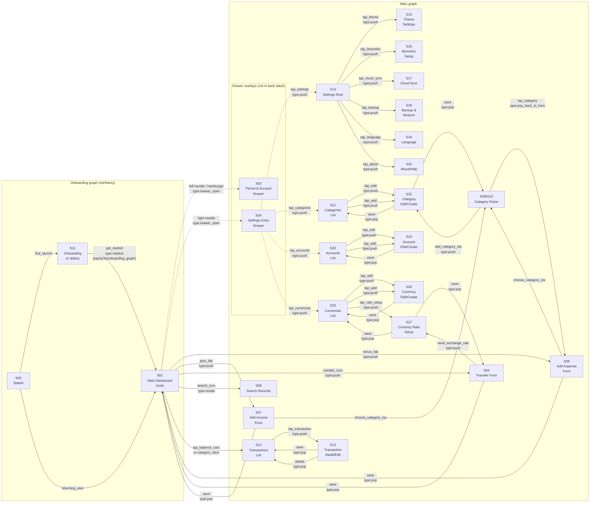

# Navigation Map — MyMoney (Monefy re-implementation)

> Inputs: `02_business.md`, `07_apk.md`, `user_answers_qB.yaml`, `user_answers_qC.yaml`
> Scope: full Monefy clone (qB1 = `full_monefy_clone`); no paywall (qB3); onboarding + transactions list added (qB2)
> UI framework: Jetpack Compose + Compose Navigation (single-Activity)
> M3 fidelity: close-to-original (qC4) — KEEP drawer pattern as Monefy signature

---

## Navigation architecture decision

Monefy uses a **single root screen (Main Dashboard)** with two `ModalNavigationDrawer`s
(left = period/account, right = settings entry), not a bottom navigation bar.
This pattern is a Monefy signature UX and is preserved in M3 using Compose
`ModalNavigationDrawer` components.

There are **no bottom navigation tabs**. The root of the main nav graph is `S01 main_dashboard`.
All other screens are either pushed onto the back stack (full-screen push) or overlay the
dashboard (drawers treated as composable state, not navigation destinations).

---

## Root destination

| Role | Screen ID | Slug | Notes |
|---|---|---|---|
| Single root | S01 | `main_dashboard` | Entry point after onboarding/splash. Exit app on system back. |

---

## Auth / Onboarding flow (separate nav graph)

```
S00 Splash (1 s) → S11 Onboarding (4-slide ViewPager) → S01 Main Dashboard
```

- `S00 → S11`: shown only on first launch (flag in DataStore). If not first launch: `S00 → S01` directly.
- `S11 → S01`: after last onboarding slide CTA ("Get started"). Uses `popUpTo("onboarding_graph") { inclusive = true }`.
- Both `S00` and `S11` are `noHistory` (back from S01 does NOT return to onboarding/splash).

---

## Screen inventory

| ID | Name | Screen Type | Role | Parent | Phase |
|---|---|---|---|---|---|
| S00 | Splash | standalone | standalone | — | MVP |
| S11 | Onboarding (4 slides) | standalone | standalone | — | MVP |
| S01 | Main Dashboard | dashboard | **root** | — | MVP |
| S02 | Period & Account Drawer | drawer | drawer-overlay | S01 | MVP |
| S04 | Settings Entry Drawer | drawer | drawer-overlay | S01 | MVP |
| S06 | Add Expense Form | form | push | S01 | MVP |
| S07 | Add Income Form | form | push | S01 | MVP |
| S03 | Transfer Form | form | push | S01 | MVP |
| S09/S10 | Category Picker | picker | push (within form flow) | S06/S07 | MVP |
| S12 | Transactions List | list | push | S01 | MVP |
| S13 | Transaction Detail / Edit | detail | push | S12 | MVP |
| S08 | Search Records | search | modal (full-screen) | S01 | MVP |
| S14 | Settings Root | settings | push | S01 (via S04 drawer) | MVP |
| S15 | Theme Settings | settings-sub | push | S14 | MVP |
| S16 | Biometric Lock Setup | settings-sub | push | S14 | MVP |
| S17 | Cloud Sync (Dropbox / Google Drive) | settings-sub | push | S14 | MVP |
| S18 | Backup & Restore | settings-sub | push | S14 | MVP |
| S19 | Language | settings-sub | push | S14 | MVP |
| S20 | About / Help | settings-sub | push | S14 | MVP |
| S21 | Categories List (CRUD) | list | push | S01 (via S04 drawer) | MVP |
| S22 | Category Edit / Create | form | push | S21 | MVP |
| S23 | Accounts List (CRUD) | list | push | S01 (via S04 drawer) | MVP |
| S24 | Account Edit / Create | form | push | S23 | MVP |
| S25 | Currencies List (CRUD) | list | push | S01 (via S04 drawer) | MVP |
| S26 | Currency Edit / Create | form | push | S25 | MVP |
| S27 | Currency Rate Setup (for transfers) | form | push | S03 or S25 | MVP |

**Total destinations: 27** (7 from screenshots + 20 added/inferred)

Drawers (S02, S04) are **composable state overlays**, not Navigation destinations — they
do not push onto the nav back stack. Closing a drawer via system back or scrim tap dismisses
it without navigating.

---

## Main flow diagram



---

## Edges (full list)

| From | To | Trigger | Type | Confidence | Notes |
|---|---|---|---|---|---|
| S00 | S11 | first_launch | replace | 0.95 | DataStore flag `onboarding_shown` |
| S00 | S01 | returning_user | replace | 0.95 | `onboarding_shown = true` |
| S11 | S01 | get_started | replace | 0.95 | popUpTo onboarding_graph inclusive |
| S01 | S02 | left_handle_tap / hamburger | drawer_open | 1.0 | Not a nav destination; composable state |
| S01 | S04 | right_handle_tap | drawer_open | 1.0 | Not a nav destination; composable state |
| S01 | S06 | minus_fab_tap | push | 1.0 | Red FAB bottom-left |
| S01 | S07 | plus_fab_tap | push | 1.0 | Green FAB bottom-right |
| S01 | S03 | transfer_icon_tap | push | 0.85 | Icon in toolbar (↔); see ambiguity N-1 |
| S01 | S08 | search_icon_tap | modal | 1.0 | Full-screen modal over dashboard |
| S01 | S12 | tap_balance_card | push | 0.90 | Resolves ambiguity A-2 from qB.yaml |
| S01 | S12 | tap_category_slice | push | 0.85 | Tapping donut segment opens filtered list |
| S06 | S09 | choose_category_cta | push | 1.0 | "ВЫБОР КАТЕГОРИИ" button |
| S07 | S09 | choose_category_cta | push | 1.0 | Same component, income type |
| S09 | S06 | tap_category | pop | 1.0 | Selects category, pops back to form |
| S09 | S22 | add_category_cta | push | 0.92 | "(+) ДОБАВИТЬ" tile |
| S22 | S09 | save | pop | 0.92 | Returns to picker with new category |
| S06 | S01 | save (after category select) | pop | 1.0 | Transaction saved → back to dashboard |
| S07 | S01 | save (after category select) | pop | 1.0 | |
| S03 | S01 | save | pop | 1.0 | Transfer saved → back to dashboard |
| S03 | S27 | accounts_differ_currency | push | 0.75 | Shown if src/dst accounts have diff currencies; see ambiguity N-2 |
| S27 | S03 | save | pop | 0.75 | Rate saved → back to transfer form |
| S12 | S13 | tap_transaction_item | push | 0.95 | |
| S13 | S12 | save | pop | 0.95 | |
| S13 | S12 | delete_confirm | pop | 0.95 | |
| S04 | S14 | tap_settings | push | 1.0 | Closes drawer, pushes settings |
| S04 | S21 | tap_categories | push | 1.0 | |
| S04 | S23 | tap_accounts | push | 1.0 | |
| S04 | S25 | tap_currencies | push | 1.0 | |
| S14 | S15 | tap_theme | push | 1.0 | |
| S14 | S16 | tap_biometric_lock | push | 1.0 | |
| S14 | S17 | tap_cloud_sync | push | 1.0 | |
| S14 | S18 | tap_backup_restore | push | 1.0 | |
| S14 | S19 | tap_language | push | 1.0 | |
| S14 | S20 | tap_about_help | push | 1.0 | |
| S15 | S14 | back | pop | 1.0 | |
| S16 | S14 | back | pop | 1.0 | |
| S17 | S14 | back | pop | 1.0 | Dropbox/GDrive OAuth completes, returns here |
| S18 | S14 | back | pop | 1.0 | |
| S19 | S14 | back | pop | 1.0 | |
| S20 | S14 | back | pop | 1.0 | |
| S21 | S22 | tap_edit_category | push | 1.0 | |
| S21 | S22 | tap_add_category | push | 1.0 | |
| S22 | S21 | save | pop | 1.0 | |
| S23 | S24 | tap_edit_account | push | 1.0 | |
| S23 | S24 | tap_add_account | push | 1.0 | |
| S24 | S23 | save | pop | 1.0 | |
| S25 | S26 | tap_edit_currency | push | 1.0 | |
| S25 | S26 | tap_add_currency | push | 1.0 | |
| S26 | S25 | save | pop | 1.0 | |
| S25 | S27 | tap_add_rate | push | 0.80 | Exchange rate CRUD from currencies screen |
| S27 | S25 | save | pop | 0.80 | |

---

## Drawer overlays detail

Drawers are **not** Navigation graph destinations. They are rendered as Compose
`ModalNavigationDrawer` (or a custom two-drawer wrapper) as siblings to the main content
within the `S01` composable scope.

| Drawer | Open trigger | Close triggers | Effect on back stack |
|---|---|---|---|
| S02 Left (Period & Account) | Left handle tap, hamburger icon | Scrim tap, back gesture, period/account selection | None — no back stack entry |
| S04 Right (Settings Entry) | Right handle tap | Scrim tap, back gesture, any menu item tap | None — menu items push new destinations after drawer closes |

When S04 menu item is tapped: drawer closes first (state change), then `navController.navigate(route)` fires.

---

## Back-stack strategy

| Rule | Detail |
|---|---|
| **Main is root** | `S01` is `startDestination`. System back from S01 = exit app (standard Android behavior). |
| **Onboarding never returns** | `S00`, `S11` use `noHistory`; `S11 → S01` uses `popUpTo("onboarding_graph") { inclusive = true }`. |
| **Drawers not in back stack** | Opening a drawer does NOT add a back stack entry. System back closes open drawer if open, else exits/pops normally. |
| **Forms pop to dashboard** | After save on S06/S07/S03 → `navController.popBackStack()` returns to S01. |
| **Category picker in form flow** | S09 is pushed on top of S06/S07; category selection pops S09, returning amount + category to the form. Back from S09 cancels category selection, returns to form. |
| **Settings hierarchy unwinds** | Each settings sub-screen is pushed; back from any sub = pop to S14; back from S14 = pop to S01 (drawer was not in stack). |
| **CRUD lists** | S21/S23/S25 are pushed from S01 (via drawer action). Each edit/create form pushed on top; save = pop. Back from S21/S23/S25 = pop to S01. |
| **Search is modal** | S08 is presented as a full-screen composable (not bottom sheet); system back dismisses it → pop to S01. |
| **Transactions list** | S12 pushed from S01; S13 pushed from S12; save/delete from S13 = pop to S12; back from S12 = pop to S01. |
| **Transfer currency rate** | S27 pushed from S03 (or S25). Save pops back to caller. |
| **Biometric lock** | If user has opted into biometric (S16), the app shows `EnterPasswordActivity` equivalent as a composable overlay (not a nav destination) on `onResume`. This does NOT change back stack. |

---

## Deep-link candidates

| Pattern | Target | Params | Source | Phase |
|---|---|---|---|---|
| `monefy://add-expense` | S06 | — | App Shortcut (new, based on APK shortcut strings) | MVP |
| `monefy://add-income` | S07 | — | App Shortcut (new) | MVP |
| `monefy://add-transfer` | S03 | — | App Shortcut (new) | MVP |
| `db-wxbzuly0x7v23t8://...` | S17 (Cloud Sync) | OAuth tokens | Dropbox OAuth callback (from APK manifest) | MVP |
| `com.google.android.apps.drive.DRIVE_OPEN` | S18 (Backup & Restore) | file URI | Google Drive file open intent (from APK manifest) | MVP |

Note: the original APK has **no** `monefy://` scheme in the manifest. We ADD it for App Shortcuts.
The Dropbox and Google Drive intents are carried over from the APK and pointed at the
appropriate screens in the re-implementation.

---

## App Shortcuts (Android 7.1+, API 25+)

Sourced from APK string resources (confirmed present in `07_apk.md` strings catalog):

| Shortcut ID | Short Label key | Long Label | Target route | Phase |
|---|---|---|---|---|
| `shortcut_expense` | `expense_transaction_shortcut_short_label` | "Add Expense" | `monefy://add-expense` → S06 | MVP |
| `shortcut_income` | `income_transaction_shortcut_short_label` | "Add Income" | `monefy://add-income` → S07 | MVP |
| `shortcut_transfer` | `transfer_transaction_shortcut_short_label` | "Add Transfer" | `monefy://add-transfer` → S03 | MVP |

Declare in `res/xml/shortcuts.xml`. Each shortcut deep-links into the main graph,
bypassing onboarding (the onboarding skip logic checks the DataStore flag at S00).

---

## Compose Navigation routes (reference)

```
// Onboarding graph
"onboarding_graph" {
  startDestination = "splash"
  "splash"          → S00
  "onboarding"      → S11
}

// Main graph
"main_graph" {
  startDestination = "dashboard"
  "dashboard"                → S01
  "add_expense"              → S06  // deep-link: monefy://add-expense
  "add_income"               → S07  // deep-link: monefy://add-income
  "transfer"                 → S03  // deep-link: monefy://add-transfer
  "search"                   → S08
  "category_picker/{type}"   → S09/S10  (type = expense | income)
  "transactions_list?category={id}&period={p}" → S12
  "transaction_detail/{id}"  → S13
  "settings"                 → S14
  "settings/theme"           → S15
  "settings/biometric"       → S16
  "settings/cloud_sync"      → S17
  "settings/backup"          → S18
  "settings/language"        → S19
  "settings/about"           → S20
  "categories"               → S21
  "category_edit?id={id}"    → S22  (id optional; absent = create mode)
  "accounts"                 → S23
  "account_edit?id={id}"     → S24
  "currencies"               → S25
  "currency_edit?id={id}"    → S26
  "currency_rate?id={id}"    → S27
}
```

---

## Ambiguities

| ID | Question | Confidence impact |
|---|---|---|
| N-1 | The ↔ icon in the dashboard toolbar (S01, S05) — is this "Transfer" shortcut or a display mode toggle (income/expense view)? APK has a separate transfer form but also a "swap" icon. Assumed: opens Transfer form. | S01→S03 edge confidence: 0.85 |
| N-2 | Currency Rate Setup (S27) — is it triggered automatically when a transfer between different-currency accounts is started, or is it only accessible from Currencies list? Both assumed true. | S03→S27 edge confidence: 0.75 |
| N-3 | Transactions List (S12) — does tapping a donut chart segment open a pre-filtered list (by category), or does it show a detail pop-up? Assumed: opens filtered S12. | S01→S12 edge confidence: 0.85 |
| N-4 | Category Picker (S09) back-navigation when accessed from S22 "Add category inline" — does saving the new category auto-select it, or does the user need to tap it? Assumed: auto-select and pop. | S22→S09 confidence: 0.92 |
| N-5 | Biometric lock flow — is the lock screen a full-screen composable presented on app foreground, or a separate navigation destination? Assumed: composable overlay (not nav destination) to avoid back-stack pollution. | Architecture decision; not yet confirmed. |
| N-6 | App Shortcuts deep-link behavior when biometric lock is enabled — should the lock screen appear before the shortcut target, or skip if app was recently unlocked? Assumed: standard Android BiometricPrompt on resume check covers this. | v1.1 edge case |
