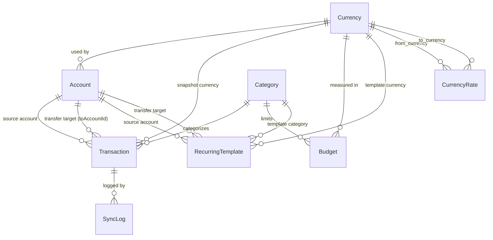
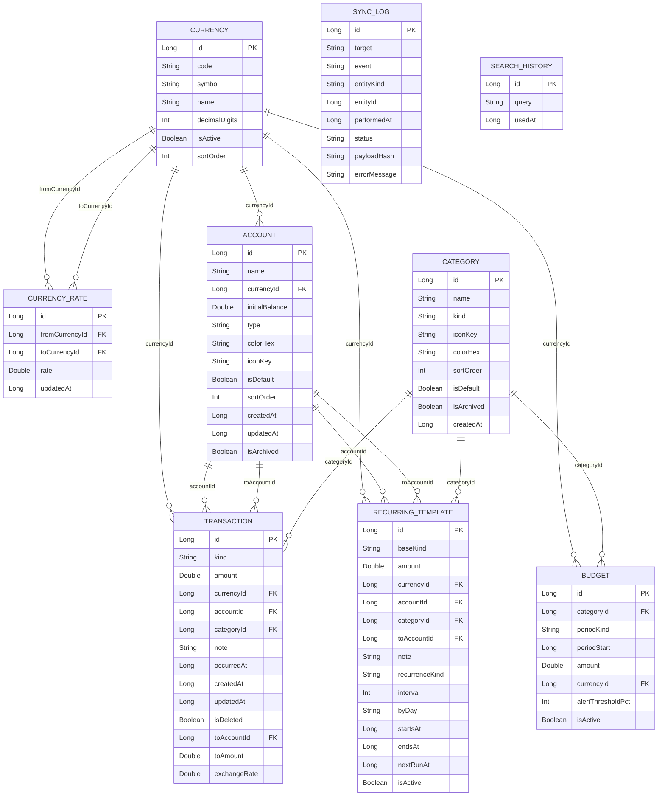

# Data Model — MyMoney (Monefy re-implementation)

> Derived from: `02_business.md`, `04_navigation.md`, `07_apk.md`, `user_answers_qB.yaml`, `user_answers_qC.yaml`
> Scope: full Monefy clone, no IAP, no ads, all Premium features unlocked for free.
> Storage stack: Room (SQLite) + DataStore Preferences + EncryptedSharedPreferences.
> All data is **local-first**. Network is used only for cloud-sync snapshot upload/download.

---

## Entities (10)

### 1. Currency

- **Purpose (RU):** Валюта, используемая в счетах и транзакциях. Поставляется как встроенный список + пользовательские.
- **Cache strategy:** `room`
- **Primary key:** `id: Long (autoGenerate)`

| Field | Type | Required | Source |
|---|---|---|---|
| id | Long | yes | S25, S26, S03 |
| code | String | yes | S02.account_dropdown "RUB", S03.amount_card "RUB" |
| symbol | String | yes | S03.amount_card "€", S06.amount_card "€" |
| name | String | yes | S25 list, S26 form |
| decimalDigits | Int | yes | (server-derived / bundled) |
| isActive | Boolean | yes | S25 list (active toggle) |
| sortOrder | Int | yes | S25 list ordering |

**Validation:**
- `code` must match `^[A-Z]{3}$`
- `symbol` non-blank, max 4 chars
- `name` non-blank, max 40 chars
- `decimalDigits` in `0..8`
- `sortOrder >= 0`

**Bundled seeds (ISO-4217):** USD, EUR, RUB, GBP, JPY, CNY, CHF, CAD, AUD, INR, BRL, KRW, MXN, SEK, NOK, DKK, PLN, CZK, HUF, TRY (20 currencies; all `isActive = false` except the first-launch default chosen during onboarding).

---

### 2. CurrencyRate

- **Purpose (RU):** Обменный курс между парой валют, используется при переводах между счетами с разными валютами.
- **Cache strategy:** `room`
- **Primary key:** `id: Long (autoGenerate)`

| Field | Type | Required | Source |
|---|---|---|---|
| id | Long | yes | S27 form |
| fromCurrencyId | Long | yes | S27.source_currency |
| toCurrencyId | Long | yes | S27.target_currency |
| rate | Double | yes | S27.rate_field |
| updatedAt | Long (epoch ms) | yes | S27 (set on save) |

**Unique constraint:** `(fromCurrencyId, toCurrencyId)` — only one rate per ordered pair.

**Validation:**
- `rate > 0.0`
- `fromCurrencyId != toCurrencyId`
- `updatedAt > 0`

---

### 3. Account

- **Purpose (RU):** Счёт пользователя (наличные, карта, накопительный и т.д.) с привязкой к валюте и начальным балансом.
- **Cache strategy:** `room`
- **Primary key:** `id: Long (autoGenerate)`

| Field | Type | Required | Source |
|---|---|---|---|
| id | Long | yes | S23, S24, S02.account_dropdown |
| name | String | yes | S02 "Динары", S03 "Наличные" / "Динары" |
| currencyId | Long | yes | S02 "RUB", S03 "RUB" (FK → Currency.id) |
| initialBalance | Double | yes | S24 form (account_initial_balance string) |
| type | String | yes | S24 form (cash/card/bank/savings) |
| colorHex | String | yes | S23 list (colored icon) |
| iconKey | String | yes | S23 list (drawable ref) |
| isDefault | Boolean | yes | S24 form (default account setting) |
| sortOrder | Int | yes | S23 list ordering |
| createdAt | Long (epoch ms) | yes | (server-derived) |
| updatedAt | Long (epoch ms) | yes | (server-derived) |
| isArchived | Boolean | yes | (APK: delete_category_account_explanation mentions disable option) |

**Computed (not stored):** `balance = initialBalance + SUM(income transactions) - SUM(expense transactions) + SUM(transfer_in) - SUM(transfer_out)`

**Validation:**
- `name` non-blank, max 32 chars
- `type` in `{ "cash", "card", "bank", "savings" }`
- `colorHex` matches `^#[0-9A-Fa-f]{6}$`
- `iconKey` non-blank, max 64 chars
- `initialBalance` finite Double (can be negative)
- `sortOrder >= 0`

**Seeds:** Two default accounts created on first launch: "Cash" (`type=cash`, `isDefault=true`) and one card account. Currency = default currency from onboarding.

---

### 4. Category

- **Purpose (RU):** Категория транзакции (расход или доход) с иконкой и цветом.
- **Cache strategy:** `room`
- **Primary key:** `id: Long (autoGenerate)`

| Field | Type | Required | Source |
|---|---|---|---|
| id | Long | yes | S09, S10, S21, S22 |
| name | String | yes | S09 "Здоровье", "Кафе", etc. |
| kind | String | yes | S09 = "expense" picker; implied "income" for income categories |
| iconKey | String | yes | S09/S10 grid icons |
| colorHex | String | yes | S01/S05 donut segment colors (14 distinct colors) |
| sortOrder | Int | yes | S09/S10 grid position |
| isDefault | Boolean | yes | seed categories flag |
| isArchived | Boolean | yes | APK: "disable it instead" of delete |
| createdAt | Long (epoch ms) | yes | (server-derived) |

**Validation:**
- `name` non-blank, max 32 chars
- `kind` in `{ "expense", "income" }`
- `colorHex` matches `^#[0-9A-Fa-f]{6}$`
- `iconKey` non-blank, max 64 chars
- `sortOrder >= 0`

**Default expense categories (15, from S09+S10):**
Гигиена, Еда, Жильё, Здоровье, Кафе, Машина, Одежда, Питомцы, Подарки, Развлечения, Связь, Спорт, Счета, Такси, Транспорт

**Default income categories (inferred from APK strings):**
Зарплата, Подарки (income), Другое — exact set to be confirmed; at minimum 1 income category for onboarding UX.

---

### 5. Transaction

- **Purpose (RU):** Финансовая запись — расход, доход или перевод между счетами.
- **Cache strategy:** `room`
- **Primary key:** `id: Long (autoGenerate)`

**Design note — Transfer approach:**
Two approaches exist:
- **Approach A**: Two linked `Transaction` rows (one expense on source, one income on target) with `linkedTransactionId` pointing to each other.
- **Approach B**: Single `Transaction` row with `kind=transfer`, `fromAccountId`, `toAccountId`, `fromAmount`, `toAmount`, `exchangeRate`.

**Recommendation: Approach B** (single row per transfer). Rationale: simpler JOIN queries for balance calculation, cleaner DAO, no risk of orphaned linked records on delete, and the transfer form (S03) naturally maps to a single entity. The balance query handles `kind=transfer` as a special case: subtract `fromAmount` from `fromAccount` balance, add `toAmount` to `toAccount` balance.

| Field | Type | Required | Source |
|---|---|---|---|
| id | Long | yes | S12, S13 |
| kind | String | yes | S06=expense, S07=income, S03=transfer |
| amount | Double | yes | S06/S07.amount_card, S03.amount_card |
| currencyId | Long | yes | S06 "RUB" (snapshot of currency at time of entry) |
| accountId | Long | yes | S03 source account, S06/S07 active account |
| categoryId | Long? | no | S09/S10 picker (null for transfers) |
| note | String? | no | S03/S06/S07.note_field "Заметка" |
| occurredAt | Long (epoch ms) | yes | S03/S06/S07.date_chip (transaction date, not record date) |
| createdAt | Long (epoch ms) | yes | (server-derived) |
| updatedAt | Long (epoch ms) | yes | (server-derived) |
| isDeleted | Boolean | yes | soft delete for sync consistency |
| toAccountId | Long? | no | S03.target_account (transfer only) |
| toAmount | Double? | no | S03 (transfer to different currency; = amount if same currency) |
| exchangeRate | Double? | no | S27 (transfer cross-currency rate; null if same currency) |

**Indexes:** `(accountId, occurredAt DESC)`, `(categoryId, occurredAt DESC)`, `(occurredAt DESC)`, `(isDeleted)`, `(toAccountId)` (for transfer queries).

**Validation:**
- `amount > 0.0`
- `kind` in `{ "expense", "income", "transfer" }`
- `categoryId` must be null if `kind = "transfer"`; must be non-null if `kind` in `{ "expense", "income" }`
- `toAccountId` must be non-null if `kind = "transfer"`, null otherwise
- `toAccountId != accountId` (APK: "Accounts have to be different")
- `toAmount > 0.0` if non-null
- `exchangeRate > 0.0` if non-null
- `note` max 256 chars

---

### 6. Budget

- **Purpose (RU):** Бюджетный лимит по категории или суммарный за период. Функция budget_mode из APK, в нашей реализации бесплатна.
- **Cache strategy:** `room`
- **Primary key:** `id: Long (autoGenerate)`

| Field | Type | Required | Source |
|---|---|---|---|
| id | Long | yes | (APK budget_mode_enabled string) |
| categoryId | Long? | no | null = total budget across all categories |
| periodKind | String | yes | day/week/month/year/custom |
| periodStart | Long (epoch ms) | yes | start of current budget window |
| amount | Double | yes | budget limit amount |
| currencyId | Long | yes | budget currency |
| alertThresholdPct | Int | yes | % of budget at which to alert (e.g. 80) |
| isActive | Boolean | yes | toggleable budget |

**Computed (not stored):** `actualSpent` — query sum of expense transactions in period matching `categoryId` (or all if null).

**Validation:**
- `amount > 0.0`
- `periodKind` in `{ "day", "week", "month", "year", "custom" }`
- `alertThresholdPct` in `1..100`
- `categoryId` FK must exist if non-null

---

### 7. RecurringTemplate

- **Purpose (RU):** Шаблон повторяющейся транзакции (расход/доход/перевод). Было Premium в оригинале, бесплатно в нашей реализации.
- **Cache strategy:** `room`
- **Primary key:** `id: Long (autoGenerate)`

| Field | Type | Required | Source |
|---|---|---|---|
| id | Long | yes | (APK recurring_records_hint string) |
| baseKind | String | yes | expense/income/transfer |
| amount | Double | yes | template amount |
| currencyId | Long | yes | FK → Currency.id |
| accountId | Long | yes | FK → Account.id |
| categoryId | Long? | no | FK → Category.id (null for transfers) |
| toAccountId | Long? | no | FK → Account.id (transfer target, null otherwise) |
| note | String? | no | optional note template |
| recurrenceKind | String | yes | daily/weekly/monthly/yearly |
| interval | Int | yes | every N days/weeks/months/years |
| byDay | String? | no | comma-sep DOW for weekly (e.g. "MON,WED,FRI") |
| startsAt | Long (epoch ms) | yes | first occurrence date |
| endsAt | Long? (epoch ms) | no | null = no end date |
| nextRunAt | Long (epoch ms) | yes | next scheduled execution (maintained by WorkManager job) |
| isActive | Boolean | yes | pause without deleting |

**Validation:**
- `amount > 0.0`
- `baseKind` in `{ "expense", "income", "transfer" }`
- `recurrenceKind` in `{ "daily", "weekly", "monthly", "yearly" }`
- `interval >= 1`
- `endsAt > startsAt` if non-null
- `nextRunAt >= startsAt`

---

### 8. AppSettings

- **Purpose (RU):** Единственная запись настроек пользователя. Хранится в DataStore Preferences, не в Room.
- **Cache strategy:** `prefs` (DataStore Preferences)
- **Primary key:** n/a — single document

| Field | Type | Default | Source |
|---|---|---|---|
| language | String | "system" | S19 Language settings |
| themeMode | String | "system" | S15 Theme settings |
| biometricLockEnabled | Boolean | false | S16 Biometric setup |
| soundEnabled | Boolean | true | S14 Settings root |
| hapticEnabled | Boolean | true | S14 Settings root |
| defaultAccountId | Long | -1 (first account) | S14 / S24 isDefault flag |
| defaultPeriod | String | "month" | S02 period selection |
| dateFirstDayOfWeek | Int | 1 (Monday) | S14 Settings |
| currencySymbolPosition | String | "before" | S14 Settings |
| onboardingCompletedAt | Long? | null | S11 last slide CTA |
| dropboxToken | String? | null | S17 Cloud Sync (store in EncryptedSharedPreferences, not DataStore) |
| gdriveAccountEmail | String? | null | S17 Cloud Sync (EncryptedSharedPreferences) |
| lastSyncAt | Long? | null | S17 sync result |
| autoSyncEnabled | Boolean | false | S17 Cloud Sync toggle |
| budgetModeEnabled | Boolean | false | S14 (APK: budget_mode_enabled string) |

**Notes:**
- `dropboxToken` and `gdriveAccountEmail` are stored in **EncryptedSharedPreferences**, NOT in DataStore. Only the `lastSyncAt` and `autoSyncEnabled` flags live in DataStore.
- `language`: `{ "system", "en", "ru" }` (APK confirmed ru split)
- `themeMode`: `{ "system", "light", "dark" }` (APK: dark mode confirmed, qC2)
- `defaultPeriod`: `{ "day", "week", "month", "year", "all" }`
- `currencySymbolPosition`: `{ "before", "after" }`
- `dateFirstDayOfWeek`: `1=Monday, 7=Sunday`

---

### 9. SyncLog

- **Purpose (RU):** Служебная таблица аудита облачной синхронизации (Dropbox / Google Drive).
- **Cache strategy:** `room`
- **Primary key:** `id: Long (autoGenerate)`

| Field | Type | Required | Source |
|---|---|---|---|
| id | Long | yes | (sync infrastructure) |
| target | String | yes | "dropbox" / "gdrive" |
| event | String | yes | "push" / "pull" / "conflict" / "error" |
| entityKind | String? | no | "transaction" / "account" / "category" / "full_db" |
| entityId | Long? | no | FK to affected entity (null for full_db) |
| performedAt | Long (epoch ms) | yes | timestamp |
| status | String | yes | "success" / "failure" / "partial" |
| payloadHash | String? | no | SHA-256 of exported data (for conflict detection) |
| errorMessage | String? | no | failure reason if status=failure |

**Validation:**
- `target` in `{ "dropbox", "gdrive" }`
- `event` in `{ "push", "pull", "conflict", "error" }`
- `status` in `{ "success", "failure", "partial" }`
- Auto-prune: keep last 100 rows per target (enforced in DAO)

---

### 10. SearchHistory (auxiliary)

- **Purpose (RU):** История поисковых запросов (экран S08). APK использует MaterialSearchView с собственным ContentProvider — мы заменяем на простую Room-таблицу.
- **Cache strategy:** `room`
- **Primary key:** `id: Long (autoGenerate)`

| Field | Type | Required | Source |
|---|---|---|---|
| id | Long | yes | S08 search screen |
| query | String | yes | S08.search_field text |
| usedAt | Long (epoch ms) | yes | timestamp of last use |

**Validation:**
- `query` non-blank, max 128 chars
- Keep only last 20 distinct queries (enforced in DAO prune)

---

## Relations



| From | To | Cardinality | Kind | FK field |
|---|---|---|---|---|
| Account | Currency | many-to-one | belongs_to | `Account.currencyId` → `Currency.id` |
| Transaction | Currency | many-to-one | belongs_to | `Transaction.currencyId` → `Currency.id` |
| Transaction | Account | many-to-one | belongs_to | `Transaction.accountId` → `Account.id` |
| Transaction | Account | many-to-one | belongs_to (transfer) | `Transaction.toAccountId` → `Account.id` |
| Transaction | Category | many-to-one | belongs_to (nullable) | `Transaction.categoryId` → `Category.id` |
| Budget | Category | many-to-one | belongs_to (nullable) | `Budget.categoryId` → `Category.id` |
| Budget | Currency | many-to-one | belongs_to | `Budget.currencyId` → `Currency.id` |
| RecurringTemplate | Currency | many-to-one | belongs_to | `RecurringTemplate.currencyId` → `Currency.id` |
| RecurringTemplate | Account | many-to-one | belongs_to | `RecurringTemplate.accountId` → `Account.id` |
| RecurringTemplate | Account | many-to-one | belongs_to (transfer) | `RecurringTemplate.toAccountId` → `Account.id` |
| RecurringTemplate | Category | many-to-one | belongs_to (nullable) | `RecurringTemplate.categoryId` → `Category.id` |
| CurrencyRate | Currency | many-to-one | belongs_to | `CurrencyRate.fromCurrencyId` → `Currency.id` |
| CurrencyRate | Currency | many-to-one | belongs_to | `CurrencyRate.toCurrencyId` → `Currency.id` |
| SyncLog | (entity) | many-to-one | audit | `SyncLog.entityId` (polymorphic, no FK constraint) |

---

## Cache strategy summary

| Entity | Strategy | Reason |
|---|---|---|
| Currency | room | Referenced everywhere; must work offline |
| CurrencyRate | room | Needed offline for transfer amount calculations |
| Account | room | Core entity; balance shown on every screen (S01) |
| Category | room | Picker (S09/S10) must be instant; works offline |
| Transaction | room | All data is local-first; no backend; offline write critical |
| Budget | room | Budget progress shown on dashboard; offline read |
| RecurringTemplate | room | WorkManager fires even when offline |
| AppSettings | prefs (DataStore) | Single key-value document; no relational queries needed |
| AppSettings — credentials | EncryptedSharedPreferences | Dropbox token + GDrive email are sensitive; not in plaintext DataStore |
| SyncLog | room | Audit trail; needed after offline→online transition |
| SearchHistory | room | Recent queries needed offline; bounded size |

---

## ER Diagram



---

## Kotlin Data Classes

### CurrencyEntity

```kotlin
@Entity(tableName = "currencies")
data class CurrencyEntity(
    @PrimaryKey(autoGenerate = true) val id: Long = 0,
    @ColumnInfo(name = "code") val code: String,           // ISO-4217, e.g. "USD"
    @ColumnInfo(name = "symbol") val symbol: String,       // e.g. "$"
    @ColumnInfo(name = "name") val name: String,           // e.g. "US Dollar"
    @ColumnInfo(name = "decimal_digits") val decimalDigits: Int = 2,
    @ColumnInfo(name = "is_active") val isActive: Boolean = false,
    @ColumnInfo(name = "sort_order") val sortOrder: Int = 0,
)
```

### CurrencyRateEntity

```kotlin
@Entity(
    tableName = "currency_rates",
    foreignKeys = [
        ForeignKey(entity = CurrencyEntity::class, parentColumns = ["id"], childColumns = ["from_currency_id"], onDelete = ForeignKey.RESTRICT),
        ForeignKey(entity = CurrencyEntity::class, parentColumns = ["id"], childColumns = ["to_currency_id"], onDelete = ForeignKey.RESTRICT),
    ],
    indices = [Index(value = ["from_currency_id", "to_currency_id"], unique = true)],
)
data class CurrencyRateEntity(
    @PrimaryKey(autoGenerate = true) val id: Long = 0,
    @ColumnInfo(name = "from_currency_id") val fromCurrencyId: Long,
    @ColumnInfo(name = "to_currency_id") val toCurrencyId: Long,
    @ColumnInfo(name = "rate") val rate: Double,
    @ColumnInfo(name = "updated_at") val updatedAt: Long,
)
```

### AccountEntity

```kotlin
@Entity(
    tableName = "accounts",
    foreignKeys = [
        ForeignKey(entity = CurrencyEntity::class, parentColumns = ["id"], childColumns = ["currency_id"], onDelete = ForeignKey.RESTRICT),
    ],
    indices = [Index("currency_id"), Index("sort_order")],
)
data class AccountEntity(
    @PrimaryKey(autoGenerate = true) val id: Long = 0,
    @ColumnInfo(name = "name") val name: String,
    @ColumnInfo(name = "currency_id") val currencyId: Long,
    @ColumnInfo(name = "initial_balance") val initialBalance: Double = 0.0,
    @ColumnInfo(name = "type") val type: String = "cash",   // cash|card|bank|savings
    @ColumnInfo(name = "color_hex") val colorHex: String = "#7ac794",
    @ColumnInfo(name = "icon_key") val iconKey: String = "ic_cash",
    @ColumnInfo(name = "is_default") val isDefault: Boolean = false,
    @ColumnInfo(name = "sort_order") val sortOrder: Int = 0,
    @ColumnInfo(name = "created_at") val createdAt: Long,
    @ColumnInfo(name = "updated_at") val updatedAt: Long,
    @ColumnInfo(name = "is_archived") val isArchived: Boolean = false,
)
```

### CategoryEntity

```kotlin
@Entity(
    tableName = "categories",
    indices = [Index("kind"), Index("sort_order")],
)
data class CategoryEntity(
    @PrimaryKey(autoGenerate = true) val id: Long = 0,
    @ColumnInfo(name = "name") val name: String,
    @ColumnInfo(name = "kind") val kind: String,            // expense|income
    @ColumnInfo(name = "icon_key") val iconKey: String,
    @ColumnInfo(name = "color_hex") val colorHex: String,
    @ColumnInfo(name = "sort_order") val sortOrder: Int = 0,
    @ColumnInfo(name = "is_default") val isDefault: Boolean = false,
    @ColumnInfo(name = "is_archived") val isArchived: Boolean = false,
    @ColumnInfo(name = "created_at") val createdAt: Long,
)
```

### TransactionEntity

```kotlin
@Entity(
    tableName = "transactions",
    foreignKeys = [
        ForeignKey(entity = CurrencyEntity::class, parentColumns = ["id"], childColumns = ["currency_id"], onDelete = ForeignKey.RESTRICT),
        ForeignKey(entity = AccountEntity::class, parentColumns = ["id"], childColumns = ["account_id"], onDelete = ForeignKey.RESTRICT),
        ForeignKey(entity = AccountEntity::class, parentColumns = ["id"], childColumns = ["to_account_id"], onDelete = ForeignKey.SET_NULL),
        ForeignKey(entity = CategoryEntity::class, parentColumns = ["id"], childColumns = ["category_id"], onDelete = ForeignKey.SET_NULL),
    ],
    indices = [
        Index("account_id"),
        Index("to_account_id"),
        Index("category_id"),
        Index(value = ["account_id", "occurred_at"]),
        Index(value = ["category_id", "occurred_at"]),
        Index("occurred_at"),
        Index("is_deleted"),
    ],
)
data class TransactionEntity(
    @PrimaryKey(autoGenerate = true) val id: Long = 0,
    @ColumnInfo(name = "kind") val kind: String,            // expense|income|transfer
    @ColumnInfo(name = "amount") val amount: Double,
    @ColumnInfo(name = "currency_id") val currencyId: Long,
    @ColumnInfo(name = "account_id") val accountId: Long,
    @ColumnInfo(name = "category_id") val categoryId: Long? = null,
    @ColumnInfo(name = "note") val note: String? = null,
    @ColumnInfo(name = "occurred_at") val occurredAt: Long,
    @ColumnInfo(name = "created_at") val createdAt: Long,
    @ColumnInfo(name = "updated_at") val updatedAt: Long,
    @ColumnInfo(name = "is_deleted") val isDeleted: Boolean = false,
    // Transfer-only fields
    @ColumnInfo(name = "to_account_id") val toAccountId: Long? = null,
    @ColumnInfo(name = "to_amount") val toAmount: Double? = null,
    @ColumnInfo(name = "exchange_rate") val exchangeRate: Double? = null,
)
```

### BudgetEntity

```kotlin
@Entity(
    tableName = "budgets",
    foreignKeys = [
        ForeignKey(entity = CategoryEntity::class, parentColumns = ["id"], childColumns = ["category_id"], onDelete = ForeignKey.CASCADE),
        ForeignKey(entity = CurrencyEntity::class, parentColumns = ["id"], childColumns = ["currency_id"], onDelete = ForeignKey.RESTRICT),
    ],
    indices = [Index("category_id"), Index("currency_id")],
)
data class BudgetEntity(
    @PrimaryKey(autoGenerate = true) val id: Long = 0,
    @ColumnInfo(name = "category_id") val categoryId: Long? = null, // null = total budget
    @ColumnInfo(name = "period_kind") val periodKind: String,
    @ColumnInfo(name = "period_start") val periodStart: Long,
    @ColumnInfo(name = "amount") val amount: Double,
    @ColumnInfo(name = "currency_id") val currencyId: Long,
    @ColumnInfo(name = "alert_threshold_pct") val alertThresholdPct: Int = 80,
    @ColumnInfo(name = "is_active") val isActive: Boolean = true,
)
```

### RecurringTemplateEntity

```kotlin
@Entity(
    tableName = "recurring_templates",
    foreignKeys = [
        ForeignKey(entity = CurrencyEntity::class, parentColumns = ["id"], childColumns = ["currency_id"], onDelete = ForeignKey.RESTRICT),
        ForeignKey(entity = AccountEntity::class, parentColumns = ["id"], childColumns = ["account_id"], onDelete = ForeignKey.RESTRICT),
        ForeignKey(entity = AccountEntity::class, parentColumns = ["id"], childColumns = ["to_account_id"], onDelete = ForeignKey.SET_NULL),
        ForeignKey(entity = CategoryEntity::class, parentColumns = ["id"], childColumns = ["category_id"], onDelete = ForeignKey.SET_NULL),
    ],
    indices = [Index("next_run_at"), Index("is_active"), Index("account_id")],
)
data class RecurringTemplateEntity(
    @PrimaryKey(autoGenerate = true) val id: Long = 0,
    @ColumnInfo(name = "base_kind") val baseKind: String,
    @ColumnInfo(name = "amount") val amount: Double,
    @ColumnInfo(name = "currency_id") val currencyId: Long,
    @ColumnInfo(name = "account_id") val accountId: Long,
    @ColumnInfo(name = "category_id") val categoryId: Long? = null,
    @ColumnInfo(name = "to_account_id") val toAccountId: Long? = null,
    @ColumnInfo(name = "note") val note: String? = null,
    @ColumnInfo(name = "recurrence_kind") val recurrenceKind: String,
    @ColumnInfo(name = "interval") val interval: Int = 1,
    @ColumnInfo(name = "by_day") val byDay: String? = null,
    @ColumnInfo(name = "starts_at") val startsAt: Long,
    @ColumnInfo(name = "ends_at") val endsAt: Long? = null,
    @ColumnInfo(name = "next_run_at") val nextRunAt: Long,
    @ColumnInfo(name = "is_active") val isActive: Boolean = true,
)
```

### SyncLogEntity

```kotlin
@Entity(tableName = "sync_log", indices = [Index("performed_at"), Index("target")])
data class SyncLogEntity(
    @PrimaryKey(autoGenerate = true) val id: Long = 0,
    @ColumnInfo(name = "target") val target: String,           // dropbox|gdrive
    @ColumnInfo(name = "event") val event: String,             // push|pull|conflict|error
    @ColumnInfo(name = "entity_kind") val entityKind: String? = null,
    @ColumnInfo(name = "entity_id") val entityId: Long? = null,
    @ColumnInfo(name = "performed_at") val performedAt: Long,
    @ColumnInfo(name = "status") val status: String,           // success|failure|partial
    @ColumnInfo(name = "payload_hash") val payloadHash: String? = null,
    @ColumnInfo(name = "error_message") val errorMessage: String? = null,
)
```

### SearchHistoryEntity

```kotlin
@Entity(tableName = "search_history", indices = [Index("used_at")])
data class SearchHistoryEntity(
    @PrimaryKey(autoGenerate = true) val id: Long = 0,
    @ColumnInfo(name = "query") val query: String,
    @ColumnInfo(name = "used_at") val usedAt: Long,
)
```

---

## Domain Models (repository layer, no Room annotations)

```kotlin
data class Account(
    val id: Long,
    val name: String,
    val currency: Currency,
    val initialBalance: Double,
    val type: AccountType,
    val colorHex: String,
    val iconKey: String,
    val isDefault: Boolean,
    val sortOrder: Int,
    val isArchived: Boolean,
    val computedBalance: Double,   // resolved by AccountRepository
)

enum class AccountType { CASH, CARD, BANK, SAVINGS }

data class Transaction(
    val id: Long,
    val kind: TransactionKind,
    val amount: Double,
    val currency: Currency,
    val account: Account,
    val category: Category?,       // null for transfers
    val note: String?,
    val occurredAt: Long,
    val toAccount: Account?,       // transfer target
    val toAmount: Double?,
    val exchangeRate: Double?,
)

enum class TransactionKind { EXPENSE, INCOME, TRANSFER }
```

---

## DAO Interfaces

### CurrencyDao

```kotlin
@Dao
interface CurrencyDao {
    @Query("SELECT * FROM currencies WHERE is_active = 1 ORDER BY sort_order ASC")
    fun observeActiveCurrencies(): Flow<List<CurrencyEntity>>

    @Query("SELECT * FROM currencies ORDER BY sort_order ASC")
    fun observeAll(): Flow<List<CurrencyEntity>>

    @Query("SELECT * FROM currencies WHERE id = :id")
    suspend fun findById(id: Long): CurrencyEntity?

    @Query("SELECT * FROM currencies WHERE code = :code LIMIT 1")
    suspend fun findByCode(code: String): CurrencyEntity?

    @Upsert
    suspend fun upsertAll(items: List<CurrencyEntity>)

    @Upsert
    suspend fun upsert(item: CurrencyEntity): Long

    @Query("UPDATE currencies SET is_active = :active WHERE id = :id")
    suspend fun setActive(id: Long, active: Boolean)
}
```

### CurrencyRateDao

```kotlin
@Dao
interface CurrencyRateDao {
    @Query("SELECT * FROM currency_rates WHERE from_currency_id = :from AND to_currency_id = :to LIMIT 1")
    suspend fun findRate(from: Long, to: Long): CurrencyRateEntity?

    @Query("SELECT * FROM currency_rates ORDER BY updated_at DESC")
    fun observeAll(): Flow<List<CurrencyRateEntity>>

    @Upsert
    suspend fun upsert(rate: CurrencyRateEntity): Long

    @Query("DELETE FROM currency_rates WHERE id = :id")
    suspend fun deleteById(id: Long)
}
```

### AccountDao

```kotlin
@Dao
interface AccountDao {
    @Query("SELECT * FROM accounts WHERE is_archived = 0 ORDER BY sort_order ASC")
    fun observeActive(): Flow<List<AccountEntity>>

    @Query("SELECT * FROM accounts WHERE id = :id")
    suspend fun findById(id: Long): AccountEntity?

    @Query("SELECT * FROM accounts WHERE is_default = 1 LIMIT 1")
    suspend fun findDefault(): AccountEntity?

    // Compute balance: initialBalance + SUM income - SUM expense + SUM transfer_in - SUM transfer_out
    @Query("""
        SELECT a.initial_balance
            + COALESCE((SELECT SUM(t.amount) FROM transactions t WHERE t.account_id = a.id AND t.kind = 'income' AND t.is_deleted = 0), 0)
            - COALESCE((SELECT SUM(t.amount) FROM transactions t WHERE t.account_id = a.id AND t.kind = 'expense' AND t.is_deleted = 0), 0)
            + COALESCE((SELECT SUM(t.to_amount) FROM transactions t WHERE t.to_account_id = a.id AND t.kind = 'transfer' AND t.is_deleted = 0), 0)
            - COALESCE((SELECT SUM(t.amount) FROM transactions t WHERE t.account_id = a.id AND t.kind = 'transfer' AND t.is_deleted = 0), 0)
        FROM accounts a WHERE a.id = :accountId
    """)
    suspend fun computeBalance(accountId: Long): Double

    @Upsert
    suspend fun upsert(account: AccountEntity): Long

    @Query("UPDATE accounts SET is_archived = 1 WHERE id = :id")
    suspend fun archive(id: Long)

    @Query("UPDATE accounts SET is_default = 0")
    suspend fun clearDefault()

    @Query("UPDATE accounts SET is_default = 1 WHERE id = :id")
    suspend fun setDefault(id: Long)

    @Transaction
    suspend fun setDefaultAccount(id: Long) {
        clearDefault()
        setDefault(id)
    }
}
```

### CategoryDao

```kotlin
@Dao
interface CategoryDao {
    @Query("SELECT * FROM categories WHERE is_archived = 0 AND kind = :kind ORDER BY sort_order ASC")
    fun observeByKind(kind: String): Flow<List<CategoryEntity>>

    @Query("SELECT * FROM categories WHERE is_archived = 0 ORDER BY kind ASC, sort_order ASC")
    fun observeAll(): Flow<List<CategoryEntity>>

    @Query("SELECT * FROM categories WHERE id = :id")
    suspend fun findById(id: Long): CategoryEntity?

    @Upsert
    suspend fun upsert(category: CategoryEntity): Long

    @Query("UPDATE categories SET is_archived = 1 WHERE id = :id")
    suspend fun archive(id: Long)

    @Upsert
    suspend fun upsertAll(categories: List<CategoryEntity>)
}
```

### TransactionDao

```kotlin
@Dao
interface TransactionDao {
    // Paged feed for S12 Transactions List
    @Query("""
        SELECT * FROM transactions
        WHERE is_deleted = 0 AND account_id = :accountId
        AND occurred_at BETWEEN :from AND :to
        ORDER BY occurred_at DESC
        LIMIT :limit OFFSET :offset
    """)
    suspend fun pagedByAccount(accountId: Long, from: Long, to: Long, limit: Int, offset: Int): List<TransactionEntity>

    // Recent N transactions for dashboard preview
    @Query("SELECT * FROM transactions WHERE is_deleted = 0 ORDER BY occurred_at DESC LIMIT :limit")
    fun observeRecent(limit: Int): Flow<List<TransactionEntity>>

    // S01 dashboard donut: category breakdown for period
    @Query("""
        SELECT category_id, SUM(amount) as total
        FROM transactions
        WHERE is_deleted = 0 AND kind = 'expense'
        AND account_id = :accountId
        AND occurred_at BETWEEN :from AND :to
        GROUP BY category_id
        ORDER BY total DESC
    """)
    suspend fun getCategorySummaryForPeriod(accountId: Long, from: Long, to: Long): List<CategorySummary>

    // S01 dashboard balance card totals
    @Query("""
        SELECT
          COALESCE(SUM(CASE WHEN kind = 'income' THEN amount ELSE 0 END), 0) as totalIncome,
          COALESCE(SUM(CASE WHEN kind = 'expense' THEN amount ELSE 0 END), 0) as totalExpense
        FROM transactions
        WHERE is_deleted = 0 AND account_id = :accountId
        AND occurred_at BETWEEN :from AND :to
    """)
    suspend fun getMonthlyBalance(accountId: Long, from: Long, to: Long): BalanceSummary

    // S08 text search
    @Query("""
        SELECT * FROM transactions
        WHERE is_deleted = 0 AND note LIKE '%' || :query || '%'
        ORDER BY occurred_at DESC LIMIT 50
    """)
    suspend fun searchByNote(query: String): List<TransactionEntity>

    @Query("SELECT * FROM transactions WHERE id = :id")
    suspend fun findById(id: Long): TransactionEntity?

    @Upsert
    suspend fun upsert(transaction: TransactionEntity): Long

    // Soft delete
    @Query("UPDATE transactions SET is_deleted = 1, updated_at = :now WHERE id = :id")
    suspend fun softDelete(id: Long, now: Long)

    // Prune old soft-deleted rows to reclaim space
    @Query("DELETE FROM transactions WHERE is_deleted = 1 AND updated_at < :before")
    suspend fun pruneDeleted(before: Long)
}

data class CategorySummary(val categoryId: Long, val total: Double)
data class BalanceSummary(val totalIncome: Double, val totalExpense: Double)
```

### BudgetDao

```kotlin
@Dao
interface BudgetDao {
    @Query("SELECT * FROM budgets WHERE is_active = 1")
    fun observeActive(): Flow<List<BudgetEntity>>

    @Query("SELECT * FROM budgets WHERE category_id = :categoryId AND is_active = 1 LIMIT 1")
    suspend fun findForCategory(categoryId: Long): BudgetEntity?

    @Query("SELECT * FROM budgets WHERE category_id IS NULL AND is_active = 1 LIMIT 1")
    suspend fun findTotalBudget(): BudgetEntity?

    @Upsert
    suspend fun upsert(budget: BudgetEntity): Long

    @Query("UPDATE budgets SET is_active = 0 WHERE id = :id")
    suspend fun deactivate(id: Long)
}
```

### RecurringTemplateDao

```kotlin
@Dao
interface RecurringTemplateDao {
    @Query("SELECT * FROM recurring_templates WHERE is_active = 1 AND next_run_at <= :now ORDER BY next_run_at ASC")
    suspend fun findDue(now: Long): List<RecurringTemplateEntity>

    @Query("SELECT * FROM recurring_templates ORDER BY starts_at DESC")
    fun observeAll(): Flow<List<RecurringTemplateEntity>>

    @Upsert
    suspend fun upsert(template: RecurringTemplateEntity): Long

    @Query("UPDATE recurring_templates SET next_run_at = :nextRunAt WHERE id = :id")
    suspend fun updateNextRun(id: Long, nextRunAt: Long)

    @Query("UPDATE recurring_templates SET is_active = 0 WHERE id = :id")
    suspend fun deactivate(id: Long)
}
```

### SyncLogDao

```kotlin
@Dao
interface SyncLogDao {
    @Insert
    suspend fun insert(entry: SyncLogEntity): Long

    @Query("SELECT * FROM sync_log WHERE target = :target ORDER BY performed_at DESC LIMIT 20")
    suspend fun recentByTarget(target: String): List<SyncLogEntity>

    // Keep only last 100 rows per target
    @Query("""
        DELETE FROM sync_log WHERE id IN (
          SELECT id FROM sync_log WHERE target = :target
          ORDER BY performed_at DESC LIMIT -1 OFFSET 100
        )
    """)
    suspend fun pruneOldEntries(target: String)
}
```

### SearchHistoryDao

```kotlin
@Dao
interface SearchHistoryDao {
    @Query("SELECT * FROM search_history ORDER BY used_at DESC LIMIT 20")
    fun observe(): Flow<List<SearchHistoryEntity>>

    @Query("INSERT OR REPLACE INTO search_history(query, used_at) VALUES(:query, :usedAt)")
    suspend fun insertOrUpdate(query: String, usedAt: Long)

    @Query("DELETE FROM search_history WHERE id IN (SELECT id FROM search_history ORDER BY used_at DESC LIMIT -1 OFFSET 20)")
    suspend fun pruneToLimit()
}
```

---

## Database Definition

```kotlin
@Database(
    entities = [
        CurrencyEntity::class,
        CurrencyRateEntity::class,
        AccountEntity::class,
        CategoryEntity::class,
        TransactionEntity::class,
        BudgetEntity::class,
        RecurringTemplateEntity::class,
        SyncLogEntity::class,
        SearchHistoryEntity::class,
    ],
    version = 1,
    exportSchema = true,
    autoMigrations = [],   // none yet; see migration plan below
)
@TypeConverters(/* none needed — all fields are primitives or Long epoch ms */)
abstract class MoneyDatabase : RoomDatabase() {
    abstract fun currencyDao(): CurrencyDao
    abstract fun currencyRateDao(): CurrencyRateDao
    abstract fun accountDao(): AccountDao
    abstract fun categoryDao(): CategoryDao
    abstract fun transactionDao(): TransactionDao
    abstract fun budgetDao(): BudgetDao
    abstract fun recurringTemplateDao(): RecurringTemplateDao
    abstract fun syncLogDao(): SyncLogDao
    abstract fun searchHistoryDao(): SearchHistoryDao
}
```

---

## Migration Plan

| Version | Changes | Strategy |
|---|---|---|
| v1 | Initial schema. All 9 tables. | Room `createFromAsset` or `fallbackToDestructiveMigration` on dev builds only |
| v1 → v2 (placeholder) | Add `tags: TEXT` column to `transactions` if tag feature requested | Room `AutoMigration(from=1, to=2)` with `@RenameColumn`/`@DeleteColumn` spec |
| v1 → v2 (alternative) | Add `spending_goals` table | Manual `Migration(1, 2)` with `execSQL("CREATE TABLE spending_goals ...")` |

**Tunnel pattern scaffold (v1→v2):**
```kotlin
// In MoneyDatabase:
@Database(version = 2, autoMigrations = [AutoMigration(from = 1, to = 2)])
// OR for structural changes that AutoMigration cannot handle:
val MIGRATION_1_2 = object : Migration(1, 2) {
    override fun migrate(db: SupportSQLiteDatabase) {
        db.execSQL("ALTER TABLE transactions ADD COLUMN tags TEXT DEFAULT NULL")
    }
}
// Register in databaseBuilder:
Room.databaseBuilder(context, MoneyDatabase::class.java, "monefy.db")
    .addMigrations(MIGRATION_1_2)
    .build()
```

---

## Validation Rules (consolidated)

| Entity | Field | Rule |
|---|---|---|
| Currency | code | `^[A-Z]{3}$` (ISO-4217) |
| Currency | symbol | non-blank, max 4 chars |
| Currency | name | non-blank, max 40 chars |
| Currency | decimalDigits | `0..8` |
| CurrencyRate | rate | `> 0.0` |
| CurrencyRate | fromCurrencyId | `!= toCurrencyId` |
| CurrencyRate | (pair) | unique `(fromCurrencyId, toCurrencyId)` |
| Account | name | non-blank, max 32 chars |
| Account | type | in `{cash, card, bank, savings}` |
| Account | colorHex | `^#[0-9A-Fa-f]{6}$` |
| Account | iconKey | non-blank, max 64 chars |
| Account | initialBalance | finite Double |
| Category | name | non-blank, max 32 chars |
| Category | kind | in `{expense, income}` |
| Category | colorHex | `^#[0-9A-Fa-f]{6}$` |
| Transaction | amount | `> 0.0` |
| Transaction | kind | in `{expense, income, transfer}` |
| Transaction | categoryId | non-null if `kind != transfer`; null if `kind == transfer` |
| Transaction | toAccountId | non-null if `kind == transfer`; null otherwise |
| Transaction | toAccountId | `!= accountId` (from APK string "Accounts have to be different") |
| Transaction | toAmount | `> 0.0` if non-null |
| Transaction | exchangeRate | `> 0.0` if non-null |
| Transaction | note | max 256 chars |
| Budget | amount | `> 0.0` |
| Budget | periodKind | in `{day, week, month, year, custom}` |
| Budget | alertThresholdPct | `1..100` |
| RecurringTemplate | amount | `> 0.0` |
| RecurringTemplate | recurrenceKind | in `{daily, weekly, monthly, yearly}` |
| RecurringTemplate | interval | `>= 1` |
| RecurringTemplate | endsAt | `> startsAt` if non-null |
| SyncLog | target | in `{dropbox, gdrive}` |
| SyncLog | status | in `{success, failure, partial}` |
| SearchHistory | query | non-blank, max 128 chars |

---

## Ambiguities

| ID | Question (RU) |
|---|---|
| D-1 | Перевод между счетами с разными валютами (S03, S27): при отсутствии сохранённого курса — должен ли экран S27 открываться автоматически или пользователь должен нажать отдельную кнопку «Указать курс»? Влияет на flow-логику в TransferViewModel. |
| D-2 | Удаление категории (S22): APK-строка "All associated records will be removed. You can merge or disable it instead" — реализуем ли мы «объединение» (merge) или только архивирование? Если merge — нужен дополнительный метод в CategoryDao и UI в S22. |
| D-3 | Бюджет (S14): отображается ли progress-bar на главном экране S01 (вокруг доната или под ним) или только в отдельном разделе настроек? Влияет на то, нужен ли Flow<BudgetWithProgress> в DashboardViewModel. |
| D-4 | RecurringTemplate: WorkManager-джоб запускает шаблон и создаёт транзакцию — нужно ли показывать уведомление пользователю после автосоздания? Если да — нужен отдельный NotificationChannel. |
| D-5 | Категории дохода по умолчанию: из APK подтверждена только строка "recurring_records_hint" и нет явного списка income-категорий. Нужно уточнить — использовать ли минимум {"Зарплата", "Другое"} или копировать часть expense-категорий с kind=income. |
| D-6 | Перевод — Approach B (одна строка): при отображении в S12 (Transactions List) перевод показывается как одна запись или как две (расход из source + доход в target)? Влияет на запрос в TransactionDao.pagedByAccount и UI-логику. |
