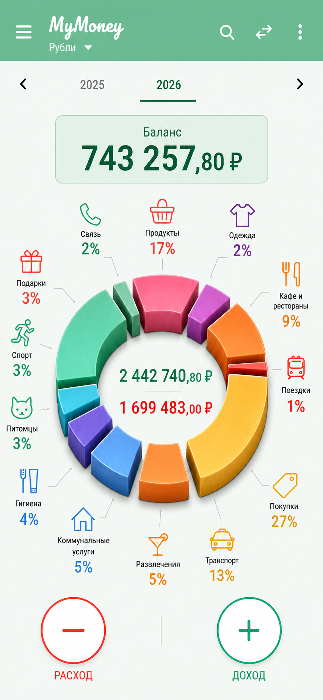

# Dashboard Final 38 Implementation Spec

Date: 2026-06-05

Status: final visual target for a future implementation session. Do not treat this file as an implementation commit; it is a handoff specification.

## Source Of Truth

Primary visual reference:



Local file:

```text
docs/design/dashboard-redesign/dashboard-final-38.png
```

Generated source file, kept outside the repo by Codex:

```text
C:\Users\k.shavrin\.codex\generated_images\019e945d-c39d-78b3-a929-83fda58ecd6b\ig_0857603b54350557016a21fb871f388191bf8d7658c347c3a4.png
```

Image dimensions: `852 x 1846`. It represents a `390 x 844` portrait Android screen; use proportional scaling, not literal pixels.

## Product Intent

Implement an improved S01 dashboard visual design while preserving current MyMoney behavior.

The chosen direction is based on concept 28 with final micro-adjustments from variant 38:

- Keep the large 3D exploded donut as the central visual object.
- Keep the compact large balance panel above the donut.
- Keep large radial category icons and percentages around the donut.
- Keep the bottom `-` / `+` action buttons, separated a few pixels farther apart than concept 28.
- Make income and expense totals inside the donut larger than concept 28.
- Add a thin horizontal divider between income and expense inside the donut.

## Non-Goals

- Do not add new dashboard features.
- Do not add bottom navigation, transaction feed, analytics cards, or extra summary chips.
- Do not change dashboard event semantics, navigation, drawer behavior, period behavior, slice click behavior, or add/income actions.
- Do not implement the reference as a static bitmap. The screen must remain Compose-native and data-driven.
- Do not migrate unrelated screens.

## Existing Code To Start From

Likely implementation files:

```text
feature/dashboard/src/main/java/com/kshavrin/mymoney/feature/dashboard/DashboardScreen.kt
feature/dashboard/src/main/java/com/kshavrin/mymoney/feature/dashboard/components/TwoFabLayout.kt
core/designsystem/src/main/java/com/kshavrin/mymoney/core/designsystem/donut/MonefyDonutChart.kt
core/designsystem/src/main/java/com/kshavrin/mymoney/core/designsystem/balancebar/MonefyBalanceBar.kt
core/ui/src/main/java/com/kshavrin/mymoney/core/ui/theme/Color.kt
```

Relevant existing details:

- Current dashboard already uses `MonefyDonutChart(style = DonutStyle.Extrude)`.
- Current `TwoFabLayout` uses `100.dp` circular FABs with `6.dp` outlines.
- Current balance bar is a narrower Monefy-style pill; final 38 replaces it visually with a larger balance panel above the chart.
- Current donut center totals are drawn by `drawCenterTotals`.
- Current donut icons are drawn in `MonefyDonutChart` using `categoryIcon(iconKey)`.

## Layout Specification

Target viewport:

```text
390 x 844 dp portrait
```

The design should scale to typical Android portrait widths, but Pixel 5 / API 34 at the target viewport is the verification baseline.

### Root Surface

- Background: very pale mint / near white, close to existing `LightColors.background = #F2FFF7`.
- Avoid full-screen cards. The screen should feel like one continuous surface.
- Main content should remain vertically scroll-free for the target dashboard state.

### Top App Bar

Preserve current app-bar behavior and actions.

Visual target:

- Height: approximately `72-76 dp`.
- Container: `#7AC794`, but with a subtle top-to-bottom/left-to-right mint depth if implementation can support it cheaply. A flat primary fill is acceptable if gradient would add complexity.
- Title: handwritten/script `MyMoney`, white, large, visually around `30-34 sp`.
- Currency subtitle: `Рубли`, white, around `18-20 sp`, under the title with a small down caret.
- Navigation icon: hamburger, white, around `32 dp`.
- Actions: search, transfer, overflow, white, large enough to match the mock.

Implementation note: if keeping `TopAppBar`, use custom title content and larger icon modifiers. If gradient is wanted, replace the top bar container with a custom `Box` and keep semantics/click targets intact.

### Period Row

Visual target:

- Directly below app bar.
- Previous chevron near left edge, next chevron near right edge.
- `2025` appears muted gray.
- `2026` appears dark green and selected.
- Selected underline: dark green, rounded, short line under `2026`.
- Row height roughly `72-84 dp`.

Behavior:

- Preserve current period navigation events.
- Keep current period model. The mock is a year-period sample, not a new always-year-only mode.

### Balance Panel

This is the main structural change from the current dashboard.

Content:

```text
Баланс
743 257,80 ₽
```

Only the net balance belongs here. Do not show income or expense in this panel.

Visual target:

- Position: below period row, above category icons/donut.
- Width: approximately `255-275 dp` at `390 dp` screen width.
- Height: approximately `78-90 dp`.
- Center aligned.
- Shape: rounded rectangle, radius around `10-14 dp`.
- Fill: pale mint, close to `#E9F7EF`.
- Border: thin mint outline, close to `#A9E0BB` / `#9ED8B2`.
- Shadow/elevation: low, soft, mostly visible below the panel.
- Label: dark green, around `18-20 sp`, medium weight.
- Value: dark green, around `34-40 sp`, bold/extra-bold, center aligned.

Interaction:

- Preserve `DashboardEvent.BalanceCardClicked`.
- The entire panel should be tappable.
- Keep or update test tag `dashboard_balance_bar`; if renamed, update tests.

Implementation note: this likely replaces `MonefyBalanceBar` usage on S01 with a new dashboard-specific composable, e.g. `DashboardBalancePanel`, or extends `MonefyBalanceBar` with a visual variant. Prefer a dashboard-specific component if the existing balance bar is used elsewhere.

### Donut And Category Cluster

The donut cluster is the screen hero.

Position:

- Below balance panel.
- Donut center roughly in the vertical middle-lower half of the screen.
- Keep enough room above for top category icons and below for bottom category icons plus actions.

Donut style:

- Use a 3D exploded donut, not the current connected/extruded ring.
- Preserve the visual character of final 38:
  - Each slice is separated by a narrow radial gap.
  - Each slice is displaced outward by the same small amount.
  - The overall ring still reads as one precise circular donut.
  - Matte top faces.
  - Darker straight side walls.
  - Medium-deep extrusion.
  - Ambient-occlusion shadows in gaps.
  - Soft shadow under the whole ring.
- Avoid glossy/plastic look.
- Avoid transparent/glass look.
- Avoid stacked or layered decorative slices.
- Avoid irregular explosion; the separation should feel engineered and even.

Approximate Compose parameters to explore:

```text
outerRadiusFraction: 0.58-0.62
ringThicknessFraction: 0.34-0.40
sliceGapDegrees: visually wider than current, but not so wide that small slices vanish
explodedOffset: 5-9 dp equivalent, equal for every non-zero slice
extrudeDepth: 14-22 px at mdpi-equivalent canvas density, scaled by stroke width
```

The exact values should be tuned against `dashboard-final-38.png` after device screenshot comparison.

### Center Totals

Content:

```text
2 442 740,80 ₽
1 699 483,00 ₽
```

Rules:

- These are the only visible income and expense totals on the dashboard.
- Income is green.
- Expense is red/coral.
- Text is larger than the current implementation and larger than concept 28.
- Add a thin horizontal divider between the two lines.

Visual target:

- Income font size: approximately `18-22 sp`, semi-bold/bold.
- Expense font size: approximately `18-22 sp`, semi-bold/bold.
- Divider: `1 dp` hairline, centered, pale gray/mint.
- Divider width: roughly `45-55%` of donut-hole width.
- Vertical spacing: enough that the line does not crowd either amount.
- The text must fit long localized values without clipping at `390 dp`.

Implementation note:

- Update `drawCenterTotals`.
- Add a divider draw between measured text layouts.
- Consider a new parameter like `centerTextScale` or `showCenterDivider` if needed.
- Keep formatting through `MoneyFormatter`; do not hardcode amounts.

### Category Icons, Labels, And Percentages

Final 38 shows larger, readable category callouts around the donut.

Visual target:

- Category icons are approximately `1.5x` larger than early dashboard variants.
- Icons are colored outlines using each slice color.
- Category names are shown near the icons.
- Percentages are bold and colored.
- Leader lines are thin gray/mint and collision-free.
- Top, side, and bottom callouts should form a balanced radial orbit around the donut.

Visible sample ordering from the selected reference:

- Top / upper ring: `Связь 2%`, `Продукты 17%`, `Одежда 2%`.
- Left side: `Подарки 3%`, `Спорт 3%`, `Питомцы 3%`, `Гигиена 4%`.
- Bottom: `Коммунальные услуги 5%`, `Развлечения 5%`, `Транспорт 13%`.
- Right side: `Кафе и рестораны 9%`, `Поездки 1%`, `Покупки 27%`.

Implementation notes:

- Current `MonefyDonutChart` draws icon + percentage but not category label. Final 38 includes category labels. The implementation should either:
  - add label drawing to the chart for S01, or
  - add a chart parameter to toggle labels so other uses are unaffected.
- Labels must come from existing category data, not hardcoded strings.
- Long labels may wrap to two lines, as in `Коммунальные услуги` and `Кафе и рестораны`.
- Keep all user-facing text localizable/data-driven. Do not introduce hardcoded fixed category names in production code.
- Preserve slice click hit testing.

Approximate callout typography:

```text
category label: 13-15 sp, black/onSurface, medium
percentage: 20-26 sp, extra-bold
icon: 32-42 dp visual size
leader line: 1 dp, neutral gray with low alpha
```

### Bottom Actions

Content:

```text
-       +
РАСХОД  ДОХОД
```

Visual target:

- Two large circular outline buttons.
- `-` on left, coral/red.
- `+` on right, green.
- White interiors.
- Button diameter roughly `92-104 dp`.
- Outline width roughly `3-5 dp`.
- Icon size roughly `36-46 dp`.
- Labels below buttons:
  - `РАСХОД` in red.
  - `ДОХОД` in green.
  - all caps, around `14-18 sp`, medium/bold.
- Buttons should be a few pixels farther apart than concept 28:
  - At `390 dp` width, use horizontal padding around `42-44 dp` instead of current `48 dp`, or tune visually.
  - Keep safe margins; do not hug the edges.
- Keep vertical position close to final 38. Do not move substantially lower.

Behavior:

- Preserve `DashboardEvent.MinusFabClicked`.
- Preserve `DashboardEvent.PlusFabClicked`.
- Preserve haptic behavior.
- Preserve content descriptions from strings.

Implementation note:

- Update `TwoFabLayout` with optional labels and tuned horizontal padding, or create a dashboard-specific action composable.
- Current `TwoFabLayout` uses `100.dp` buttons, `48.dp` horizontal padding, `6.dp` outline, no labels. Final 38 needs labels and likely a thinner border.

## Color Guidance

Use existing theme colors where possible:

```text
primary mint: #7AC794
background: #F2FFF7
primaryContainer / outline mint: #A9E0BB
income green: existing secondary or tuned emerald close to #15995B
expense red: existing tertiary #F66561 or slightly brighter #F94F4B
dark green text: approximately #066A35 / #0A6F38
neutral label text: onSurface with high alpha
leader lines: gray/mint, alpha 0.35-0.55
```

Do not literal-version new colors in Gradle. Color constants belong in code/theme files only if reusable; otherwise keep them local to the dashboard component.

## Typography Guidance

Use current `MoneyTypography` where practical. Tune by style overrides rather than introducing a new font stack.

Expected hierarchy:

- App logo: script/cursive, large, white.
- Period selected: bold, dark green.
- Balance value: largest text on the screen.
- Donut center totals: second-tier numeric text, clearly larger than current implementation.
- Percentages: bold and large.
- Category labels: readable but secondary to percentages.
- Action labels: all caps, strong color.

## Accessibility

Must preserve or improve current accessibility:

- Top bar buttons retain content descriptions.
- Balance panel is tappable and announces balance.
- Donut chart content description still summarizes income, expense, and slices.
- Slice tap targets must remain valid after exploded offsets.
- Bottom actions retain localized content descriptions.
- Visual labels must not be the only source of meaning for tests or screen readers.

## Testing And Verification

Minimum verification for the implementation session:

```powershell
$env:JAVA_HOME = 'C:\Program Files\Android\Android Studio\jbr'
.\gradlew.bat --no-daemon :feature:dashboard:testDebugUnitTest --console=plain
.\gradlew.bat --no-daemon :app:assembleDebug --console=plain
```

Because this is a visual dashboard change, use the documented device gate before claiming visual verification. The required target remains `Pixel_5_API_34`, API 34, boot-complete.

Visual verification flow:

```powershell
.\gradlew.bat --no-daemon :app:installDebug --console=plain
# connect/check Pixel_5_API_34 per AGENTS.md
# launch app and capture screenshot
```

Then compare the captured dashboard screenshot against:

```text
docs/design/dashboard-redesign/dashboard-final-38.png
```

Expected visual acceptance:

- App bar, period row, balance panel, donut cluster, and action buttons match the reference composition.
- Balance panel is smaller than earlier large-card variants and stays above the donut.
- Donut is visibly exploded 3D with equal radial gaps.
- Center totals are larger than current production and include a thin divider.
- Category icons/labels/percentages are large and readable.
- `-` and `+` buttons are slightly farther apart than concept 28, but not edge-hugging.
- No clipping at the top, sides, center text, category labels, or bottom action labels.

Suggested test updates:

- Keep existing `DashboardContentUiTest` behavior assertions green.
- If `MonefyBalanceBar` is replaced by `DashboardBalancePanel`, update tests that query `dashboard_balance_bar`.
- Add/adjust screenshot-oriented or semantics assertions only where stable.
- Keep `MonefyDonutChartUiTest` green; add a targeted test if center divider or labels are behind a new parameter.

## Implementation Risks

- The exploded 3D donut may require hit-test updates, because visual slice centers move outward.
- Larger category labels can collide on narrow screens. Use a deterministic layout and test at `390 dp`.
- Drawing category labels inside the Canvas may require careful text measurement and wrapping.
- A top app-bar gradient/custom bar can disturb drawer overlay positioning; preserve the existing dashboard drawer behavior from the 2026-06-04 drawer rework.
- If the balance panel moves from below the donut to above it, existing vertical weight/layout assumptions in `DashboardContent` will need adjustment.

## Handoff Summary For Next Session

Implement final dashboard redesign 38:

1. Use `dashboard-final-38.png` as the visual source of truth.
2. Keep behavior unchanged.
3. Create a compact tappable balance panel above the donut.
4. Upgrade `MonefyDonutChart` to support equal-offset exploded 3D slices, larger center totals, and a center divider.
5. Render large radial category icons, labels, percentages, and leader lines like the reference.
6. Update bottom actions with labels and slightly wider horizontal separation.
7. Build, run dashboard unit tests, perform device visual verification on `Pixel_5_API_34`, and iterate against the reference.
