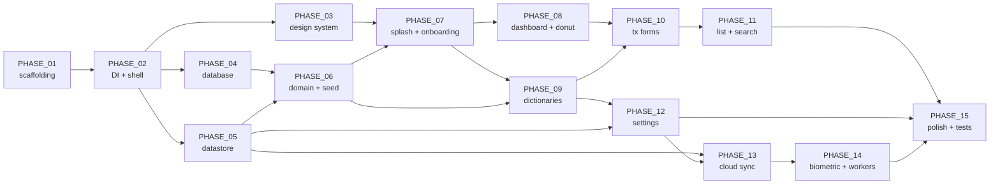

# Overview — phase map, dependency graph, TDD index

A reference document. Cross-link from phase files; do not duplicate content here.

---

## 1. Phase map

| #  | Phase                                          | TDD sections (primary)                                  | Screens          | Gradle modules touched                                                       |
|----|------------------------------------------------|---------------------------------------------------------|------------------|------------------------------------------------------------------------------|
| 01 | Scaffolding                                    | §2.2, §8.1, §9.3                                        | —                | `:app` + create all `:core:*` and `:feature:*` stubs                          |
| 02 | DI + App shell + Sentry                        | §2.1, §2.4, §2.6, §9.1 (Sentry)                         | —                | `:app`, `:core:common`                                                        |
| 03 | Design system                                  | §6.1–§6.4, §6.6, §6.10                                  | —                | `:core:ui`, `:core:designsystem`                                              |
| 04 | Database                                       | §7.1, §7.2, §7.4, §7.6, §7.8                            | —                | `:core:database`                                                              |
| 05 | DataStore + secure storage                     | §7.3, §8.3                                              | —                | `:core:datastore`                                                              |
| 06 | Domain + repos + seeding                       | §2.1, §2.5, §7.5, §7.7, §10.6                           | —                | `:core:domain`, `:core:common`                                                |
| 07 | Splash + onboarding + nav root                 | §3.2, §3.3, §3.4, §4.0, §4.1, §11.7                     | S00, S11         | `:app`, `:feature:onboarding`                                                  |
| 08 | Dashboard + donut                              | §4.2, §4.3, §4.4, §4.5, §6.5, §6.7, BR-1…BR-5, AS-12, AS-14 | S01, S05, S02, S04 | `:feature:dashboard`, `:core:designsystem`                                  |
| 09 | Dictionaries CRUD                              | §4.20–§4.25, §7.8, AS-13                                 | S21–S26          | `:feature:dictionaries`                                                       |
| 10 | Transaction forms                              | §4.6, §4.7, §4.8, §4.10, §4.26, §6.5 (keypad), BR-7…BR-16, AS-4, AS-6, AS-7 | S03, S06, S07, S09, S27 | `:feature:transaction`, `:core:designsystem`              |
| 11 | List + search + detail                         | §4.9, §4.11, §4.12, §11.4, BR-24, AS-9                   | S08, S12, S13    | `:feature:transactionslist`                                                   |
| 12 | Settings hierarchy                             | §4.13, §4.14, §4.17, §4.18, §4.19, §10.3, AS-15          | S14, S15, S18, S19, S20 | `:feature:settings`                                                  |
| 13 | Cloud sync + Sentry + Remote Config            | §2.4, §4.16, §9.1, §9.5, §11.5                           | S17              | `:core:sync`, `:core:network`, `:feature:cloudsync`                            |
| 14 | Biometric + WorkManager                        | §4.15, §6.9, §7.9, §11.8, AS-5, AS-11, BR-25             | S16              | `:feature:lockscreen`, `:core:sync` (workers)                                  |
| 15 | Polish + l10n + tests + release                | §6.8, §6.9, §6.10, §10, §12, §13.1 week 12               | all              | `:core:testing`, all features (RU strings + a11y pass)                         |

---

## 2. Dependency graph

**Critical path**: 01 → 02 → 04 → 06 → 07 → 08 → 10 → 11 → 12 → 13 → 14 → 15. Phases 03 and 05 fan out from 02 and feed 07/06 respectively.

**Parallelisable** (if you had two engineers): 09 can run after 06, in parallel with 07/08. 12 can run after 09 + 05, in parallel with 10/11. We treat them as sequential here because we have one session at a time.

---

## 3. TDD section index (precise line ranges)

Use these to add `TDD anchors` to each phase file. Lines are 1-based, inclusive.

| Section | Topic | Lines |
|---|---|---|
| §0 | Document metadata + source-of-truth ranking | 7–48 |
| §1.1 | Name + short description | 52–55 |
| §1.2 | Target audience | 56–64 |
| §1.3 | Competitive landscape | 65–80 |
| §1.4 | UVP | 81–89 |
| §1.5 | Success metrics | 90–105 |
| §2.1 | High-level architecture | 109–155 |
| §2.2 | Module layout (Gradle) | 156–180 |
| §2.3 | MVVM with UDF | 181–228 |
| §2.4 | Persistence + sync | 229–245 |
| §2.5 | Threading + dispatchers | 246–252 |
| §2.6 | Error handling | 253–261 |
| §3.1 | Screen inventory | 265–298 |
| §3.2 | Navigation graph | 299–362 |
| §3.3 | Back-stack strategy | 363–376 |
| §3.4 | Deep links + App Shortcuts | 377–444 |
| §4.0 | S00 Splash | 458–472 |
| §4.1 | S11 Onboarding | 473–519 |
| §4.2 | S01 Main dashboard (day) | 520–601 |
| §4.3 | S05 Main dashboard (year) | 602–613 |
| §4.4 | S02 Period drawer (left) | 614–645 |
| §4.5 | S04 Settings drawer (right) | 646–665 |
| §4.6 | S06 Add expense | 666–706 |
| §4.7 | S07 Add income | 707–719 |
| §4.8 | S03 Transfer | 720–759 |
| §4.9 | S08 Search records | 760–788 |
| §4.10 | S09 Category picker | 789–817 |
| §4.11 | S12 Transactions list | 818–855 |
| §4.12 | S13 Transaction detail/edit | 856–876 |
| §4.13 | S14 Settings root | 877–905 |
| §4.14 | S15 Theme settings | 906–920 |
| §4.15 | S16 Biometric lock setup | 921–948 |
| §4.16 | S17 Cloud sync | 949–992 |
| §4.17 | S18 Backup & restore | 993–1026 |
| §4.18 | S19 Language | 1027–1036 |
| §4.19 | S20 About / Help | 1037–1057 |
| §4.20 | S21 Categories list | 1058–1078 |
| §4.21 | S22 Category edit | 1079–1100 |
| §4.22 | S23 Accounts list | 1101–1121 |
| §4.23 | S24 Account edit | 1122–1131 |
| §4.24 | S25 Currencies list | 1132–1142 |
| §4.25 | S26 Currency edit | 1143–1152 |
| §4.26 | S27 Currency rate setup | 1153–1171 |
| §5 | Business rules (all BR-x) | 1172–1207 |
| §6.1 | Colour palette | 1212–1325 |
| §6.2 | Typography | 1326–1349 |
| §6.3 | Spacing | 1350–1365 |
| §6.4 | Shapes | 1366–1379 |
| §6.5 | Components (incl. MonefyDonutChart, MonefyKeypad) | 1380–1424 |
| §6.6 | Iconography | 1425–1432 |
| §6.7 | Motion | 1433–1445 |
| §6.8 | Sound | 1446–1460 |
| §6.9 | Haptic | 1461–1472 |
| §6.10 | Accessibility | 1473–1482 |
| §7.1 | ER diagram | 1485–1500 |
| §7.2 | Entities (Room) | 1501–1661 |
| §7.3 | AppSettings (DataStore) | 1662–1690 |
| §7.4 | DAOs | 1691–1906 |
| §7.5 | Cache strategy | 1907–1924 |
| §7.6 | Migrations | 1925–1953 |
| §7.7 | Seeding | 1954–1970 |
| §7.8 | Validation rules | 1971–1983 |
| §7.9 | Background workers | 1984–1997 |
| §8.1 | Build configuration | 2000–2019 |
| §8.2 | Permissions | 2020–2041 |
| §8.3 | Storage layout on disk | 2042–2057 |
| §8.4 | R8 / ProGuard keep rules | 2058–2087 |
| §8.5 | Sizing + performance budgets | 2088–2099 |
| §8.6 | Original-vs-reimpl reference | 2100–2118 |
| §9.1 | External integrations (Dropbox, GDrive, RC, Sentry) | 2125–2170 |
| §9.2 | Endpoints found in original APK | 2171–2180 |
| §9.3 | Third-party SDKs (Gradle dependencies) | 2181–2233 |
| §9.4 | Permission-vs-SDK mapping | 2234–2242 |
| §9.5 | Error handling contract | 2243–2263 |
| §9.6 | Web-views / external links | 2264–2269 |
| §9.7 | Pre-launch blockers | 2270–2281 |
| §10.1 | Supported languages | 2285–2293 |
| §10.2 | Resource directory layout | 2294–2305 |
| §10.3 | Per-app language switching | 2306–2335 |
| §10.4 | Plurals | 2336–2355 |
| §10.5 | Key string excerpts (APK-rooted) | 2356–2394 |
| §10.6 | Format conventions | 2395–2402 |
| §10.7 | RTL readiness | 2403–2408 |
| §11.1 | User stories — logging transactions | 2413–2436 |
| §11.2 | User stories — multi-account/currency | 2437–2451 |
| §11.3 | User stories — categories | 2452–2463 |
| §11.4 | User stories — browsing history | 2464–2487 |
| §11.5 | User stories — cloud sync | 2488–2507 |
| §11.6 | User stories — settings | 2508–2527 |
| §11.7 | User stories — onboarding / launcher | 2528–2538 |
| §11.8 | User stories — recurring & budget | 2539–2552 |
| §12.1 | Test pyramid | 2557–2566 |
| §12.2 | Unit tests | 2567–2602 |
| §12.3 | Integration tests | 2603–2608 |
| §12.4 | UI tests | 2609–2626 |
| §12.5 | Macrobenchmark | 2627–2644 |
| §12.6 | Manual exploratory / accessibility | 2645–2650 |
| §12.7 | CI | 2651–2661 |
| §13.1 | Roadmap v1.0 | 2666–2682 |
| §13.1.1 | Week-8 prerequisites checklist | 2683–2695 |
| §14.1 | Resolved decisions AS-1…AS-15 | 2727–2750 |
| §14.2 | Deferred DevOps prerequisites OQ-x | 2751–2763 |
| §14.4 | Decisions worth flagging in kickoff | 2770–2781 |
| App. A | All screens at a glance | 2784–2815 |
| App. C | APK ground truth | 2820–2836 |
| App. D | Pipeline artefacts | 2837–2854 |

---

## 4. Resolved-decisions cheatsheet (AS-1 … AS-15)

One-liner per decision. Always cite by AS-id, never re-discuss.

| AS-id | Decision | Cross-ref |
|---|---|---|
| AS-1  | Toolbar transfer-icon on S01/S05 opens **S03 Transfer**. | §4.2, BR-21 |
| AS-2  | Tap on balance card → **S12 Transactions List unfiltered**. | §4.2, §4.11 |
| AS-3  | Tap on a donut chart slice → **S12 with `categoryFilter = <slice.categoryId>`**. | §4.2, §4.11 |
| AS-4  | `+ ADD` from S09 → S22 → save **pops back to S06/S07** with the new category **pre-selected** (skips S09 on return). | §4.6, §4.7, §4.10 |
| AS-5  | Biometric lock is a **Composable overlay** rendered over `NavHost`. Not a nav destination, not in backstack. | §4.15, BR-25 |
| AS-6  | S03: cross-currency transfer with no rate → **auto-navigates to S27**; save returns to S03 with rate applied. | §4.8, §4.26, BR-16 |
| AS-7  | Transfer = **single TransactionEntity row** (Approach B): `kind = transfer`, `accountId`, `toAccountId`, `amount`, `toAmount`, `exchangeRate`. | §7.2, BR-15 |
| AS-8  | Income seed = **`Salary`, `Other`** (minimal). Expense seed = 15 categories from §6.1. | §7.7 |
| AS-9  | Swipe-delete on S12 → **Snackbar UNDO, 5-second window**. On timeout, `is_deleted = 1` is final. | §4.11, BR-24 |
| AS-10 | Milestone confetti fires **once in app lifetime** on first positive-balance render. Flag `AppSettings.firstPositiveSeen`. | §6.7, §7.3, BR-27 |
| AS-11 | Recurring auto-generated transactions appear **silently** in S12. No badge, no toast, no sheet. | §11.8, §4.2 |
| **AS-12** ⚠ | "Pick a date" opens a **two-date range picker** (start + end). Emits `CustomRange(start, end)`. **DEVIATION** from v1.0 default. | §4.4, BR-6 |
| AS-13 | Deleting / archiving an account with active transactions → blocked by **AlertDialog**. No silent cascade. | §4.22 |
| **AS-14** ⚠ | Donut slice percentage label drawn when **`fraction >= 0.03`** (3 %). **DEVIATION** from v1.0 default 5 %. | §6.5, BR-5 |
| AS-15 | Privacy Policy = **bundled HTML** at `assets/privacy_policy_<lang>.html`. No hosted URL at launch. | §4.19, §9.6 |

---

## 5. Pipeline artefacts (supporting analysis)

Read these only when a TDD section is ambiguous; the TDD is the primary source.

- `D:\Pet\TDD_creater\MyMoney\pipeline\00_meta.yaml` — analysis run metadata.
- `D:\Pet\TDD_creater\MyMoney\pipeline\01_play.md` — Google Play page scrape (mostly empty per TDD §0 metadata).
- `D:\Pet\TDD_creater\MyMoney\pipeline\02_business.md` — screenshot business-logic analysis.
- `D:\Pet\TDD_creater\MyMoney\pipeline\03_style.md` — screenshot visual-style analysis (subsumed by TDD §6).
- `D:\Pet\TDD_creater\MyMoney\pipeline\04_navigation.md` — derived navigation graph.
- `D:\Pet\TDD_creater\MyMoney\pipeline\05_data_model.md` — derived entities (subsumed by TDD §7).
- `D:\Pet\TDD_creater\MyMoney\pipeline\06_backend_api.md` — derived integrations (subsumed by TDD §9).
- `D:\Pet\TDD_creater\MyMoney\pipeline\07_apk.md` — APK ground truth (subsumed by TDD §6 colours, §9.2, §10.5 strings).
- `D:\Pet\TDD_creater\MyMoney\pipeline\user_answers_qA…qE.yaml` — original Phase-0 user answers. Cited by Q-id when needed.

Input screenshots: `D:\Pet\TDD_creater\MyMoney\input\screenshots\01.jpg`…`10.jpg`. Useful for PHASE_08 (dashboard) and PHASE_10 (transaction forms) when you want to eyeball the original.
